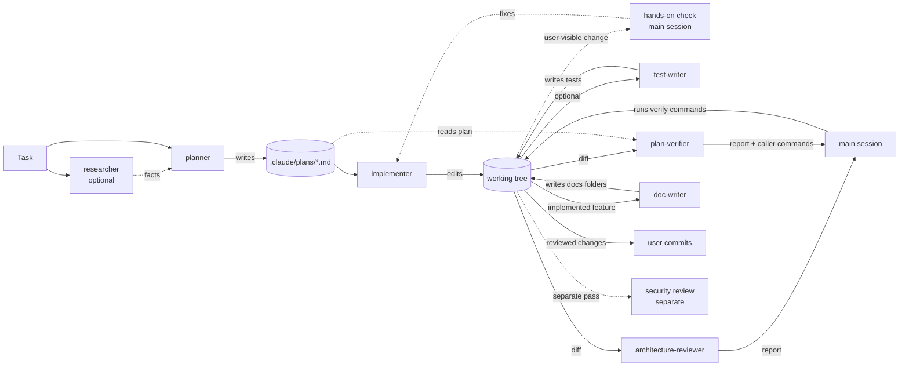

# Agents

A map of the project subagents in this folder: what each one is for, what it may touch, and
what it takes and hands back. The rules themselves live in each agent's file — change them there,
not here.

All agents are **repository-agnostic**: they learn the current repository (modules, commands,
conventions, skills, lessons-learned logs) from its files at run time, so the same definitions
can be copied into another repository unchanged. Copying the set to another repository is a
single-file operation per agent: `architecture-reviewer`, `plan-verifier` and `doc-writer` each
carry an identical, inline copy of a read-only Bash guard in their own frontmatter (see
§ Where each guarantee is enforced). The three copies must be edited together — differing only in
their `a=<agent-name>` line — because nothing else checks that they stay in sync.

## Pipeline

When the change is visible to a user, the main session runs the app and checks it against the
task before tests and review, so a wrong layout is fixed once instead of after the review.
`architecture-reviewer` and `plan-verifier` run in parallel, each in a fresh context, after the
implementer reports done; `plan-verifier` additionally reads the plan file. Nothing in this set
commits, pushes or opens a pull request; that stays with the user.

## Catalog

| Agent | Responsibility | Model | Writes | Guarded by |
|-------|----------------|-------|--------|------------|
| [researcher](researcher.md) | Answers one concrete question about the repository or external docs, with evidence | `sonnet` | nothing | prompt (read-only Bash) |
| [planner](planner.md) | Turns a task into a structured Development Plan that complies with the project's skills and lessons | `opus` · effort `high` | one plan file under `.claude/plans/` | tool list + `PreToolUse` hook |
| [implementer](implementer.md) | Executes a plan across frontend and backend, runs existing checks, verifies its own changes | `sonnet` · effort `medium` | code in the working tree, lessons-learned log entries | tool list + `PreToolUse` hook |
| [test-writer](test-writer.md) | Writes behaviour-focused tests for changed or uncovered code, keeping only tests that type-check, pass repeatedly and can fail | `sonnet` · effort `high` | test files and fixtures | tool list + `PreToolUse` hook |
| [architecture-reviewer](architecture-reviewer.md) | Checks changed code against the repository's own documented architecture rules | `opus` · effort `medium` | nothing | tool list + read-only Bash guard |
| [plan-verifier](plan-verifier.md) | Checks finished code against every item of a Development Plan, item by item | `sonnet` · effort `high` | nothing | tool list + read-only Bash guard |
| [doc-writer](doc-writer.md) | Turns an implemented, verified feature into placed, verified-against-code documentation | `sonnet` · effort `high` | Markdown files under documentation folders | tool list + read-only Bash guard |

## researcher

- **Does:** repository research (where / how / why, with `path:line` and git history) and
  external research (official docs, changelogs, versions pinned from the repo's manifests).
- **Does not:** change anything, run skills or slash commands, fill gaps with guesses.
- **Tools:** `Read, Grep, Glob, Bash, WebSearch, WebFetch`. Bash is limited to read-only commands
  by the prompt only — there is no hook.
- **Input:** a concrete question and the language the report must be written in.
- **Output (reply):** a research report — TL;DR, findings with confidence levels, sources,
  explicit "Not found" list — or `Clarification needed` with questions and suggested defaults.

## planner

- **Does:** reads project guidance and lessons-learned logs for every touched module, discovers
  the project skills (and a path-to-skill routing map, if the repository has one), maps the task
  onto files and cross-module contracts, checks every step against architecture rules and
  do-not-touch zones, and assigns to each step the skills the implementer must apply. Copies
  every acceptance criterion from the task verbatim, maps it to steps, and marks a step that
  realises a criterion differently as `deviates:` with an open question.
- **Does not:** write code, run commands, research outside the repository (external facts become
  open questions for `researcher`), assign review or audit skills to implementation steps.
- **Tools:** `Read, Grep, Glob, Skill, Write`; denied `Edit, NotebookEdit, Bash, Agent`.
- **Permission mode:** `acceptEdits` (so the plan file can be saved). A `PreToolUse` hook on
  `Write` allows only `$CLAUDE_PROJECT_DIR/.claude/plans/**/*.md` and rejects paths with `..`.
- **Input:** a task description.
- **Output artifact:** `.claude/plans/<YYYY-MM-DD>-<slug>.md` — header (date, branch, HEAD,
  status), goal and acceptance criteria, scope in/out, context used (guidance, lessons, skills),
  architecture constraints, steps (module, files, skills to apply, depends on, done when, verify
  command), cross-module sync points, test plan (every changed behaviour mapped to a test or an
  explicit "not tested" reason, each new test with an owner: the implementer step or
  test-writer, as the caller says), risks and open questions.
- **Output (reply):** plan path, status, 5–10 line summary, blocking questions. Instead of a plan
  it may return `Clarification needed` or `Plan not needed` (the change fits in one sentence).

## implementer

- **Does:** loads each step's skills before editing its files, makes the smallest change that
  meets "done when", runs the step's verify command, then runs the type check and tests of every
  touched package, matches the working tree against the plan's file list, maps acceptance
  criteria to evidence, and records genuinely new lessons in the project's lessons-learned log
  (following the skill that governs it, if any).
- **Does not:** architecture or security review, pre-PR review, verdicts on design; commits,
  pushes, branch switches or discarding uncommitted work; new dependencies or protected-file
  edits the plan does not call for; weakening tests to get green.
- **Tools:** `Read, Grep, Glob, Edit, Write, Bash, Skill`; denied `Agent, WebFetch, WebSearch,
  NotebookEdit`.
- **Permission mode:** `acceptEdits`; `maxTurns: 150`. A `PreToolUse` hook on `Bash` blocks
  `git` `commit|push|reset|rebase|checkout|switch|restore|clean|stash|merge|cherry-pick|revert|tag`
  and `gh pr|release|repo`. It matches words anywhere in the command, so it can block a harmless
  command (for example `git log --grep commit`) — fail-closed by design.
- **Input:** a plan file path or an inline plan.
- **Output artifacts:** changes in the working tree (uncommitted); lessons-learned entries.
- **Output (reply):** implementation report — status, per-step table with skills and evidence,
  verification commands and results, not-verified items, deviations, blockers, notes for
  reviewers, lessons recorded, working-tree summary. Stop states: `Plan needed`,
  `Plan is stale`, `Plan deviation needed`, or `blocked` after three failed fix attempts.

## test-writer

- **Does:** discovers the repository's test strategy, conventions, and testing/framework/
  architecture skills; writes behaviour-focused tests at the level the project prefers; keeps only
  tests that type-check, pass three runs in a row (only the new or changed test files; the full
  suite runs once at the end), and are shown able to fail by breaking their own assertion and
  restoring it.
- **Does not:** touch production code, test-runner configuration, package manifests or lockfiles;
  add a new dependency; commit, push or switch branches; mutate production code for a
  behaviour-level red check (it lists one as a suggestion instead).
- **Tools:** `Read, Grep, Glob, Edit, Write, Bash, Skill`; denied `Agent, WebFetch, WebSearch,
  NotebookEdit`.
- **Permission mode:** `acceptEdits`; `maxTurns: 120`. A `PreToolUse` hook on `Write|Edit` allows
  only test-file and fixture paths (by basename pattern or by directory, for example `/test/`,
  `/__mocks__/`, `/__snapshots__/`) under `$CLAUDE_PROJECT_DIR`, and rejects `..`, a trailing
  backslash from a truncated extraction, and `/node_modules/`, `/vendor/`, `/.git/`. A second
  `PreToolUse` hook on `Bash`, copied from implementer's, blocks the same git-mutation and `gh pr`
  words.
- **Input:** a concrete target — a plan path plus step ids or the test plan entries marked
  `owner: test-writer`, a file list, or named behaviours.
- **Output artifacts:** new or changed test files and fixtures (uncommitted).
- **Output (reply):** test report — behaviours covered with level, test location and can-fail
  result; discarded tests; verification commands; production changes needed but not made; suggested
  red checks; lesson candidates. Stop states: `Clarification needed`, `Production change needed`,
  `Dependency needed`, `Bug found` (a correct test exposes a real bug — the failing test stays in
  the tree), `blocked` after three failed gate attempts.

## architecture-reviewer

- **Does:** discovers the repository's own architecture rules from its guidance and architecture
  skills, maps every changed or untracked file to a module/layer, checks documented allowed/
  forbidden edges (dependency direction, layer skipping, module internals, composition root,
  frontend feature boundaries) with full import chains for transitive cases, and runs the rules'
  own self-checks as equivalent Grep calls.
- **Does not:** modify files; check plan conformance, security, style or test quality; retry a
  denied command in another shape (it reports "Not checked" instead); treat a pre-existing problem
  outside the diff as a finding.
- **Tools:** `Read, Grep, Glob, Bash, Skill`; denied `Agent, Write, Edit, NotebookEdit, WebFetch,
  WebSearch`.
- **Permission mode:** inherited (not set — a specifier would be ignored in `auto`/`acceptEdits`/
  `bypassPermissions` anyway); `maxTurns: 80`. A `PreToolUse` hook on `Bash` is the read-only guard:
  one single `git status|diff|log|show|ls-files|merge-base|rev-parse|grep` call per invocation, no
  pipes, redirections, chaining or variables (see § Where each guarantee is enforced).
- **Input:** a base to diff against (or it derives one from `git merge-base`), optionally scoped by
  a caller-given file list.
- **Output artifacts:** none.
- **Output (reply):** architecture review — rules applied, findings by severity with `path:line`,
  rule source, verbatim quote and fix direction, "Checked and clean", "Known deviations touched",
  "Observations (no written rule)", "Not checked". An empty findings list is a valid, complete
  result. Stop states: `Nothing to review`, `Clarification needed`.

## plan-verifier

- **Does:** locates a Development Plan (by path or inline), extracts every acceptance criterion,
  step, scope-out entry, architecture-constraint compliance claim, sync point and test-plan item
  into an atomic, quoted checklist before reading any code, then verifies each item independently
  against `path:line` or read-only git output, and traces every changed file back to an item.
  Requirements passed alongside the plan are checked against their own wording, not through the
  plan, so a plan that drifted from the task shows up as a gap.
- **Does not:** run tests, type checks, builds or the plan's own `Verify` commands (it lists them
  under "Not verified — commands for the caller" instead); give generic advice, or an architecture
  or quality verdict; treat the implementer's own report as evidence; modify files.
- **Tools:** `Read, Grep, Glob, Bash, Skill`; denied `Agent, Write, Edit, NotebookEdit, WebFetch,
  WebSearch`.
- **Permission mode:** inherited (not set, for the same reason as architecture-reviewer);
  `maxTurns: 100`. The same read-only Bash guard as architecture-reviewer.
- **Input:** a plan file path (usually under `.claude/plans/`) or an inline plan, plus any
  requirements passed alongside it.
- **Output artifacts:** none.
- **Output (reply):** plan verification — a checklist table (id, item, source, status, evidence),
  gaps, untraced changes, and the commands the caller still has to run. Status vocabulary: `Met`,
  `Partially met`, `Not met`, `Not verifiable`, `Not verified`. Result: `verified` (every item Met
  or Not verified, header states "pending `<e>` caller commands" when `e > 0`), `gaps found`,
  `incomplete`, `blocked`. Returns `Plan needed` (with candidate plan files) when none is given.

## doc-writer

- **Does:** builds a map of the repository's existing documentation sections and the question each
  answers (Diátaxis), places each planned document in an existing section where one fits, verifies
  every claim in the source material against the code or read-only git output, transforms
  plan/notes prose into present-tense documentation with Mermaid diagrams, and updates the target
  section's index.
- **Does not:** modify code; edit guidance files, root/module READMEs or lessons-learned logs
  directly (it proposes those edits instead); create a new documentation section or a decision
  record without the task's explicit authorisation; document a claim it could not verify; commit.
- **Tools:** `Read, Grep, Glob, Edit, Write, Bash, Skill`; denied `Agent, NotebookEdit, WebFetch,
  WebSearch`.
- **Permission mode:** `acceptEdits`; `maxTurns: 80`. A `PreToolUse` hook on `Write|Edit` allows
  only `*.md` paths under a `docs/` folder inside `$CLAUDE_PROJECT_DIR`, rejecting `..`, a
  backslash, `/node_modules/`, `/vendor/`, `/.claude/`, `/.git/`, and the basenames `CLAUDE.md` /
  `AGENTS.md` anywhere. A second `PreToolUse` hook on `Bash`, listed after the first, is the same
  read-only guard as architecture-reviewer and plan-verifier.
- **Input:** source material — a plan path, spec, notes, a pull-request description, or "document
  feature X" plus where it lives.
- **Output artifacts:** new or updated Markdown files under documentation folders and their section
  index (uncommitted).
- **Output (reply):** documentation report — written files with type and placement rationale,
  claims verified, discrepancies between source and code, dropped unverifiable claims, proposals
  not made (new section, ADR candidate, edit outside docs). Stop states: `Source needed`,
  `Clarification needed`, `Section proposal` (per document; the rest proceeds).

## Where each guarantee is enforced

| Guarantee | Enforced by | Why not the prompt or `permissionMode` alone |
|-----------|-------------|-----------------------------------------------|
| planner never edits code | `tools` list + `Write` hook | `permissionMode` is ignored when the main session runs in `auto`, `acceptEdits` or `bypassPermissions` |
| implementer never touches git history | `Bash` hook | `disallowedTools: Bash(git commit *)` would remove the whole Bash tool |
| no nested delegation | `disallowedTools: Agent` | subagents may otherwise spawn subagents up to three levels deep |
| plans stay local | `.claude/plans/` in `.gitignore` | — |
| architecture-reviewer and plan-verifier never modify files | `tools` list (no `Write`/`Edit`/`NotebookEdit`) + the read-only Bash guard | `disallowedTools` is reported unenforced for some tools ([issue 94202](https://github.com/anthropics/claude-code/issues/94202)), and `permissionMode` would be ignored in `auto`/`acceptEdits`/`bypassPermissions` the same way it is for planner |
| Bash of architecture-reviewer, plan-verifier and doc-writer runs only one read-only git command | inline `PreToolUse(Bash)` guard, identical in all three | deliberately does not allow: any shell metacharacter (`; & \| < > $`, backtick, backslash, newline) — so no pipes, no redirections (not even `2>/dev/null`), no chaining, no substitution, no variables; any command other than `git`; a global option other than `-C <dir>` / `--no-pager`; a subcommand outside `status diff log show ls-files merge-base rev-parse grep`; `--output`/`--ext-diff`/`--open-files-in-pager` and their unambiguous abbreviations, and any `-O` option (both run or write through an external program). Reading and searching go through Read/Grep/Glob, or `git grep` / `git ls-files` where the session has no Grep or Glob tool. Known false denials — a quoted argument that happens to contain a metacharacter (`git log --grep "a\|b"`), a `-C` path with a space, `git diff 2>/dev/null` — are reported by the agents, never worked around |
| the guard fails closed | the guard body itself | no `jq`, an empty or unparsable hook payload, or a missing `.tool_input.command` all deny rather than pass through |
| plan-verifier never runs tests, type checks, builds or the plan's `Verify` commands | prompt (Step 1 checklist extraction) + the same Bash guard (nothing but git can run anyway) | they come back as `Not verified` items under "Not verified — commands for the caller" |
| test-writer writes only test paths | `PreToolUse(Write\|Edit)` hook | Bash writes are not covered by this hook — only by the prompt rule and the agent's own end-of-run working-tree comparison; this is a residual risk, not a mechanical guarantee |
| doc-writer writes only Markdown under `docs/` folders | `PreToolUse(Write\|Edit)` hook | same file-path allowlist pattern as planner's and test-writer's hooks |

Frontmatter hooks of project agents run only after the workspace trust dialog has been accepted.

## Sources behind the agents

Authoring (planner, implementer):

| Source | Rules taken from it | Applied in |
|--------|---------------------|------------|
| [Create custom subagents](https://code.claude.com/docs/en/sub-agents) | `description` drives delegation ("use proactively"); `tools` is an allowlist; `permissionMode` is overridden by `auto` / `acceptEdits` / `bypassPermissions` in the main session; a specifier in `disallowedTools` removes the whole tool; `skills` preloads full content while the Skill tool can still load others; subagents do not inherit the conversation or loaded skills but do get CLAUDE.md and a git status snapshot; nesting depth; `maxTurns` returns partial output; `isolation: worktree` branches from the default branch | both descriptions; tool lists; hooks instead of `permissionMode`/`disallowedTools` specifiers; runtime skill discovery instead of `skills:`; orientation and freshness steps; `disallowedTools: Agent`; implementer's `maxTurns`; worktree isolation deliberately not used |
| [Hooks reference](https://code.claude.com/docs/en/hooks) | frontmatter hooks are scoped to the subagent; `PreToolUse` exit code 2 blocks the call | planner `Write` hook, implementer `Bash` hook |
| [Choose a permission mode](https://code.claude.com/docs/en/permission-modes) | mode semantics; deny rules hold in every mode | guarantees table above |
| [Best practices for Claude Code](https://code.claude.com/docs/en/best-practices) | explore → plan → implement, kept separate; skip the plan when the diff fits in one sentence; a good spec names files and interfaces, states what is out of scope, ends with verification; give the agent a check it can run and demand evidence; review in a fresh context rather than by the author | the planner/implementer split; `Plan not needed`; plan sections; per-step `Verify` and report evidence; implementer's "no verdicts" boundary and "For reviewers" section |
| [Effective context engineering for AI agents](https://www.anthropic.com/engineering/effective-context-engineering-for-ai-agents) | subagents explore widely but return a condensed summary | planner replies with path + summary; compact report formats citing `path:line` |
| [How we built our multi-agent research system](https://www.anthropic.com/engineering/multi-agent-research-system) | a delegated task needs an objective, output format, tool guidance and clear boundaries | fields of each plan step; "Out of scope for the implementer" |
| [Building effective agents](https://www.anthropic.com/engineering/building-effective-agents) | orchestrator–workers pattern; ground truth from the environment at each step; explicit stop conditions | step → verify loop; three-attempt limit; stop states |
| [Skill authoring best practices](https://platform.claude.com/docs/en/agents-and-tools/agent-skills/best-practices) | descriptions in third person, stating what and when | wording of both `description` fields (applied by analogy) |
| [GitHub issue 94202](https://github.com/anthropics/claude-code/issues/94202) | `disallowedTools` is reported unenforced for some tools (community report, unconfirmed) | `tools` allowlists, not `disallowedTools` specifiers, are the primary guard for every agent added since |

Testing (test-writer):

| Source | Rules taken from it | Applied in |
|--------|---------------------|------------|
| [The Testing Trophy](https://kentcdodds.com/blog/the-testing-trophy-and-testing-classifications), [Write tests](https://kentcdodds.com/blog/write-tests), [Testing Library guiding principles](https://testing-library.com/docs/guiding-principles/), [Testing implementation details](https://kentcdodds.com/blog/testing-implementation-details) | mostly integration tests at the seams; behaviour over implementation | Step 3 design, level choice |
| [Testing Library queries](https://testing-library.com/docs/queries/about/), [user-event](https://testing-library.com/docs/user-event/intro/), [async utilities](https://testing-library.com/docs/dom-testing-library/api-async/), [Effective snapshot testing](https://kentcdodds.com/blog/effective-snapshot-testing) | query priority, full user interactions over single events, async waits over sleeps, small snapshots | UI principles in Step 3 |
| [Network-level mocking FAQ](https://mswjs.io/docs/faq/) | use the repository's own mocking approach; no new dependency | Hard limits, Step 3 |
| [Framework guide: unit tests vs end-to-end for server components](https://nextjs.org/docs/app/guides/testing/vitest) | components the unit runner cannot render belong to end-to-end tests | Step 3 |
| [HTTP framework testing guide](https://fastify.dev/docs/v5.8.x/Guides/Testing/), [Plugin encapsulation reference](https://fastify.dev/docs/v5.7.x/Reference/Encapsulation/) | drive the app in-process through request injection against the app factory; build once per file | Step 3, HTTP backends |
| [Ephemeral database containers](https://testcontainers.com/guides/getting-started-with-testcontainers-for-nodejs/), [Rollback vs truncation isolation](https://blog.alexrusin.com/testcontainers-for-postgres/) (medium confidence), [Test-runner parallelism](https://vitest.dev/guide/parallelism) | a real database only where the strategy calls for it, with its own naming convention | Step 3 |
| [Make your test fail](https://kentcdodds.com/blog/make-your-test-fail), [Automated unit test improvement at Meta (TestGen-LLM)](https://arxiv.org/abs/2402.09171), [Stryker Mutator docs](https://stryker-mutator.io/docs/), [Test coverage](https://martinfowler.com/bliki/TestCoverage.html), [Code coverage best practices](https://testing.googleblog.com/2020/08/code-coverage-best-practices.html) | can-fail check; keep only tests that build, pass repeatedly and add value; coverage is reported, never targeted | Step 5 gate |

Architecture/verification (architecture-reviewer, plan-verifier):

| Source | Rules taken from it | Applied in |
|--------|---------------------|------------|
| [ArchUnit](https://www.archunit.org/userguide/html/000_Index.html), [ArchUnitTS](https://github.com/LukasNiessen/ArchUnitTS), [dependency-cruiser rules](https://github.com/sverweij/dependency-cruiser/blob/main/doc/rules-reference.md), [eslint-plugin-boundaries](https://github.com/javierbrea/eslint-plugin-boundaries/blob/master/docs/rules/element-types.md), [Nx module boundaries](https://nx.dev/docs/features/enforce-module-boundaries) | rules expressed as named allowed/forbidden edges; transitive reachability | architecture-reviewer Step 2, Step 4 |
| [dependency-cruiser FAQ](https://github.com/sverweij/dependency-cruiser/blob/main/doc/faq.md) | type-only imports, barrel files, accepted-baseline exclusions | architecture-reviewer Step 4, Step 5 |
| [The Clean Architecture](https://blog.cleancoder.com/uncle-bob/2012/08/13/the-clean-architecture.html), [Palermo, layered architecture part 1](https://jeffreypalermo.com/2008/07/the-onion-architecture-part-1/), [Hexagonal architecture](https://alistair.cockburn.us/hexagonal-architecture) | dependency rule, DI at boundaries, ports and adapters | architecture-reviewer rule inventory |
| [Software verification and validation](https://en.wikipedia.org/wiki/Software_verification_and_validation), [IEEE 1012](https://standards.ieee.org/ieee/1012/7324) | verification (does it meet the spec?) is distinct from validation (is it the right spec?) | plan-verifier's scope statement |
| [ISO/IEC/IEEE 29148 overview](https://www.modernrequirements.com/blogs/iso-29148-explained/), [NASA SWE-047 traceability](https://swehb.nasa.gov/spaces/7150/pages/16449982/SWE-047+-+Traceability+Data), [Requirements traceability matrix](https://www.perforce.com/resources/alm/requirements-traceability-matrix) | vague items → `Not verifiable`; every item traced; the status vocabulary; inverse trace | plan-verifier Step 1, Step 4, status vocabulary |
| [Chain-of-Verification](https://arxiv.org/abs/2309.11495), [Judging LLM-as-a-Judge](https://arxiv.org/abs/2306.05685), [LLM hallucination detection](https://www.datadoghq.com/blog/ai/llm-hallucination-detection/) | extract the checklist before reading the code; answer independently; a different model from the implementer reduces self-preference bias | plan-verifier Steps 1–3; a different model from the implementer for architecture-reviewer |

Documentation (doc-writer):

| Source | Rules taken from it | Applied in |
|--------|---------------------|------------|
| [Diátaxis](https://diataxis.fr/), [Diátaxis: start here](https://diataxis.fr/start-here/) | classify by the question a page answers; adopt incrementally, do not force-reorganise | Step 1 docs map, Step 2 placement |
| [Docs as code](https://www.writethedocs.org/guide/docs-as-code/), [Google style: tense](https://developers.google.com/style/tense), [Google style: highlights](https://developers.google.com/style/highlights), [Microsoft reference-content guide](https://learn.microsoft.com/en-us/style-guide/developer-content/reference-documentation) | present tense; no restated code; structure | Step 4 transform |
| [C4 model](https://c4model.com/), [arc42](https://arc42.org/overview) | context/container/component levels for structure diagrams | Step 5 diagrams |
| [Documenting architecture decisions](https://cognitect.com/blog/2011/11/15/documenting-architecture-decisions), [MADR](https://adr.github.io/madr/) | an ADR only for a significant decision with options considered; MADR-style shape when the repo has no format of its own | Step 2 placement, decision records |
| [Mermaid intro](https://mermaid.js.org/intro/), [GitHub diagram rendering](https://docs.github.com/en/get-started/writing-on-github/working-with-advanced-formatting/creating-diagrams), [GitHub Mermaid rendering gaps](https://github.com/orgs/community/discussions/203196), [Mermaid size-limit issue](https://github.com/mermaid-js/mermaid/issues/8260), [Mermaid syntax reference](https://mermaid.js.org/intro/syntax-reference.html) | diagram types, renderer gaps, size ceiling, syntax pitfalls (quoting, node ids, `subgraph`/`end`) | Step 5 diagrams |
| [Living documentation principles](https://hilton.org.uk/blog/living-documentation-principles) | transform source material into docs; verify claims against the code | Step 3, Step 4 |

Report formats, severity words and `file:line` evidence are community conventions, not official
rules; they follow the pattern the first three agents already set.

Model choice follows no official rule; it is a judgement. `opus` for planning and for
architecture-reviewer: their work is reasoning-heavy comparison against rules, and using a
different model from the `sonnet` implementer reduces self-preference bias when judging that
implementer's own output. plan-verifier runs on `sonnet` to save tokens: its checklist is
extracted before it reads any code and every item is answered from quoted evidence, which keeps
the check mechanical rather than a judgement call. `sonnet` for implementation and for the two
writers (test-writer, doc-writer): their work is tool-call-heavy, and its output is checked by
tests or by plan-verifier rather than by the writer's own judgement. Effort is `medium` for the
implementer and architecture-reviewer, whose work is bounded by a plan or a written rule set,
and `high` elsewhere.

## Maintaining this set

- Claude Code watches this folder: an edited agent file is used on the next delegation, no
  restart needed.
- Keep definitions free of repository names, paths and stack details — point the agent at the
  guidance files instead.
- When an agent's tools, model, hooks, inputs or outputs change, update its row and section here.
- Keep all seven `description` fields distinct: delegation is routed by description, so two
  similar ones make the wrong agent fire.
- After editing the read-only Bash guard, re-run its test matrix (see the agent files'
  `PreToolUse(Bash)` hooks) and re-check that the three copies — in architecture-reviewer,
  plan-verifier and doc-writer — are still identical except each one's `a=<agent-name>` line.
