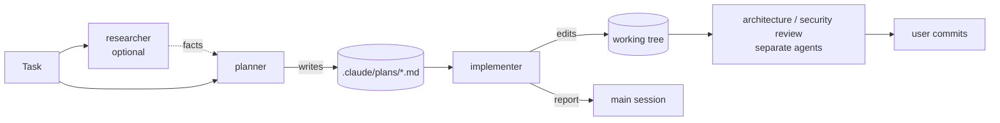

# Agents

A map of the project subagents in this folder: what each one is for, what it may touch, and
what it takes and hands back. The rules themselves live in each agent's file — change them there,
not here.

All agents are **repository-agnostic**: they learn the current repository (modules, commands,
conventions, skills, lessons-learned logs) from its files at run time, so the same definitions
can be copied into another repository unchanged.

## Pipeline

Nothing in this set commits, pushes or opens a pull request; that stays with the user.

## Catalog

| Agent | Responsibility | Model | Writes | Guarded by |
|-------|----------------|-------|--------|------------|
| [researcher](researcher.md) | Answers one concrete question about the repository or external docs, with evidence | `sonnet` | nothing | prompt (read-only Bash) |
| [planner](planner.md) | Turns a task into a structured Development Plan that complies with the project's skills and lessons | `opus` · effort `high` | one plan file under `.claude/plans/` | tool list + `PreToolUse` hook |
| [implementer](implementer.md) | Executes a plan across frontend and backend, runs existing checks, verifies its own changes | `sonnet` · effort `high` | code in the working tree, lessons-learned log entries | tool list + `PreToolUse` hook |

## researcher

- **Does:** repository research (where / how / why, with `path:line` and git history) and
  external research (official docs, changelogs, versions pinned from the repo's manifests).
- **Does not:** change anything, run skills or slash commands, fill gaps with guesses.
- **Tools:** `Read, Grep, Glob, Bash, WebSearch, WebFetch`. Bash is limited to read-only commands
  by the prompt only — there is no hook.
- **Input:** a concrete question and the language the report must be written in.
- **Output (reply):** a research report — TL;DR, findings with confidence levels, sources,
  explicit "Not found" list — or `Clarification needed` with questions and suggested defaults.

## planner

- **Does:** reads project guidance and lessons-learned logs for every touched module, discovers
  the project skills (and a path-to-skill routing map, if the repository has one), maps the task
  onto files and cross-module contracts, checks every step against architecture rules and
  do-not-touch zones, and assigns to each step the skills the implementer must apply.
- **Does not:** write code, run commands, research outside the repository (external facts become
  open questions for `researcher`), assign review or audit skills to implementation steps.
- **Tools:** `Read, Grep, Glob, Skill, Write`; denied `Edit, NotebookEdit, Bash, Agent`.
- **Permission mode:** `acceptEdits` (so the plan file can be saved). A `PreToolUse` hook on
  `Write` allows only `$CLAUDE_PROJECT_DIR/.claude/plans/**/*.md` and rejects paths with `..`.
- **Input:** a task description.
- **Output artifact:** `.claude/plans/<YYYY-MM-DD>-<slug>.md` — header (date, branch, HEAD,
  status), goal and acceptance criteria, scope in/out, context used (guidance, lessons, skills),
  architecture constraints, steps (module, files, skills to apply, depends on, done when, verify
  command), cross-module sync points, test plan, risks and open questions.
- **Output (reply):** plan path, status, 5–10 line summary, blocking questions. Instead of a plan
  it may return `Clarification needed` or `Plan not needed` (the change fits in one sentence).

## implementer

- **Does:** loads each step's skills before editing its files, makes the smallest change that
  meets "done when", runs the step's verify command, then runs the type check and tests of every
  touched package, matches the working tree against the plan's file list, maps acceptance
  criteria to evidence, and records genuinely new lessons in the project's lessons-learned log
  (following the skill that governs it, if any).
- **Does not:** architecture or security review, pre-PR review, verdicts on design; commits,
  pushes, branch switches or discarding uncommitted work; new dependencies or protected-file
  edits the plan does not call for; weakening tests to get green.
- **Tools:** `Read, Grep, Glob, Edit, Write, Bash, Skill`; denied `Agent, WebFetch, WebSearch,
  NotebookEdit`.
- **Permission mode:** `acceptEdits`; `maxTurns: 150`. A `PreToolUse` hook on `Bash` blocks
  `git` `commit|push|reset|rebase|checkout|switch|restore|clean|stash|merge|cherry-pick|revert|tag`
  and `gh pr|release|repo`. It matches words anywhere in the command, so it can block a harmless
  command (for example `git log --grep commit`) — fail-closed by design.
- **Input:** a plan file path or an inline plan.
- **Output artifacts:** changes in the working tree (uncommitted); lessons-learned entries.
- **Output (reply):** implementation report — status, per-step table with skills and evidence,
  verification commands and results, not-verified items, deviations, blockers, notes for
  reviewers, lessons recorded, working-tree summary. Stop states: `Plan needed`,
  `Plan is stale`, `Plan deviation needed`, or `blocked` after three failed fix attempts.

## Where each guarantee is enforced

| Guarantee | Enforced by | Why not the prompt or `permissionMode` alone |
|-----------|-------------|-----------------------------------------------|
| planner never edits code | `tools` list + `Write` hook | `permissionMode` is ignored when the main session runs in `auto`, `acceptEdits` or `bypassPermissions` |
| implementer never touches git history | `Bash` hook | `disallowedTools: Bash(git commit *)` would remove the whole Bash tool |
| no nested delegation | `disallowedTools: Agent` | subagents may otherwise spawn subagents up to three levels deep |
| plans stay local | `.claude/plans/` in `.gitignore` | — |

Frontmatter hooks of project agents run only after the workspace trust dialog has been accepted.

## Sources behind planner and implementer

| Source | Rules taken from it | Applied in |
|--------|---------------------|------------|
| [Create custom subagents](https://code.claude.com/docs/en/sub-agents) | `description` drives delegation ("use proactively"); `tools` is an allowlist; `permissionMode` is overridden by `auto` / `acceptEdits` / `bypassPermissions` in the main session; a specifier in `disallowedTools` removes the whole tool; `skills` preloads full content while the Skill tool can still load others; subagents do not inherit the conversation or loaded skills but do get CLAUDE.md and a git status snapshot; nesting depth; `maxTurns` returns partial output; `isolation: worktree` branches from the default branch | both descriptions; tool lists; hooks instead of `permissionMode`/`disallowedTools` specifiers; runtime skill discovery instead of `skills:`; orientation and freshness steps; `disallowedTools: Agent`; implementer's `maxTurns`; worktree isolation deliberately not used |
| [Hooks reference](https://code.claude.com/docs/en/hooks) | frontmatter hooks are scoped to the subagent; `PreToolUse` exit code 2 blocks the call | planner `Write` hook, implementer `Bash` hook |
| [Choose a permission mode](https://code.claude.com/docs/en/permission-modes) | mode semantics; deny rules hold in every mode | guarantees table above |
| [Best practices for Claude Code](https://code.claude.com/docs/en/best-practices) | explore → plan → implement, kept separate; skip the plan when the diff fits in one sentence; a good spec names files and interfaces, states what is out of scope, ends with verification; give the agent a check it can run and demand evidence; review in a fresh context rather than by the author | the planner/implementer split; `Plan not needed`; plan sections; per-step `Verify` and report evidence; implementer's "no verdicts" boundary and "For reviewers" section |
| [Effective context engineering for AI agents](https://www.anthropic.com/engineering/effective-context-engineering-for-ai-agents) | subagents explore widely but return a condensed summary | planner replies with path + summary; compact report formats citing `path:line` |
| [How we built our multi-agent research system](https://www.anthropic.com/engineering/multi-agent-research-system) | a delegated task needs an objective, output format, tool guidance and clear boundaries | fields of each plan step; "Out of scope for the implementer" |
| [Building effective agents](https://www.anthropic.com/engineering/building-effective-agents) | orchestrator–workers pattern; ground truth from the environment at each step; explicit stop conditions | step → verify loop; three-attempt limit; stop states |
| [Skill authoring best practices](https://platform.claude.com/docs/en/agents-and-tools/agent-skills/best-practices) | descriptions in third person, stating what and when | wording of both `description` fields (applied by analogy) |

Model choice (`opus` for planning, `sonnet` for implementation) follows no official rule; it is a
judgement: planning is reasoning-heavy, implementation is tool-call-heavy and checked by tests.

## Maintaining this set

- Claude Code watches this folder: an edited agent file is used on the next delegation, no
  restart needed.
- Keep definitions free of repository names, paths and stack details — point the agent at the
  guidance files instead.
- When an agent's tools, model, hooks, inputs or outputs change, update its row and section here.
