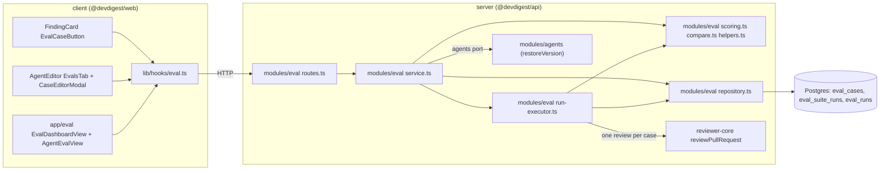
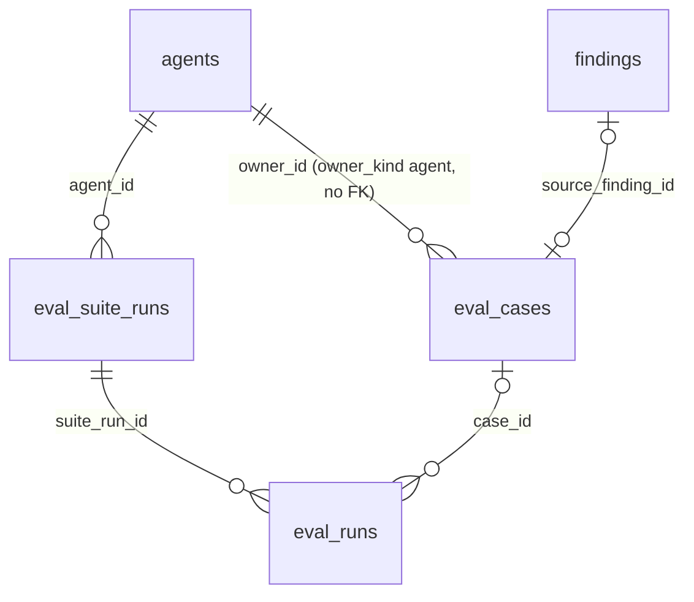
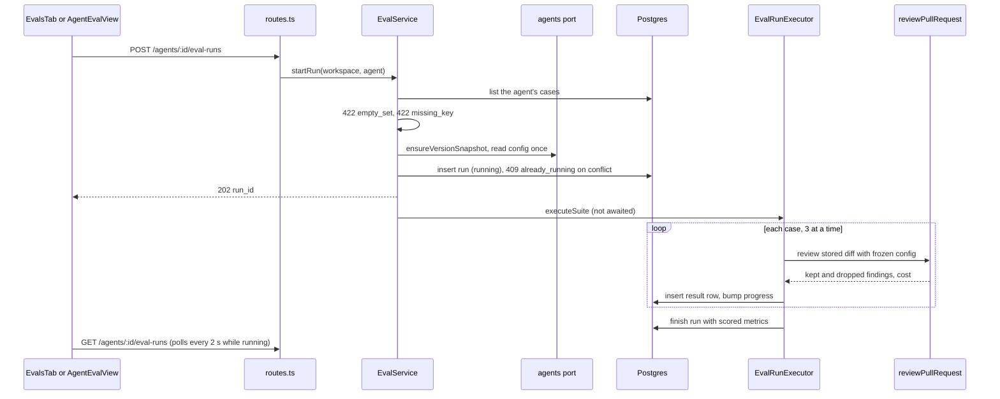
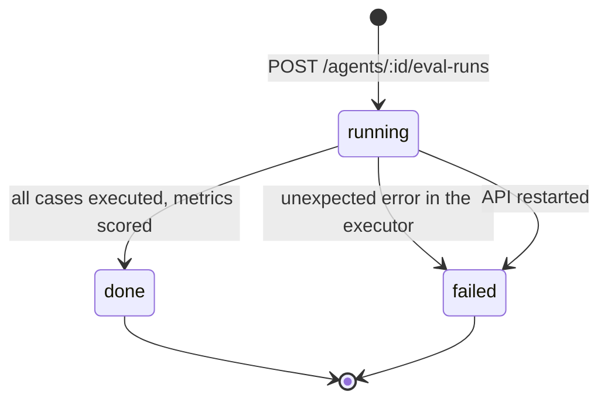

# Eval pipeline — a regression harness for review agents

How the studio measures whether a change to a review agent (its system prompt, model or skills)
made the agent better or worse: how a decided finding becomes an eval case, how a run executes the
cases, how the result is scored in code, how two runs are compared and one of them promoted, which
states a run goes through, what bounds the size of a case, how to run the verification script and
how to repeat the prompt experiment by hand. Read this before touching the `eval` module, the
`eval-pipeline` contract, `AgentsRepository.restoreVersion`, the Evals tab of the agent editor, the
"Turn into eval case" button or the `/eval` pages.

Requirements: [`specs/eval-pipeline/spec.md`](../specs/eval-pipeline/spec.md) (SPEC-06).

## What it does

- **A case is one labelled expectation about one file.** A finding the user accepted becomes a
  `must_find` case ("the agent must report this at `file:line`"); a finding the user dismissed
  becomes a `must_not_flag` case ("the agent must not report this at `file:line`"). A case can also
  be written by hand in the case editor.
- **A run executes every case of one agent** with the agent's configuration as it was when the run
  started, and scores the answers. Runs of different agent versions are comparable because the
  inputs are fixed: each case stores the diff and the PR title and body it is reviewed with.
- **Scoring is code only.** Recall, precision and citation accuracy are computed from the findings by
  [`scoring.ts`](../server/src/modules/eval/scoring.ts), which has no provider parameter. The only
  model calls of a run are the reviews themselves, one per case.
- **Runs are kept.** The studio lists an agent's runs, compares any two completed runs down to the
  individual case that flipped, shows a regression banner and can promote the configuration of the
  newer run to the agent's current one.
- **The Eval Dashboard** (`/eval`, sidebar item "Eval Dashboard" in SKILLS LAB) lists every agent
  with its latest result. `/eval/<agentId>` shows one agent.

The set of an agent is described everywhere as its **eval cases** with a count ("12 eval cases").

## Where it lives

One box per real module or folder:



`modules/eval` is registered statically in [`modules/index.ts`](../server/src/modules/index.ts)
(key `eval`). `EvalService` ([`service.ts`](../server/src/modules/eval/service.ts)) takes ports, not
the container ([`types.ts`](../server/src/modules/eval/types.ts)): the repository, an agents port, a
findings port, a PR-diff port, `parseDiff`, `skillBlock`, `llm(provider)`, `missingKey` and a clock.
[`container.ts`](../server/src/platform/container.ts) assembles it once as `container.evalService`
(a singleton, because it owns the background executor). Only
[`repository.ts`](../server/src/modules/eval/repository.ts) and the files under `repository/` touch
Drizzle. [`scoring.ts`](../server/src/modules/eval/scoring.ts),
[`compare.ts`](../server/src/modules/eval/compare.ts) and
[`helpers.ts`](../server/src/modules/eval/helpers.ts) are pure: no IO, no clock, no provider.

The contract is [`contracts/eval-pipeline.ts`](../server/src/vendor/shared/contracts/eval-pipeline.ts),
canonical in `server/src/vendor/shared` with a copy in `client/src/vendor/shared` that must change
together with it. The older eval types in `eval-ci.ts` and `knowledge.ts` are left untouched; this
pipeline uses the new names.

## Data model

Three tables in [`schema/eval.ts`](../server/src/db/schema/eval.ts), changed by migration
`0015_eager_firelord.sql`:



| Table | One row is | Notable columns |
|-------|------------|-----------------|
| `eval_cases` | One case of one agent. | `owner_kind = 'agent'` and `owner_id` (the agent id); `input_diff`, `input_files`, `input_meta` (`{title, body}`): the stored input; `expected_output`: a JSON list of expectations; `source_finding_id` (FK to `findings`, `ON DELETE SET NULL`); `created_at`. |
| `eval_suite_runs` | One run of an agent over all its cases. | `agent_version`; `status` (`running`, `done`, `failed`); `error`; `cases_total`, `cases_done`, `cases_errored`, `cases_passed`; `recall`, `precision`, `citation_accuracy`, `cost_usd` (all nullable); `started_at`, `finished_at`, `duration_ms`. |
| `eval_runs` | One case's result. | `suite_run_id` (cascade; `NULL` is a single-case run, see below); `case_id` (nullable, `ON DELETE SET NULL`); `case_name`; `status` (`ok`, `error`); `error`; `expected_snapshot`; `actual_output` (findings, dropped findings and expectation matches); the counters `findings_returned`, `findings_kept`, `must_find_total`, `must_find_matched`, `must_not_flag_hits`; `pass`, `duration_ms`, `cost_usd`. |

Properties the migration enforces:

- **At most one case per finding.** A partial unique index on `eval_cases.source_finding_id`
  (where it is not null).
- **At most one running run per agent.** A partial unique index on `eval_suite_runs.agent_id` where
  `status = 'running'`. `createSuiteRun` inserts with `ON CONFLICT DO NOTHING` on that index, so two
  concurrent starts cannot both succeed.
- **A deleted case keeps its history.** `eval_runs.case_id` is nullable with `SET NULL`; each result
  row also carries `case_name` and `expected_snapshot`, so a run shows the case as it was scored.
- `agent_version` is a plain number, not a foreign key: it names a row of `agent_versions`
  (`agent_id`, `version`).

The `owner_id` column has no foreign key. `eval_runs` has no workspace column: reads of the result
rows of a run are scoped through `eval_suite_runs`.

## Eval cases

An expectation ([`EvalExpectation`](../server/src/vendor/shared/contracts/eval-pipeline.ts)) is
`{ type, file, start_line, end_line }` plus the optional notes `title`, `severity` and `category`.
`type` is `must_find` or `must_not_flag`. A case's expected output is a non-empty list of them. The
scorer never reads the notes.

### From a finding

`POST /findings/:id/eval-case` (201 when created, 200 when the case already existed). The service
([`createFromFinding`](../server/src/modules/eval/service.ts)) works in this order:

1. The finding must exist in the workspace, else 404.
2. If a case already exists for this finding, it is returned with `created: false`. This check comes
   first, so a later change of the decision does not change or replace the case.
3. A finding that is neither accepted nor dismissed: 422, "The finding must be accepted or dismissed
   first".
4. The agent that produced the finding's review must still exist, else 409 `agent_deleted`.
5. The PR diff is loaded and the whole patch of the finding's file is sliced out with
   `patchForFile` (an exact `diff --git` header match, new-side line numbers preserved; it returns
   `null` instead of falling back to the whole diff). No patch: 422 `diff_unavailable`.
6. The case is stored with the expectation of the finding's file and line range (`must_find` when
   accepted, `must_not_flag` when dismissed), the finding's title, severity and category as notes,
   the patch as `input_diff` and the PR title and body at that moment as `input_meta`.

The name is the slug of the finding title (lower case, runs of non-alphanumeric characters become
`-`, at most 100 characters, `eval-case` when empty), with `-2`, `-3`, … when the agent already owns
a case of that name. Every finding kind is accepted, including `secret_leak`, `lethal_trifecta`,
`phantom` and `hook`. A concurrent double click is resolved by the unique index: the second request
returns the existing case.

The finding card shows the button **Turn into eval case** after Accept and Dismiss
([`EvalCaseButton`](../client/src/app/repos/[repoId]/pulls/[number]/_components/FindingCard/_components/EvalCaseButton/EvalCaseButton.tsx)).
It is disabled with a visible description until the finding is accepted or dismissed, creates the
case on one click without a dialog, announces the result in a live region ("already an eval case"
when `created` is `false`) and shows the API's error message on failure while keeping the button
available.

### By hand

`POST /agents/:id/eval-cases` takes `name` (1 to 120 characters), `input_diff`, `input_meta` and
`expected_output`. The service rejects a diff with no files and, for every expectation, a file that
is not in the diff or a line range that intersects no hunk of that file (422 with the reasons, see
`validateExpectationsAgainstDiff`). This check applies to manual create and edit only; a case made
from a finding is not checked.

`PUT /eval-cases/:id` accepts only `name` and `expected_output`. The schema is strict, so any other
key, such as `input_diff`, is rejected with 422: the stored input of a case never changes. A new
expected output is checked against the stored diff with the same rule. `DELETE /eval-cases/:id`
removes the case; its result rows stay.

### The Evals tab and the case editor

The agent editor has an **Evals** tab after Context
([`EvalsTab`](../client/src/app/agents/[id]/_components/AgentEditor/_components/EvalsTab/EvalsTab.tsx)).
It shows the metric tiles of the two latest completed runs, "View full dashboard" (to
`/eval/<agentId>`), the cases (name, type, `file:start–end`, last result passed, failed or "never
run"), an empty state when there are none, a per-case Run, Edit and Delete (delete asks for
confirmation), "New eval case" and a Run button for the whole set. The Run button is disabled with
the reason shown when the set is empty or a run is in progress. While a run is in progress the tab
shows "completed of total", and it announces the end of a run it was watching.

The case editor
([`CaseEditorForm`](../client/src/app/agents/[id]/_components/AgentEditor/_components/EvalsTab/_components/CaseEditorModal/CaseEditorForm.tsx))
has a required Name, the input tabs Diff, Files (the paths in the diff, read-only) and PR meta, an
Expected output JSON editor with a valid or invalid badge and a "Finding skeleton" button, a "Run on
save" toggle (on when the editor opens), and Cancel, Run case and Save. For an existing case the
Diff and PR meta are read-only. The editor validates the JSON locally and disables Save and Run case
while it is invalid or the name is empty. Any failed save or run shows the API's message in an alert
and keeps the editor open with the entered text; the client adds no size check.

**Run case** (`POST /eval-cases/:id/run`, 10 per minute) runs the agent's *current* configuration on
that one case and stores a result row with `suite_run_id = NULL`. It creates no run, so history,
metrics and the dashboard do not change; only the case's last result does. If the model call fails,
the API answers 502 `eval_case_failed` and stores nothing.

## Scoring

All formulas are in [`scoring.ts`](../server/src/modules/eval/scoring.ts). The inputs are, per case,
the **kept** findings (those that passed the grounding gate of `reviewer-core`) and the **dropped**
ones (removed by the gate, with a reason).

**Match.** A finding matches an expectation when the file paths are equal and the inclusive line
ranges intersect; a reversed range is normalised first. Findings are matched only against the
expectations of the case they were produced for. Only kept findings can match: a dropped finding
never does.

**Per case**

- `must_find_total`: the number of `must_find` expectations of the case.
- `must_find_matched`: how many of them are matched by at least one kept finding.
- `must_not_flag_hits`: the number of kept findings that match at least one `must_not_flag`
  expectation (a finding matching two of them counts once).
- The case **passed** when `must_find_matched = must_find_total` and `must_not_flag_hits = 0`.
  Findings that match no expectation do not affect the outcome.

**Per run.** Metrics are **micro-averaged**: the counters are summed over the scored cases, then
divided. They are not averages of per-case ratios.

| Metric | Formula | Denominator |
|--------|---------|-------------|
| recall | Σ `must_find_matched` ÷ Σ `must_find_total` | all `must_find` expectations of the scored cases |
| precision | 1 − (Σ `must_not_flag_hits` ÷ Σ `findings_kept`) | all kept findings of the scored cases |
| citation accuracy | Σ `findings_kept` ÷ Σ (`findings_kept` + dropped) | all findings the model returned before the gate |
| passed / total | cases passed ÷ scored cases | |
| cost | sum of the scored cases' `cost_usd` | |

- **No value is not zero.** When a denominator is 0 (no `must_find` expectation, no findings at all),
  the metric is `null` in the API and the studio shows "—". It is never shown as 0 %. Precision is
  `null` when no kept finding exists, even if there are cases.
- **Errored cases are excluded.** A case whose model call failed has `status = 'error'`; it counts
  in `cases_errored` but contributes nothing to any metric, to passed/total or to cost.
- **Cost is unknown, not 0.** If any scored case has no cost (an unpriced model), the run's cost is
  `null` and shown as "—". A run with no scored case also has no cost.
- The scorer ignores the notes `title`, `severity` and `category`, and gives identical results for
  the same findings and cases in any order.
- The studio shows metrics as whole percentages and a change as a signed number of percentage points
  with an arrow ("▲ 4 pt", "▼ 2 pt"), see [`format.ts`](../client/src/lib/format.ts).

## Running the set

`POST /agents/:id/eval-runs` (10 per minute) answers `202 { run_id }` before any model is called;
the cases run in the background.



The service checks, in this order, before it records anything:

| Situation | Answer |
|-----------|--------|
| Unknown agent | 404 |
| The agent owns no cases | 422 `empty_set` |
| No key for the agent's provider | 422 `missing_key`, naming the secret (`OPENAI_API_KEY`, `ANTHROPIC_API_KEY` or `OPENROUTER_API_KEY`); no model is called |
| A run of this agent is already `running` | 409 `already_running` |

**The configuration is frozen at start.** `startRun` first makes sure the agent's current version has
a snapshot (`ensureVersionSnapshot`; a seeded agent has none until its first edit), then reads the
agent row, its enabled linked skills in link order and its cases once. The run record holds
`agent_version`. An edit to the agent while the run is in progress changes the next run, not this
one.

**What the model sees.** [`reviewCase`](../server/src/modules/eval/run-executor.ts) calls
`reviewPullRequest` with the agent's system prompt, model, strategy and skill blocks, the case's
parsed diff, the PR title and body (as `prDescription`) and the fixed task line
`Review this pull request.` It passes no intent, repo map, callers, specifications, project context
or memory, and never uses the intent classifier. The diff and the PR text reach the model only
through the engine's `<untrusted>` wrapper; the task line contains no PR text.

**Execution.** Cases run through a queue of three at a time. Each case writes its result row and
increments the run's progress (`cases_done`, `cases_errored`, `cases_passed`) atomically. A failed
model call becomes an `error` row with the message (at most 500 characters) and the run goes on. A
case deleted while the run is in progress loses its result row (the insert violates the foreign key
and is skipped), but its counters still enter the run's metrics. When all cases are done the run is
closed as `done` with the micro-averaged metrics, cost and duration; an unexpected failure closes it
as `failed` with the message.



Only a `running` row is ever updated, so a late update cannot reopen a closed run.

**Restart.** `buildApp` awaits `failStaleRuns()` before the server listens
([`app.ts`](../server/src/app.ts)): every run still `running` becomes `failed` with the reason "The
API restarted while this run was in progress". The reap covers all workspaces and assumes one API
instance per database, as the review-run reap does. A failure of the reap is logged and does not stop
the boot.

**Run all agents.** `POST /eval/run-all` (5 per minute) calls the same start path for every enabled
agent. An agent with no cases, a run in progress or a missing key is skipped without an error;
the response lists the runs that were started. Disabled agents are never started.

**Reading a run.** `GET /eval-runs/:id` returns the run and its case rows (errored rows carry their
message). `GET /eval-runs/:id/cases/:caseRunId` returns one case's expectations, the findings that
passed grounding (with file, lines, title and whether each matched), the findings the gate dropped
with their reasons, and the per-expectation matches. The studio shows this in the case-result drawer
opened from the run history.

## History and dashboard

`GET /agents/:id/eval-runs?days=&status=&limit=` lists an agent's runs newest first, of any status
unless `status` is given. `days` limits to runs started within that many days and is omitted for
"all"; `limit` is at most 500 (1000 when omitted).

`GET /eval/dashboard` returns every agent of the workspace (disabled agents and agents never run
included) with its case count, latest **completed** run, run in progress and the recall of its last 10
completed runs (oldest first, `null` for no value), plus the 10 most recent runs of all agents of any
status.

Metrics, deltas, trend, the latest run and Compare use completed runs only. Running and failed runs
appear in the lists with a marker ("running n/m", "failed" with the reason) and "—" for metrics.

On the agent view (`/eval/<agentId>`,
[`AgentEvalView`](../client/src/app/eval/_components/AgentEvalView/AgentEvalView.tsx)):

- a period filter (7 days, 30 days, 90 days or all; 30 days when the view opens) limits the trend
  chart and the run history;
- a **regression banner** appears when the latest completed run is lower than the previous completed
  run by at least 1 percentage point in recall, precision or citation accuracy. It names each lowered
  metric with its drop and the cases that went from passed to failed (read from the compare
  endpoint). A metric without a value on either side is never reported as a drop, and with one
  completed run there is no delta and no banner;
- the history has checkboxes on completed runs; **Compare** is enabled only while exactly two are
  selected;
- an agent switcher, "All agents", and **Run eval**, disabled with the reason shown while a run is in
  progress or the set is empty; an error such as a missing key is shown next to the button.

## Compare and Promote

`GET /eval/compare?a=<runId>&b=<runId>` compares two runs. It answers 422 when the ids are equal,
when the runs belong to different agents or when either run is not `done`, and 404 for an unknown
run. The two runs are ordered by start time whatever the order of `a` and `b`.

**What is compared.** Cases are matched by `case_id`. The metrics, their deltas and the flipped
cases are recomputed with the same scorer over the cases **scored in both runs**:

- `recall`, `precision` and `citation_accuracy` each return `older`, `newer` and `delta_pp` (the
  signed difference in percentage points, `null` when either side has no value);
- `shared_case_count` is the number of cases scored in both runs;
- `only_in_older` and `only_in_newer` list the cases that are in one run only: a case added or
  deleted between the runs, and a result row whose case was deleted (`case_id` is `null`). The
  compare view shows them in a notice. A case that errored in one of the runs is not in these
  lists: it is left out of the shared set and counted in `errored`;
- `flipped` lists every shared case whose outcome differs, with name, expectation types and
  direction (`passed` to `failed` or the reverse);
- `errored` is the count of errored cases of each run;
- `cost` is each run's own total with the signed difference, `null` when unknown;
- `config_diff` compares the two agent version snapshots: a line diff of the system prompt (`same`,
  `add`, `del` lines), the provider and the model when they differ, and the linked skills `added`,
  `removed` (by name) and `reordered` (the skills present in both are in a different order).

The compare view is
[`CompareModal`](../client/src/app/eval/_components/AgentEvalView/_components/CompareModal/CompareModal.tsx).
Stored text is rendered as plain text, with a marker on every diff line so the change does not rest
on colour.

**Promote.** The modal's button "Promote" calls
`POST /agents/:id/versions/:version/restore` with the version used by the *newer* run
([`restoreVersion`](../server/src/modules/agents/repository.ts)). One transaction, with the agent row
locked:

1. 404 for an unknown agent or version; **409** when `:version` is already the agent's current
   version.
2. The snapshot's provider, model, system prompt, output schema, strategy, `ci_fail_on`, `repo_intel`
   and context documents are written to the agent.
3. The agent's skill links are replaced by the snapshot's skills **in the snapshot's order**. A skill
   that no longer exists in the workspace is skipped and its id is returned in `skipped_skill_ids`.
4. The version is bumped **exactly once** and a snapshot of the new version is written, so the new
   version equals the restored configuration. The snapshot of the replaced version is written too if
   it was missing.
5. `name`, `description` and `enabled` are not part of a snapshot and stay as they are.

The response is the agent at its new version plus `skipped_skill_ids`. The modal confirms the new
version number and lists the skipped skill ids with the skills. While the newer run used the agent's
current version, Promote is disabled with the description "already current".

## Size of a case

There is **no case-specific size limit**, because regular reviews send the whole diff and have none.

- A case made from a finding is not bounded: its input is the whole patch of the finding's file.
  A request for it carries only the finding id, so no request-size limit applies.
- A **manually entered** case is bounded only by the API's global request body limit of 1 MB
  (`bodyLimit: 1_048_576` in [`app.ts`](../server/src/app.ts)). The eval routes set no `bodyLimit` of
  their own. A larger request is rejected by Fastify with **HTTP 413** before the handler runs and
  nothing is stored. The error handler forwards Fastify's status and message with the code
  `internal_error`; the case editor shows that message.
- The only other bounds are the case name (120 characters), the 1,000/500 caps of the history query
  and the 500-character cap of a stored error message.

## API summary

All routes are workspace-scoped and live in [`routes.ts`](../server/src/modules/eval/routes.ts),
except Promote.

| Route | Purpose |
|-------|---------|
| `POST /findings/:id/eval-case` | Case from a decided finding (201 or 200) |
| `GET`, `POST /agents/:id/eval-cases` | List an agent's cases with their last result; create a manual case (201) |
| `GET`, `PUT`, `DELETE /eval-cases/:id` | Read a case with its input; edit name or expected output; delete |
| `POST /eval-cases/:id/run` | Run one case with the current configuration (10 per minute) |
| `POST /agents/:id/eval-runs` | Start a run (202, 10 per minute) |
| `GET /agents/:id/eval-runs` | Run history (`days`, `status`, `limit`) |
| `POST /eval/run-all` | Start a run for every eligible enabled agent (5 per minute) |
| `GET /eval/dashboard` | Agents overview and 10 most recent runs |
| `GET /eval/compare?a=&b=` | Compare two completed runs |
| `GET /eval-runs/:id` | A run and its case rows |
| `GET /eval-runs/:id/cases/:caseRunId` | One case result in detail |
| `POST /agents/:id/versions/:version/restore` | Promote: restore a version as a new one ([`agents/routes.ts`](../server/src/modules/agents/routes.ts)) |

The client reaches these through [`lib/hooks/eval.ts`](../client/src/lib/hooks/eval.ts) and
`useRestoreAgentVersion` in [`lib/hooks/agents.ts`](../client/src/lib/hooks/agents.ts). The history,
a single run and the dashboard poll every 2 seconds while a run is `running`, so progress survives a
page reload.

## Verification: `pnpm verify:l06`

```sh
cd server && pnpm verify:l06
```

The script in [`server/package.json`](../server/package.json) is
`pnpm run typecheck && EVAL_VERIFY_STRICT=1 vitest run test/eval/`: the server typecheck, then every
test under [`server/test/eval/`](../server/test/eval/). It exits non-zero when either step fails.

- The unit tests (`scoring`, `compare`, `helpers`, `contracts`) need nothing. The `*.it.test.ts`
  suites (cases from findings, manual cases, runs, dashboard/compare/restart, agent restore,
  repository) start a real Postgres through testcontainers, so **Docker must be running**.
- `EVAL_VERIFY_STRICT=1` turns a missing Docker into a failure: without it the integration suites
  skip themselves and the script could pass with every database test skipped
  ([`strict-docker.test.ts`](../server/test/eval/strict-docker.test.ts), `describeDb` in
  [`harness.ts`](../server/test/eval/harness.ts)).
- **No test calls a model or the network.** Every integration test injects a scripted `LLMProvider`
  ([`scripted-llm.ts`](../server/test/eval/scripted-llm.ts)), a mock secrets store and an intent
  facade that throws if touched, and replaces `fetch` with a trap that records calls and fails them.
  The suite asserts one model call per case, and that the trap saw no call.
- `server/package.json` is marked `skip-worktree` in some checkouts (see
  [TESTING.md](../TESTING.md)); in such a checkout the script exists only in the working tree until
  that flag is cleared.

## Experiment: does a prompt change show up in the numbers?

The harness is meant to answer one question by hand: after a change to the system prompt, does the
compare view show a different recall or precision? This recipe uses real reviews and real model
calls, so it needs an API key for the agent's provider and costs money.

**Prerequisites.** At least 8 decided findings of one agent on **real** pull requests, with at least
one accepted and one dismissed. The seeded demo review cannot be used: the demo PR has no patch text
and its sample review has no agent.

1. **Collect the cases.** Review at least three real PRs with the agent. Accept the findings that are
   real issues and dismiss the noise. Click **Turn into eval case** on at least 8 of them (at least
   one of each kind). The agent's Evals tab lists them.
2. **Baseline.** Press Run in the Evals tab (or Run eval on `/eval/<agentId>`). Wait for `done`. This
   is the baseline run, on version *n*.
3. **A new prompt pair.** Edit the agent's system prompt in the Config tab with a wording change that
   should alter what the agent reports. Saving creates version *n+1*. Run the set again.
4. **Compare.** On `/eval/<agentId>` select the two runs and press Compare. Recall or precision shows a
   non-zero change, the prompt diff shows the edit and the flipped cases are listed.
5. **A deliberately spoiled prompt.** Edit the prompt again so that it over-reports, for example
   "Flag every line of the diff". Run the set a third time and compare it with the baseline:
   precision is lower, and `must_not_flag` cases are among the flipped ones. The regression banner
   appears on the agent view when the latest run is at least 1 point below the previous one.
6. **Optionally** press Promote on the better run to make its configuration current again.

**Model nondeterminism.** The model's answers vary from run to run. If a delta is exactly 0, run the
set again before drawing a conclusion; a single pair of runs with a small difference can be noise.
Two runs of an unchanged prompt are a useful control.

## Known gaps

- **The 413 has no dedicated code.** An oversized manual case answers with the code `internal_error`
  and Fastify's message; the editor shows the message only.
- **A deleted case still counts in a running run.** If a case is deleted while a run is in progress,
  its result row is not stored, but its counters stay in the run's metrics.
- **`run-all` hides why an agent was skipped.** Missing keys, empty sets and running runs all give the
  same "not started".
- **The boot reap assumes a single API instance** per database and fails every `running` run of every
  workspace.
- **The `eval_runs` per-case columns `recall`, `precision` and `citation_accuracy`** are written but
  not read: run metrics are computed from the counters.
- **No real-model run was observed while writing this page.** The behaviour above is taken from the
  code and from the tests, which use a scripted provider; the experiment above is the place to see
  real answers.
