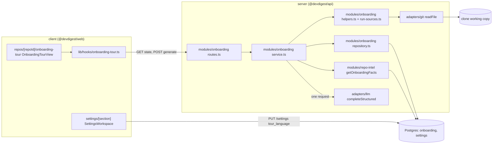
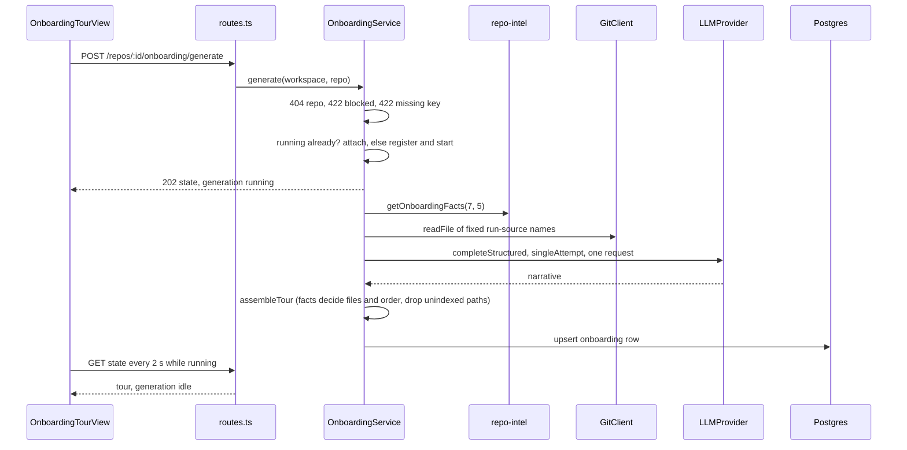
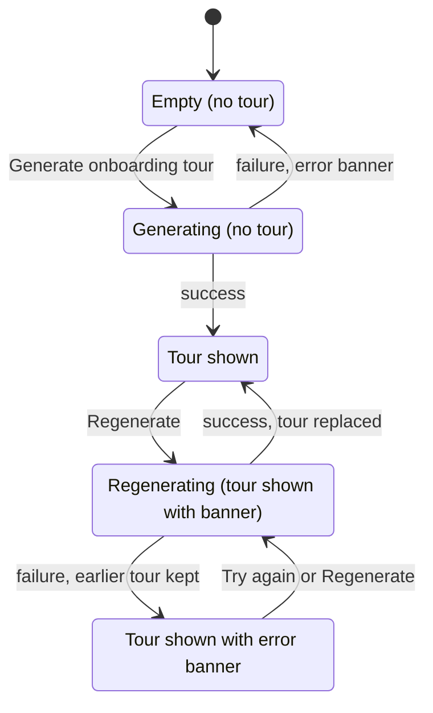

# Onboarding Tour — a guided introduction to a repository

How the studio turns the index of an imported repository into a five-part tour, end to
end: which facts come from the index and which text comes from the model, how a
generation runs, which states the page can be in, how the tour language and right-to-left
text work, and which constraints keep repository text and model output from doing harm.
Read this before touching the `onboarding` module, `RepoIntel.getOnboardingFacts`, the
`singleAttempt` flag of the LLM adapters, or the tour page in the studio.

Requirements: [`specs/onboarding-tour/spec.md`](../specs/onboarding-tour/spec.md)
(SPEC-03). The page does not index anything, does not run any command, and does not
generate a tour on its own: a tour exists only after the user asks for it.

## What it does

- A per-repository page, `/repos/<repoId>/onboarding-tour`, shows five sections in a
  fixed order: **Architecture overview**, **Critical paths**, **How to run locally**,
  **Guided reading path**, **First tasks**.
- **The index decides which files are shown and in which order; the model only writes
  words.** The reading path and the critical paths are computed from the repo-intel index
  without the model. The model writes the architecture prose and diagram, a one-line reason
  per listed file, the run commands, and the first tasks.
- A generation makes **exactly one** LLM request (no retry, no repair or follow-up
  request, no per-section request), runs only when the user clicks Generate or Regenerate,
  and its result is stored, so opening the page again costs no LLM request and no index work.
- The prose is written in the workspace's **Tour language** (English, Ukrainian or Hebrew).
  Headings, labels and buttons of the page stay English.

## Where it lives

One box per real module or folder:

`modules/onboarding` is registered statically in
[`modules/index.ts`](../server/src/modules/index.ts). `OnboardingService` takes ports, not
the container: the repository port, `repoIntel` (only `getIndexState` and
`getOnboardingFacts`), `GitClient`, an `llm(provider)` factory, `resolveModel`,
`hasSecret` and a clock. The container assembles it once as `container.onboarding`
([`container.ts`](../server/src/platform/container.ts)); it is a singleton because it owns
the in-memory generation registry. Only
[`repository.ts`](../server/src/modules/onboarding/repository.ts) touches Drizzle.

## The contract

[`contracts/onboarding-tour.ts`](../server/src/vendor/shared/contracts/onboarding-tour.ts)
is canonical in `server/src/vendor/shared`; `client/src/vendor/shared` holds an identical
copy, and the two must change together. It is not the legacy `Onboarding` contract in
`knowledge.ts`, which this feature does not use.

| Type | Content |
|------|---------|
| `OnboardingTour` | The stored tour: `generated_at`, `language`, `indexed_files` (the index's file count at generation time), `provider`, `model`, and the five sections. |
| Section fields | `architecture` `{ markdown, diagram \| null }`, `critical_paths` `[{ path, reason \| null, imported_by, imports }]`, `reading_path` `[{ rank, path, reason \| null }]`, `first_tasks` `[{ description, paths }]` and `run` `{ commands: string[] }`. Every section except `run` is `null` when it has nothing valid; `run.commands` is always an array. |
| `OnboardingTourState` | What `GET` and `POST` return: `tour \| null`, `generation` `{ status: idle \| running \| failed, started_at, error }`, `blocked`, `missing_key`, `tour_language`, `language_changed`, `index_changed`, `repo` `{ full_name, default_branch }`. |
| `OnboardingBlocked` | `{ reason, message, index_status, files_indexed }`; `reason` is `not_indexed`, `partial`, `degraded`, `no_clone` or `no_source_files`. Also the `details` of a 422 rejection. |
| `TourLanguage` | `English`, `Ukrainian` or `Hebrew`. A closed enum, because it is inserted into the prompt. |

`SettingsKnown.tour_language` (`contracts/platform.ts`) is `TourLanguage`, default
`English`. The tour is stored in the existing `onboarding` table (`repo_id` primary key,
`json`, `generated_at`; deleted with the repository by `ON DELETE CASCADE`); no migration
was added. A row whose JSON does not parse as `OnboardingTour` (an old shape) reads as "no
tour".

## What comes from the index and what from the model

| Section | Files and order | Written by the model |
|---------|-----------------|----------------------|
| Guided reading path | Top 7 files by index file rank, tests, configs, declaration files and migrations excluded, rank descending, ties by path ascending; numbered from 1. Fewer eligible files means a shorter list. | One reason per file, matched by exact path. |
| Critical paths | At most 5 distinct files taken from the dependency chains of `getCriticalPaths`, rank descending, ties by path ascending. Not junk-filtered. `imported_by` and `imports` are edge counts from the index. | One reason per file, matched by exact path. A number in a reason may only be one of those counts. |
| How to run locally | None. | Commands, taken only from the run sources (below). |
| First tasks | Any indexed path. | 3 to 5 tasks, each with a description and at least one indexed path. |
| Architecture overview | None. | Markdown prose and an optional Mermaid diagram. |

[`RepoIntelService.getOnboardingFacts`](../server/src/modules/repo-intel/service.ts) reads
the full ranked list, all edges and the critical-path chains, then the pure
[`buildOnboardingFacts`](../server/src/modules/repo-intel/onboarding-facts.ts) sorts and
cuts them. The same rows in any order give the same lists. It returns
`{ indexedPaths, readingPath, criticalPaths }`, where `indexedPaths` is the whole ranked
list and is the allow-list for every path the model names.

- **Critical chains.** `getCriticalPaths` seeds chains from the 5 highest-ranked files and
  follows the highest-ranked unvisited import target for a bounded number of hops; chains
  shorter than two files are dropped. A repository without import edges has no chains, so
  the section is `null`.
- **Junk filter.** `isJunkPath` matches substrings: `.test.`, `.spec.`, `.d.ts`,
  `__tests__/`, `__mocks__/`, `/test/`, `/tests/`, `/migrations/`, `/__fixtures__/`,
  `.config.`, `vitest.`, `jest.`, `eslint`, `prettier`. The path is prefixed with `/`
  before matching, so root-level `test/`, `tests/` and `migrations/` folders are excluded
  like nested ones, while look-alikes such as `contest/` or `latest.ts` stay eligible. The
  same function serves `getTopFilesByRank`, so conventions sampling shares the rule.
- **Flag off.** With `REPO_INTEL_ENABLED` off the facts are empty; see "Failure".

## Generating a tour

The route is
[`routes.ts`](../server/src/modules/onboarding/routes.ts): `GET /repos/:id/onboarding`
and `POST /repos/:id/onboarding/generate` (202; rate limit 10 per minute). Both are
workspace-scoped. The service in
[`service.ts`](../server/src/modules/onboarding/service.ts) works in this order:

1. **Repository.** Unknown id (or another workspace's): 404.
2. **Readiness**, from the index state and the clone (`evaluateReadiness`): no index row is
   `not_indexed`, status `partial` is `partial`, `degraded` or `failed` is `degraded`, no
   working copy is `no_clone`, zero indexed files is `no_source_files`. Rejected with 422
   and the `OnboardingBlocked` object in `details`.
3. **API key.** The provider of the **Onboarding Tour** feature model (Settings → Feature
   Models, default `openrouter`) must have a stored key. Otherwise 422 with
   `details: { reason: "missing_key", provider }`.
4. **Attach or start.** If a generation is running for this workspace and repository, the
   request attaches to it and makes no LLM request. Otherwise the registry entry is set
   with no `await` between the check and the set, and the work starts in the background.
   The call returns at once with `generation.status = "running"`.
5. **Background run.** The language and model are read when the generation starts; a later
   settings change affects only the next generation. The service fetches the facts, reads
   the run sources, renders the system prompt
   ([`onboarding.system.md`](../server/src/prompts/onboarding.system.md), `{{language}}`
   filled from the enum), builds the user message and makes **one** `completeStructured`
   call with `singleAttempt: true`, `maxRetries: 0`, temperature 0.2, 4,000 output tokens
   and a 120 s timeout. `assembleTour` builds the tour and the repository upserts it,
   replacing the earlier one.

**One request.** `singleAttempt` ([`adapters.ts`](../server/src/vendor/shared/adapters.ts))
makes the OpenAI, Anthropic and OpenRouter adapters
([`openai.ts`](../server/src/adapters/llm/openai.ts),
[`anthropic.ts`](../server/src/adapters/llm/anthropic.ts),
[`openrouter.ts`](../reviewer-core/src/llm/openrouter.ts)) skip their retry wrapper, run
one loop iteration and pass `maxRetries: 0` to the SDK, so one HTTP call is the most a
generation makes, on success and on every failure path. Rejections (steps 1 to 3) and
attached requests make none. The job runner is not used, because it retries.

**The model's output** (`OnboardingNarrative` in
[`helpers.ts`](../server/src/modules/onboarding/helpers.ts)) is a lenient schema: reasons,
prose, commands and tasks only. `assembleTour` then:

- takes files and order from the facts only; a reason is matched by exact path, a missing
  one becomes `null`, a reason for a path that is not a fact file is dropped;
- keeps a first-task path only if it is in `indexedPaths`, de-duplicates paths, drops a
  task with no description or no indexed path, and keeps at most 5 tasks;
- trims everything and turns an empty section into `null`;
- keeps a run command only if it is a single line (no CR, LF or NUL), at most 300
  characters, unique, and keeps at most 30.

### Run sources

[`run-sources.ts`](../server/src/modules/onboarding/run-sources.ts) reads files through
`GitClient.readFile` from the clone, and only fixed names (never a name from model
output): at the root `package.json`, `README.md`, `README`, `README.rst`, `README.txt`,
`CONTRIBUTING.md`, `docs/setup.md`, `docs/getting-started.md`, `docs/development.md` and
the four `docker-compose`/`compose` `.yml`/`.yaml` names; and `package.json`, `README.md`
and the compose files in up to 8 top-level folders taken from the indexed paths (folder
names limited to `[A-Za-z0-9._-]`, no leading dot). Missing files are skipped. A
`package.json` contributes only its string-valued `scripts`. Each file is cut at 6,000
characters and the total at 24,000. Nothing is executed or written; the model's commands
are not compared with the sources afterwards, the prompt requires them to come from there.

### The prompt

[`buildUserMessage`](../server/src/modules/onboarding/helpers.ts) names the language
explicitly (the system prompt does too), then lists the critical files and the reading-path
files with their counts, the file tree (top 300 indexed paths by rank) and the run sources.
Each block is wrapped by `wrapUntrusted` into an `<untrusted source="…">` block; the system
prompt tells the model that such blocks are data and never instructions. Paths, identifiers,
package names, scripts, commands, environment variable names and route patterns stay
verbatim in any language.

## Page states

`GET /repos/:id/onboarding` returns the whole page state from the stored JSON, the index
state row, the `tour_language` setting, the feature-model setting and whether a key is
stored for its provider. It makes no LLM request and computes no facts.
`blocked` and `missing_key` are recomputed on every read.

| Situation | What the page shows |
|-----------|---------------------|
| Loading | Skeleton. A failed read shows an error state with retry. Unknown repository: the studio's "repository not found" state. |
| No tour, idle | "Generate onboarding tour" empty state and button. Opening the page never starts a generation. |
| Running | Progress state, or the earlier tour with a banner "A new tour is being generated"; Generate, Regenerate and Try again are disabled; a polite live region announces start, success and failure. The hook polls every 2 s while `generation.status` is `running`, so a second tab, a reload or a return to the page picks the same generation up. |
| Tour stored | Heading "Onboarding for <repo>", Regenerate, Share link, the provenance line "Generated from index of N files · last refreshed <relative time>", the "On this page" list and the five sections. |
| Blocked | The `message` and "Index state: <status> · N indexed files" in a note; Generate and Regenerate are disabled; a stored tour stays visible. A 422 from POST is shown the same way. |
| Missing key | A note naming the provider with a link to `/settings/api-keys`; Generate and Regenerate are disabled. |
| Failed | An error banner with the reason and "Try again"; the earlier tour, if any, is untouched. |
| Stale | "Index changed since this tour was generated" and "Tour language changed since this tour was generated", as text next to Regenerate; nothing regenerates on its own. |
| Section is `null` | "Not enough data for this section" with a Regenerate button. A file without a reason is listed without a reason line. |

Staleness (`staleFlags`): `language_changed` is true when the stored language differs from
the current setting; `index_changed` is true when the index row's `updated_at` is later than
the tour's `generated_at` and the index exists. Both flags are `false` when no tour is
stored.

## Failure and degraded modes

- **The generation never throws into the request.** Any error inside the background run
  (the facts, the run sources, the LLM request, unreadable output, the save) is caught and
  kept in an in-memory failure entry as a bounded single-line text (300 characters, key-like
  tokens redacted). The next state read returns `generation.status = "failed"` with that
  text; the stored tour is not touched. Starting a new generation clears the entry.
- **Unreadable model output.** The adapter parses once and gives up; the generation fails,
  with no second request.
- **No indexed files.** If the facts contain no indexed path (for example
  `REPO_INTEL_ENABLED` is off, or the ranked list is empty although the index state says
  files exist), the run fails with "The index contains no source files" before any LLM
  request.
- **Partial or degraded index, no clone, zero files, no key.** Rejected up front (above),
  with no LLM request. There is no reduced or prose-only tour.
- **Missing sections.** A tour that is readable but has an empty or invalid section is
  stored; the page marks that section "Not enough data".
- **Restart.** The registry and the failure entry live in the API process. A restart drops a
  running generation and a remembered failure; a stored tour survives. A single API instance
  is assumed, as for run reaping.

## Language and right-to-left text

**Tour language** is a workspace-wide setting under Settings → Workspace
([`SettingsWorkspace`](../client/src/app/settings/[section]/_components/SettingsView/_components/SettingsWorkspace/SettingsWorkspace.tsx)),
with the options "English", "Українська" and "עברית"; an unset workspace is English. It is
saved with `PUT /settings`; any other value fails the `SettingsUpdate` schema with 422 and
the stored value stays. The panel holds only this setting. The setting is not specific to
the tour: the PR Brief on a pull request's Overview tab reads the same value when it
generates, and shows its own "Language changed since this brief was generated" note (see
[pr-brief.md](pr-brief.md)).

Each generation reads the value when it starts and stores it as `tour.language`; changing
the setting later raises "Tour language changed…" on the existing tour. The model is not
checked for answering in the wrong language; Regenerate is the remedy.

Hebrew is the only right-to-left language (`textDirection` in
[`TourText/direction.ts`](../client/src/app/repos/[repoId]/onboarding-tour/_components/OnboardingTourView/_components/TourText/direction.ts)).
The direction follows the stored tour's language, not the setting:

- Generated prose (the architecture markdown, reasons, task descriptions) gets `dir="rtl"`.
  The layout, headings, buttons, "On this page" list and numbers stay left to right.
- File paths, inline code, commands and the diagram are rendered by `TourCode`,
  `TourMarkdown` and `MermaidDiagram` with `dir="ltr"` and `unicode-bidi: isolate`, so they
  keep source order inside Hebrew text and copy unchanged.
- `PathReasonRow` always puts the path first, then **Open**, then the reason, whatever the
  language, so keyboard focus order does not depend on the tour language.

## Rendering generated content

Everything the model wrote is untrusted and is shown as inert text:

- **Prose** goes through `TourMarkdown` (`react-markdown` with `remark-gfm`): raw HTML is
  dropped (`skipHtml`), links render as plain text, images as their alt text. It does not
  use the shared `Markdown` primitive, whose links are clickable.
- **The diagram** is shown only if it starts with a known Mermaid keyword and passes
  `mermaid.parse`; it is rendered with `securityLevel: "strict"` (no scripts, no click
  handlers). If it is missing or does not parse, nothing is shown in its place, and the
  prose stays.
- **Commands** are plain text, copied verbatim, and never executed. A copy button per
  command (accessible name "Copy command N") and "Copy all" (one command per line) announce
  "Copied" or the failure; if the clipboard is unavailable the text stays selectable.
- **Open** is an `<a target="_blank" rel="noopener noreferrer">` whose URL
  `githubFileUrl(full_name, default_branch, path)`
  ([`github-urls.ts`](../client/src/lib/github-urls.ts)) builds from the repository's
  identity, its default branch and an indexed path, with branch and path segments encoded.
  A model-written URL is never used. Its accessible name states the path and that it opens
  a new tab.
- **Share link** copies `<origin><path>#<section id>` for the section marked in "On this
  page" and announces "Link copied". It works only where this studio runs; the button's
  tooltip and accessible description say so. A section anchor in the URL scrolls to that
  section on load. Section ids are `architecture`, `critical-paths`, `run`, `reading-path`
  and `first-tasks`.
- **Sections** are collapsible (`aria-expanded`), open on every visit; the "On this page"
  entry scrolls, moves focus to the section heading and marks itself current.

## Studio entry points

- **Sidebar:** an "Onboarding Tour" item in the WORKSPACE group
  ([`nav.ts`](../client/src/vendor/ui/nav.ts), a vendored file edited for this feature) opens
  the page of the active repository. `activeKeyFor`
  ([`helpers.ts`](../client/src/components/app-shell/helpers.ts)) highlights it on
  `/onboarding-tour` paths only, not on the add-repository page `/onboarding`.
- **Hooks:** `useOnboardingTour` and `useGenerateOnboardingTour`
  ([`onboarding-tour.ts`](../client/src/lib/hooks/onboarding-tour.ts)), query key
  `["onboarding-tour", repoId]`; the POST result is written into the cache.
- **Settings:** Settings → Feature Models → "Onboarding Tour" selects the provider and
  model; Settings → Workspace selects the language (shared with the PR Brief).

## Tests

Server unit suites: `onboarding-helpers.test.ts` (assembly, readiness, staleness, prompt),
`onboarding-run-sources.test.ts` (allowed files only, untrusted wrapping),
`onboarding-service.test.ts` (one LLM request on success and failure, rejections without a
request, attach, language and model read at start, earlier tour kept),
`repo-intel-onboarding-facts.test.ts` (ordering, ties, junk filter, counts, determinism),
`repo-intel-facade-degraded.test.ts`, `llm-single-attempt.test.ts` and, in reviewer-core,
`openrouter-single-attempt.test.ts`. Client: `TourMarkdown.test.tsx` (no raw HTML, no links),
`github-urls.test.ts` (encoding) and `nav.test.ts` (menu item and highlight). The page
components, the settings panel, the polling hook and the real Mermaid and clipboard
behaviour have no automated test; there is no DB-backed test of the module either.

## Known gaps

- `index_changed` compares the index's `updated_at` with the tour's `generated_at`. An
  incremental refresh that finds the same commit still touches `updated_at`, so the note can
  appear although nothing changed.
- A repository with a single unparsable file has a `partial` index and cannot get a tour.
- Run commands are not checked against the run sources after generation; the prompt and the
  sources given to the model are the only constraint. Run sources are read with a plain
  file read, without the symlink check that the context-docs store applies.
- The critical-path list is not junk-filtered, so a test or config file can appear there
  while it cannot appear in the reading path.
- The critical-path counts (`imported_by`, `imports`) are stored and given to the model,
  but the page does not display them.
- A generation in progress and a failure are not stored; they do not survive an API restart.
