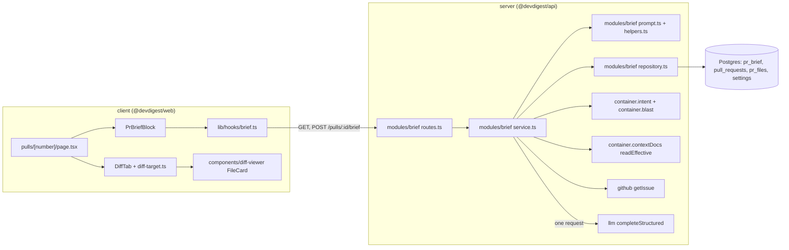
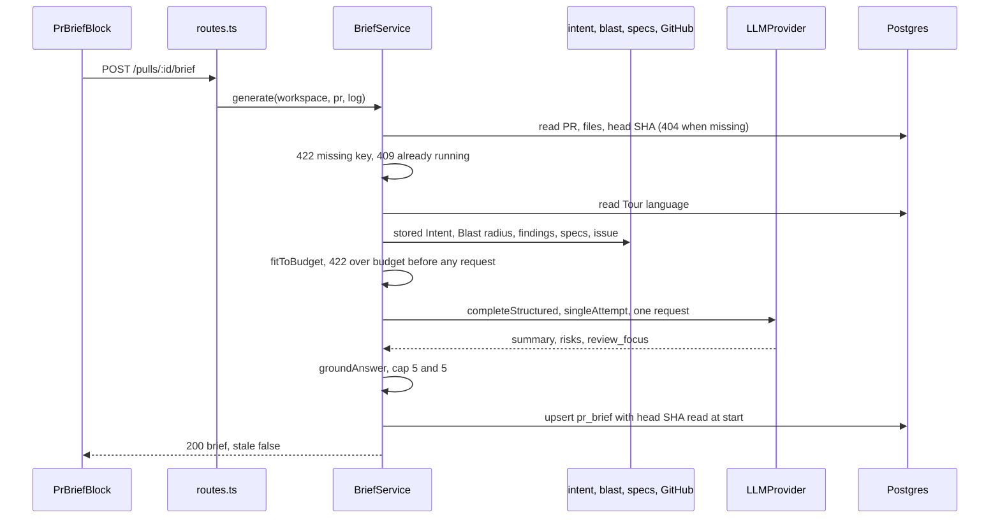
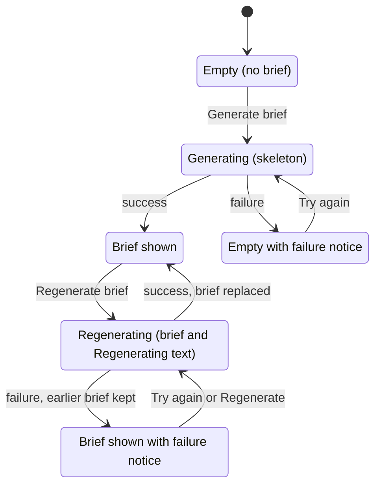
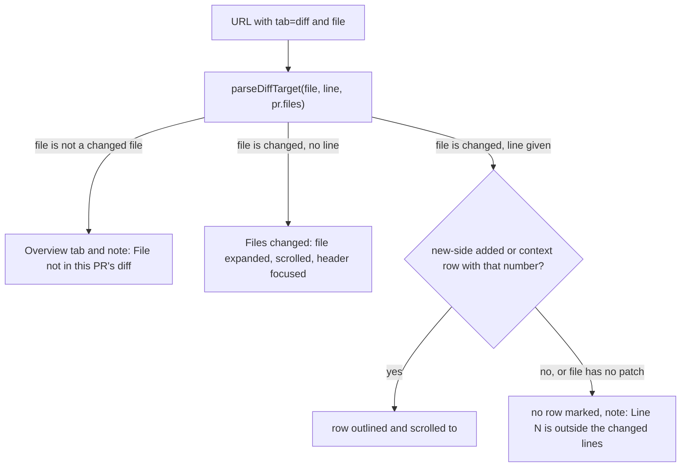

# PR Brief — a generated risk summary on the Overview tab

How the studio turns the facts it already holds about a pull request into one short brief,
end to end: which facts go to the model and within what budget, how the model's answer is
grounded before it is stored, how a stored brief becomes stale, which states the Overview
block can be in, how a click on a file reference lands in Files changed, and how the Tour
language and right-to-left text work. Read this before touching the `brief` module, the
`PrBrief` contract, the `PrBriefBlock` on the Overview tab, or the `?tab=diff&file=&line=`
deep link.

Requirements: [`specs/pr-brief/spec.md`](../specs/pr-brief/spec.md) (SPEC-04). A brief
exists only after the user asks for it: nothing in the studio or the API generates one on
its own, and reading a stored brief never calls the model.

## What it does

- The **Overview** tab of a pull request starts with a **PR Brief** block, above the PR
  description. It shows a one-paragraph summary of what the PR does and why, **Risk areas**
  (each with a title, a severity word, file links and an expandable explanation) and
  **Review focus** (up to five `path:line` starting points, each with a reason).
- **The model sees facts, never code.** It receives the PR title and description, the
  stored Intent, the Blast radius callers, diff totals, a per-file list with hunk header
  lines, the findings of the latest reviews, the first linked issue and the specification
  documents attached to the agents. No diff body line (added, removed or context) and no
  file content is ever sent.
- A generation makes **exactly one** model request (no retry, no repair or follow-up
  request), costs at most **8,000 input tokens**, and its result is stored per pull request,
  replacing the earlier brief.
- Every path in a stored brief is **grounded**: the server removes any file the model names
  that is not a changed file of the PR or a file of its Blast radius map.
- The prose is written in the workspace's **Tour language** (English, Ukrainian or Hebrew).
  Headings, labels, buttons and severity words stay in the studio's English copy.
- The block never changes Intent, Blast radius, Smart Diff or the review agents: Intent and
  Blast radius are read live from their own endpoints and are never copied into the brief.

## Where it lives

One box per real module or folder:

`modules/brief` is registered statically in
[`modules/index.ts`](../server/src/modules/index.ts). `BriefService`
([`service.ts`](../server/src/modules/brief/service.ts)) takes ports, not the container
([`types.ts`](../server/src/modules/brief/types.ts)): the repository port, the stored-Intent
reader (`intent.get`, never the deriving call), `blast.getForPull`, lambdas for findings,
specification paths and documents, the first issue reference, the GitHub client, an
`llm(provider)` factory, `resolveModel`, `hasSecret`, `classify`, the tokenizer and a clock.
The container assembles it once as `container.brief`
([`container.ts`](../server/src/platform/container.ts)); it is a singleton because it owns
the in-memory generation registry. Only
[`repository.ts`](../server/src/modules/brief/repository.ts) touches Drizzle.

## The contract

[`contracts/brief.ts`](../server/src/vendor/shared/contracts/brief.ts) is canonical in
`server/src/vendor/shared`; `client/src/vendor/shared` holds a byte-identical copy
(a server test compares them), and the two must change together. The file also still holds
the Intent, Blast radius, Risk, PR history and Smart Diff schemas that other modules use.

| Type | Content |
|------|---------|
| `PrBrief` | The stored brief: `summary`, `risks` (`kind`, `title`, `explanation`, `severity` high \| medium \| low, `file_refs`), `review_focus` (`file`, `line`, `reason`), `head_sha`, `generated_at`, `language`, `provider`, `model`, `tokens_in`, `tokens_out`, `cost_usd`, `input_tokens` (measured by the server tokenizer), `missing_inputs`, `shortened_inputs`. It has no `intent`, `blast` or `history` key. |
| `BriefMissingInput` | `{ input: intent \| blast \| specs \| issue, reason }`: an input that was not available when the brief was generated. |
| `BriefShortenedInput` | `{ input: specs \| issue \| callers \| description \| files, action: shortened \| left_out }`: an input cut to fit the token budget. |
| `PrBriefResponse` | What `GET` and `POST` return: `{ brief: PrBrief \| null, stale: boolean }`. `stale` is `false` when `brief` is `null`. |

The brief is stored as JSON in the existing `pr_brief` table (`pr_id` primary key, `json`;
deleted with the pull request by `ON DELETE CASCADE`); no migration was added. A row whose
JSON does not parse as `PrBrief` (for example one written with the earlier composed shape)
reads as "no brief". `pr_brief` has no workspace column, so every repository method is
scoped through `pull_requests`.

## What the model receives

`getPull` reads the PR row, its repository and its `pr_files` (path, additions, deletions,
patch) at the start of a generation; the patch is used only to extract hunk headers.

| Input | Content | Missing-input record |
|-------|---------|----------------------|
| PR title | Always sent; never shortened. | none |
| PR description | Sent when not empty. | none |
| Intent | Summary, in scope and out of scope of the **stored** Intent. A generation never derives one and makes no other model request. | `intent`, reason `not_derived` |
| Blast radius | The summary and the callers (`symbol — file:line`, de-duplicated). A degraded map, or one that throws, is ignored entirely, for the prompt and for grounding. | `blast`, reason the map reports (`degraded_reason`, else `degraded`), or `unavailable` |
| Diff totals | File count, additions, deletions; never shortened. | none |
| Per-file list | Per changed file: `path`, additions, deletions, Smart Diff role, and the full hunk header lines (`@@ -a,b +c,d @@ text`). Ordered by role (core, tests, wiring, docs, boilerplate), then path. | none |
| Review findings | `file:line`, severity and title of the findings of the newest review of each agent (`selectLatestReviews`). | none |
| Linked issue | Title and body of the **first** issue referenced in the PR description under the Intent layer's rules (`parseIntentLinks`), read with `GitHubClient.getIssue` and cut to 20,000 bytes. | `issue`, the bounded failure text, only when an issue is referenced and the read fails |
| Specification documents | The paths attached to every enabled agent and to the linked, globally enabled skills of those agents (`collectPaths`), de-duplicated, sorted by path, read as the effective document (local copy over repository) of the PR's repository. One unreadable or blank document is skipped without a record. | `specs`, reason `none_attached` or `unreadable` (paths attached but none usable) |

[`extractHunks`](../server/src/modules/brief/helpers.ts) reads only lines that start with
`@@`, so a body line (which starts with a space, `+`, `-` or a backslash) can never be
returned; a missing patch gives no hunks. A header line is capped at 300 characters.

The user message is assembled in [`prompt.ts`](../server/src/modules/brief/prompt.ts). A
`TASK:` line names the output language explicitly (the system prompt names
it too), and every source that can carry attacker-controlled text, namely the title,
description, Intent, Blast radius, file list, findings, issue and each specification
document, is wrapped by `wrapUntrusted` into an `<untrusted source="…">` block. The system
prompt ([`brief.system.md`](../server/src/prompts/brief.system.md)) tells the model that such
blocks are data and never instructions, that paths must be copied from the file list or the
Blast radius callers, that a line must lie in a `+c,d` range of that file or be a caller
line, that there are at most five risks and five focus items, and that paths, identifiers,
symbols and route patterns stay verbatim in any language.

### The 8,000-token budget

The measured input is the system message plus the user message, counted by the server
tokenizer (`container.tokenizer.count`). It never exceeds `BRIEF_INPUT_BUDGET_TOKENS`
(8,000, [`constants.ts`](../server/src/modules/brief/constants.ts)).
[`fitToBudget`](../server/src/modules/brief/prompt.ts) first measures the parts that are
never shortened: the system message, the language line, the title, the Intent and the diff
totals. If those alone exceed the budget the generation is rejected (see "Failure"). Otherwise
it reduces the other inputs one stage at a time, in this order, and stops as soon as the
text fits, cutting each stage only as far as needed:

1. Specification documents: whole documents are dropped, starting from the end of the path
   order.
2. Linked issue: the body keeps the largest prefix that fits (title kept); `left_out` when
   nothing fits.
3. Blast radius callers: the first N callers are kept, the summary stays.
4. PR description: the largest prefix that fits, or `left_out`.
5. The per-file list: first the review findings (only findings of files still listed are
   kept, then as many as fit), then files from the end of the role order, each file with its
   hunk headers.

Each stage that cuts something is recorded in `shortened_inputs` of the brief (findings
count as `files`, with `shortened`). The measured total is stored as `input_tokens`, and the
tokens per source go to the log line. The grounding allow-list is built from **all**
changed files, including ones the budget removed from the prompt.

## Generating a brief

The routes ([`routes.ts`](../server/src/modules/brief/routes.ts)) are `GET /pulls/:id/brief`
and `POST /pulls/:id/brief` (rate limit 10 per minute on POST). Both are workspace-scoped
and validate the response with `PrBriefResponse`. Unlike the onboarding tour, the POST is
**synchronous**: the request returns when the generation has finished, like Intent. The
service works in this order:

1. **Pull request.** Unknown id, or one of another workspace: 404. The PR row, its files
   and its head SHA are read here, once.
2. **API key.** The provider of the **Risk Brief** feature model (Settings → Feature Models,
   default `openai` / `gpt-4.1`) must have a stored key. Otherwise 422 with
   `details: { reason: "missing_key", provider }`. The model is resolved when the generation
   starts, so a later settings change affects only the next one.
3. **Registry.** If a generation runs for this workspace and pull request, the request is
   rejected with 409 and `details: { reason: "already_running" }`. The check and the set
   have no `await` between them; the entry is released in a `finally`.
4. **Facts.** Tour language (setting `tour_language`, English when unset or invalid), stored
   Intent, Blast radius, findings, specification documents, the linked issue. None of these
   reads fails the generation: Intent, Blast radius, specification documents and the issue
   are recorded as missing inputs when unavailable (table above), and a failed findings read
   is treated as no findings.
5. **Budget.** `fitToBudget`; 422 `over_budget` before the provider is resolved.
6. **One request.** `completeStructured` with the `BriefAnswer` schema, `singleAttempt: true`,
   `maxRetries: 0`, temperature 0.2, 3,000 output tokens and a 120 s timeout. The schema has
   no `min`/`max` (strict structured output rejects them); limits are applied afterwards.
7. **Grounding and storage.** See below. The brief is saved with the head SHA read in
   step 1, the generation time, the language, provider, `result.model` (falling back to the
   chosen model), tokens, cost, measured input size, and the missing and shortened inputs.

**One request.** `singleAttempt` ([`adapters.ts`](../server/src/vendor/shared/adapters.ts))
makes the LLM adapters skip their retry wrapper and pass `maxRetries: 0` to the SDK, the same
mechanism the onboarding tour uses (see [onboarding-tour.md](onboarding-tour.md)). Rejections
(404, missing key, 409, over budget) happen before the provider is resolved and make no
request; reading a stored brief makes none. The job runner is not used, because it retries.

### Grounding

[`groundAnswer`](../server/src/modules/brief/helpers.ts) compares every model-written path
with a set; a path from the model is never opened or fetched. The allow-list holds the
changed files of the PR plus, when the Blast radius is usable, the files of its changed
symbols and callers.

- A path is normalised first: trimmed, one leading `./` removed; empty, absolute and `..`
  paths are rejected. Comparison is exact and case-sensitive.
- **Risks.** An unknown reference is removed and duplicates are collapsed; a risk with no
  reference left is dropped.
- **Review focus.** An item with an unknown file, or a line that is not an integer of at
  least 1, is dropped.
- After that, at most the first 5 risks and the first 5 focus items are kept, in the model's
  order.

The server does **not** check that a focus line lies inside a hunk of that file. That check
happens when the link is opened (see "Opening a file from the brief").

## Reading a brief and staleness

`GET /pulls/:id/brief` returns the stored brief and a `stale` flag, or
`{ brief: null, stale: false }`, with no model request. `stale` is `true` when the stored
`head_sha` differs from the pull request's `head_sha` column now. A stale brief is returned
unchanged; nothing regenerates on its own.

`pull_requests.head_sha` is refreshed by polling
([`polling/routes.ts`](../server/src/modules/polling/routes.ts)), not by `GET /pulls/:id`
([`pulls/routes.ts`](../server/src/modules/pulls/routes.ts)), which refreshes files and body
but not the SHA. A brief can therefore describe new files while still reporting the old SHA
as current, until polling runs. The `POST` response always has `stale: false`.

## Failure and rejection

| Situation | API answer | Stored brief |
|-----------|-----------|--------------|
| PR not in the workspace (GET or POST) | 404 | untouched |
| No API key for the Risk Brief provider | 422, `details.reason = missing_key`, `provider` | untouched |
| A generation already runs for this PR | 409, `details.reason = already_running` | untouched |
| Never-shortened inputs alone over 8,000 tokens (for example an oversized Intent) | 422, `details.reason = over_budget`, `fixed_tokens`, `budget` | untouched |
| Provider error, timeout, or an answer that does not validate against `{ summary, risks[], review_focus[] }` | 502, `details.reason = generation_failed`, message bounded to one line of 300 characters with key-like tokens redacted | untouched |

An answer that fails validation is not stored and not retried. Any error inside the
generation after the registry entry was set is logged once (`log.error`, "brief: generation
failed", with the PR id, provider, model, error and duration) and the registry entry is
released.

On success exactly one structured line is logged (`log.info`, "brief: generation finished"):
PR id, measured input tokens and tokens per source, shortened inputs, missing inputs,
counts of risks, references and focus items returned, dropped by grounding and dropped by the
cap, language, provider, model, input and output tokens, cost and duration.

## The Overview block

[`PrBriefBlock`](../client/src/app/repos/[repoId]/pulls/[number]/_components/PrBriefBlock/PrBriefBlock.tsx)
is the first section of
[`OverviewTab`](../client/src/app/repos/[repoId]/pulls/[number]/_components/OverviewTab/OverviewTab.tsx).
The page composes it; the block owns its state. The hooks are in
[`lib/hooks/brief.ts`](../client/src/lib/hooks/brief.ts): `useBrief` (key
`["pr-brief", prId]`), `useGenerateBrief` (the POST result is written into that cache entry),
`useBriefGenerating` (mutation cache, so the busy state survives a tab switch) and
`useBriefSettings` (the Risk Brief provider, whether its key is missing, and the Tour
language).

| Situation | What the block shows |
|-----------|----------------------|
| No brief, idle | The "PR Brief" heading and a primary **Generate brief** button. Opening the page never sends a POST. |
| Generating, no brief | A skeleton in place of summary and sections; the button is disabled and `aria-busy`. |
| Generating, brief stored | The earlier brief with the text "Regenerating…" next to the disabled button. |
| Brief stored | In order: the verdict banner (below), the summary paragraph, the line "Generated <relative time> · commit <first 7 characters of the SHA> · <model>", then Intent card and **Risk areas** on the left, Blast radius card on the right, and **Review focus (N)** below. A secondary **Regenerate brief** button belongs to the block, with or without a review. |
| Verdict banner | The existing `VerdictBanner` of the Agent runs tab, from the newest `review` row that has a verdict (verdict, findings count, blockers, score, summary). Absent when the PR has no completed review; the rest of the block is unchanged. |
| Risk areas empty / Review focus empty | "No notable risks flagged." / "No review starting point was suggested for this PR." |
| Missing key | A note naming the provider with a link to `/settings/api-keys`; Generate, Regenerate and Try again are disabled; a stored brief stays visible. Decided on the client from settings and secrets status, and also enforced by the 422. Treated as "not missing" while settings load. |
| Outdated | "Outdated — generated for <first 7 characters of the stored SHA>", next to Regenerate, when `stale` is true. |
| Language changed | "Language changed since this brief was generated", when the stored language differs from the current Tour language. |
| Already running (409) | "Generation already running"; the block keeps showing what it showed. |
| Failed | The failure message and a **Try again** button; the earlier brief, if any, stays visible. |
| Missing inputs | "Missing inputs", one line per entry: `<Intent \| Blast radius \| Specification documents \| Linked issue>: <reason>`. The reason is the stored text as is (for example `not_derived`). |
| Not stored yet | Intent and Blast radius cards stay in their earlier place, below the block and above the description. Once a brief is stored they move into the block. |

All fixed labels come from the `brief` message namespace
([`messages/en/brief.json`](../client/messages/en/brief.json)). Notices are text, never colour
alone. Generation start, success and failure are announced through a polite live region.
Each risk row has an expand button (`aria-expanded`, `aria-controls`); severity is shown as
a word (the stored value, shown capitalised and styled upper case); long text and paths wrap.

Everything the model wrote is untrusted and is rendered as plain text nodes: no markdown, no
raw HTML, no links. The only links in the block are in-app links built from grounded paths
by `briefDiffHref` (below), with the file name URL-encoded.

## Opening a file from the brief

Each risk file reference and each Review focus item is an in-app link to the PR page:

- risk file: `/repos/<repoId>/pulls/<number>?tab=diff&file=<encoded path>`
- Review focus item: the same with `&line=<line>`, in monospace as `path:line`; its accessible
  name is "<path> line <line>".

[`parseDiffTarget`](../client/src/app/repos/[repoId]/pulls/[number]/_components/DiffTab/diff-target.ts)
returns `none` without a `file`, `target` for a file whose path equals a changed file's path
exactly, and `missing` otherwise. `line` counts only when it is a whole number of at least 1;
anything else means "no line". The page parses only when `tab=diff` and the PR has loaded.

- **File not in the diff.** The page shows the Overview tab with "File not in this PR's
  diff" in a polite live region above the block; the URL is left as it is. This also happens
  for a hand-edited value, a file removed by a later commit, and a **Blast radius caller
  file**: grounding allows those files in a brief, but they are not in the PR's diff, so a
  link to one lands on Overview with this message.
- **File in the diff.** [`FileCard`](../client/src/components/diff-viewer/FileCard/FileCard.tsx)
  expands the file (also a large file that starts collapsed), and in Smart order
  [`SmartDiffGroup`](../client/src/app/repos/[repoId]/pulls/[number]/_components/DiffTab/_components/SmartDiffGroup/SmartDiffGroup.tsx)
  opens its role group if it was collapsed. After render the card scrolls the marked row
  (centred) or, with no row, the file card into view, and moves keyboard focus to the file
  header (`tabIndex={-1}`, without a second scroll). Both Smart order and Original order pass
  the target on. The scroll offset is `--pr-header-h` plus, in Smart order, the group header
  height (48 px) plus 8 px, so the target clears the sticky headers.
- **The marked row** is the first parsed row whose new-side number equals `line` and whose
  kind is added or context (a removed row does not count). It gets a 2 px outline and
  `data-target-line`. The mark has no timer: it stays while the target is in the URL and ends
  when the user switches tab, which also removes `file` and `line` from the URL.
- **Line outside the diff, or a file without a patch.** The file is shown with no marked row
  and a note "Line <line> is outside the changed lines" (`role="status"`, polite) under the
  file header. A link without a `line` (a risk file) never shows this note.

## Language and right-to-left text

**Tour language** is the same workspace-wide setting the onboarding tour uses (Settings →
Workspace, key `tour_language`, closed enum `TourLanguage`; English when unset). Each
generation reads it when it starts, writes the summary, risk titles, explanations and focus
reasons in it (named in the system prompt and in the user message), and stores it as
`brief.language`. Changing the setting later raises "Language changed since this brief was
generated" on the stored brief; nothing regenerates. The model is not checked for answering
in the wrong language; Regenerate is the remedy.

Hebrew is the only right-to-left language
([`RTL_LANGUAGES`](../client/src/app/repos/[repoId]/pulls/[number]/_components/PrBriefBlock/constants.ts)).
Direction follows the **stored brief's** language, not the setting:

- The summary, risk titles, explanations and focus reasons are rendered by `BriefText` with
  `dir="rtl"` and `text-align: start`, so they are right-aligned. Layout, headings, buttons,
  notices, severity words and the DOM order stay left to right, so keyboard focus order does
  not depend on the language.
- File paths, `path:line` references and line numbers are rendered by `BriefCode` with
  `dir="ltr"`, `unicode-bidi: isolate` and `overflow-wrap: anywhere`, so they keep source
  order inside Hebrew text and are copied unchanged.

`BriefText` and its direction helper are local copies of the onboarding tour's `TourText`
pattern, not imports; likewise the live region.

## Tests

Server unit suites: `brief-contract.test.ts` (no `intent`/`blast`/`history` key; both
contract copies byte-identical), `brief-helpers.test.ts` (hunk extraction without body
lines; one grounding case for invented, absolute, `..` and line-below-1 inputs),
`brief-prompt.test.ts` (specs then issue cut first, Intent, title and totals kept, exact fit,
`over_budget`, untrusted wrapping with a forged closing tag) and `brief-service.test.ts` (one
single-attempt request on success, grounded answer stored with the head SHA, one info log, no
body line and untrusted wrapping, 404 for GET and POST, missing key, 409 with one request,
over budget without a request, provider error and unreadable answer: 502, one request,
earlier brief kept, secret redacted). DB-backed: `brief.it.test.ts` (empty GET, POST, GET
returns the same brief; `stale` after the head SHA moves; 404 for an unknown id and for
another workspace's PR with no model request).

Client: `PrBriefBlock.test.tsx` (stored layout and links, provenance, Intent and Blast slots;
no automatic POST, Generate posts once and shows the brief), `RiskAreas.test.tsx`,
`ReviewFocus.test.tsx`, `BriefText.test.tsx` (Hebrew `dir` and isolation, DOM order),
`helpers.test.ts` (`briefDiffHref` encoding, `isRtl`), `diff-target.test.ts`,
`FileCard.test.tsx` (a collapsed large file expands, the row is marked and stays marked, the
header is focused) and `DiffTab.test.tsx` (collapsed Docs group and file open, row marked,
header focused, Smart order).

## Known gaps

- **No real generation was run end to end.** There was no API key in the test environment,
  so answer quality, answering in Ukrainian or Hebrew, real token counts and the real
  provider's single HTTP request were not observed; tests use a mock provider.
- **Scroll, highlight and sticky offset were not seen in a real browser.** The seed PR has no
  patch text, and jsdom has neither layout nor `scrollIntoView` (it is stubbed). Back/Forward
  and "open in a new tab" were not exercised.
- **Edge cases are untested** (a minimal test profile was chosen): the risk/focus cap of 5,
  recording of missing inputs, language and model being read when a generation starts, the
  contents of the success log line, the later stages of the budget (callers, description,
  file list), the Outdated, language-changed, 409, failure, Try again, missing-key, Regenerating
  and skeleton states, the verdict banner, Original order, a target in a collapsed
  Smart Diff group beyond the Docs case, the "line outside" note, a file without a patch, the
  "File not in this PR's diff" fallback and `page.tsx` wiring.
- **The 409 registry is in the API process.** It protects a single API instance; a restart
  drops a running generation (its request fails), and two instances would not see each
  other's registry.
- **Staleness can lag.** `GET /pulls/:id` does not refresh `head_sha`; only polling does.
- **The busy state is local to the browser tab.** It comes from the mutation cache, not from
  the API: a reload or a second tab shows no running generation, and a second click gets 409.
  `GET` does not report that a generation runs.
- **A focus line is not checked against the hunks on the server**, only for being an integer
  of at least 1; a wrong line is caught at click time by the "outside the changed lines"
  note.
- **Stored provenance is only partly shown.** The block does not display `shortened_inputs`,
  `input_tokens`, tokens or cost, and shows a missing input's reason as the stored code or
  text.
- **The block reads only the data of the query.** A failed `GET` looks like "no brief", and
  Generate is enabled while the first `GET` is still loading.
- **The failure log line is shorter than the success line**: it has no token or cost fields.
