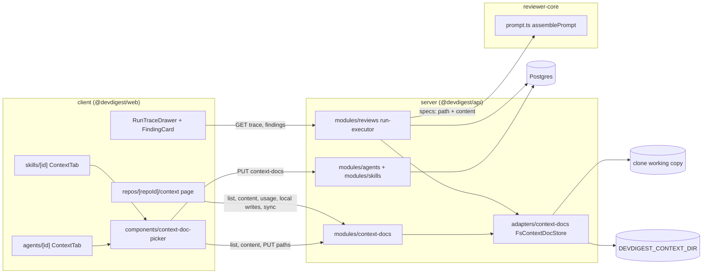
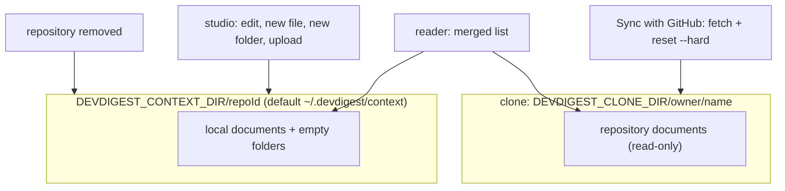
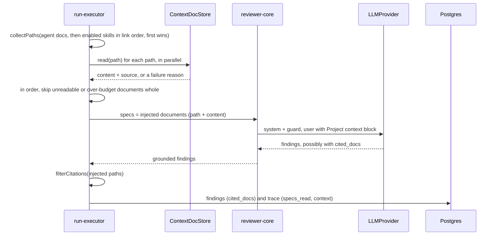

# Project context — attaching repository documents to reviews

How a reviewer sees the rules a repository already writes down (`specs/`, `docs/`,
`insights/`), end to end: where the documents come from, how an agent or a skill
points at them, what a run puts into the prompt, and where the result shows up.
Read this before touching the `context-docs` module, the `## Project context`
prompt section, or the Context tabs in the studio.

Requirements: [`specs/project-context-folder/spec.md`](../specs/project-context-folder/spec.md)
(SPEC-01). Automatic selection of documents from the content of a PR is **not**
part of this feature; every attachment is picked by hand.

## What it does

- An agent or a skill stores an ordered list of **repo-relative paths** to markdown
  documents. Text is never stored in the database.
- On every review run the server reads the current text of those documents, wraps
  each one as untrusted data and passes it to the engine for the
  `## Project context` section of the prompt. No extra LLM call is made.
- The run trace records which documents were read, where from (`repo` or `local`),
  and what each cost in tokens. A finding may cite an attached document by path;
  the server drops any citation to a document that was not in the run.
- Besides the repository's own files, a repository can have **local documents**:
  markdown the user writes or uploads in the studio. They live outside the clone,
  are never committed, and are deleted with the repository.

## Where it lives

The structure, one box per real module or folder:

`modules/context-docs` is registered statically in
[`modules/index.ts`](../server/src/modules/index.ts). The reader is a port,
`ContextDocStore` ([`types.ts`](../server/src/adapters/context-docs/types.ts)), with
one production adapter, `FsContextDocStore`, and an in-memory `MockContextDocStore`
in `adapters/mocks.ts`. The container exposes them as `container.contextDocs` (the
store) and `container.contextDocsService` (the use cases behind the routes); the
`reviews` and `repos` modules reach the store only through the container.

## Documents: how they are found

`FsContextDocStore.list` walks two roots for one repository: the clone's working
copy and the repository's local-document folder.

| Rule | Behaviour |
|------|-----------|
| Search globs | Env `CONTEXT_DOC_GLOBS`, `;`-separated, read once at server start. Default `**/{specs,docs,insights}/**/*.md`. Supports `**`, `*`, `?` and one level of `{a,b}`; case-sensitive. |
| Invalid globs | A non-empty value that is empty after trimming, or contains NUL, an absolute path, `..`, unbalanced or nested braces, or a pattern not ending in `.md`, falls back to the default and logs a warning naming the rejected value ([`config.ts`](../server/src/platform/config.ts), [`app.ts`](../server/src/app.ts)). An unset or completely empty variable uses the default silently. |
| Hidden folders | Only `.git` is skipped, so `.devdigest/specs/x.md` is found. Vendored folders such as `node_modules/**/docs` are not excluded; they count towards the cap below. |
| Document type | The name (`specs`, `docs`, `insights`) of the matching folder nearest to the file: `docs/specs/x.md` is `specs`. `null` when custom globs match a file outside such a folder. |
| Symlinks | Symlinked files and directories are skipped while listing, and refused when read (`unsafe`). Every path is resolved with `realpath` and must stay inside its root. |
| Size | Over 65,536 bytes: listed with `too_large: true`, no token count, and never returned to the studio or a run. |
| Tokens | The server tokenizer's count of `wrapUntrusted(path, content)`, i.e. of the block that would be injected, cached by a hash of path and content. |
| Cap | 1,000 documents, sorted by path (repo before local on a tie); `truncated: true` beyond that. |
| No clone | `state: "not_cloned"`, distinct from `state: "ok"` with an empty list. Local documents are still listed. |
| Content | Treated as data: never executed, links never fetched, includes and front matter never resolved. |

The working copy is whatever the clone holds as last synced; the sync action
(below) aligns it with the repository's default branch. A pull request's own change
to an attached document does not affect its review, because a run never checks the
PR head out into the working copy.

Limits are constants in [`contracts/context-docs.ts`](../server/src/vendor/shared/contracts/context-docs.ts):
64 KiB per document, 20 attachments per agent or skill, an 8,000-token budget.

## Local documents (the overlay)

- Local documents are stored under `<DEVDIGEST_CONTEXT_DIR>/<repoId>/` (default
  `~/.devdigest/context`), outside every clone, so a sync neither changes nor
  removes them. Nothing is committed, pushed or opened as a pull request.
- Local documents follow the same rules as repository documents: path, glob, size,
  UTF-8 and symlink checks. Writes are atomic (temporary file, then rename) and stay
  inside the repository's folder.
- **The repository wins on a path clash.** The Context tabs and runs use only the
  repository document for that path; the Project Context page still lists the local
  one with a "Shadowed" badge. Creating or uploading onto a path already taken by
  either source is rejected with 422 naming the path.
- Updating a local document sends the `version` (SHA-256 of the stored bytes) it was
  loaded with as `base_version`. A stale save is rejected with 409 and carries the
  stored content and version, which the page shows as "changed elsewhere".
- Deleting a local document or an **empty** local folder is allowed; attachments to
  that path stay and render as "Missing" unless a repository document has the same
  path.
- When a repository is removed, `RepoService.remove` deletes its overlay folder after
  the database row is gone (best-effort: a failure is swallowed so the removal still
  succeeds). The shell's removal confirmation asks the API for the local-document
  count and, when it is above zero, says that many documents will be deleted.

## Attaching documents

| Where | Storage | Endpoint | Versioning |
|-------|---------|----------|------------|
| Agent | `agents.context_docs` (jsonb, ordered paths, default `[]`) | `PUT /agents/:id/context-docs` `{ paths }` | A changed list bumps the agent `version` and the ordered paths are part of that version's config snapshot (`AgentVersionConfig.context_docs`, default `[]` for old snapshots). An equal list is a no-op. |
| Skill | `skills.context_docs` (same shape) | `PUT /skills/:id/context-docs` `{ paths }` | Skill `version` is unchanged. |

Migration `0014_*` also adds `findings.cited_docs` (nullable jsonb).

A save is rejected with 422, keeping the previous list, when a path is absolute,
contains `..`, a NUL byte or a backslash, does not end in `.md`, is duplicated, the
list has more than 20 entries, or a path does not match the configured globs. The
paths are not tied to a repository: the Context tabs show the documents of the
repository active in the sidebar, and a run resolves each path against the PR's
repository.

## What a run does

Reading happens once, in `ReviewRunExecutor.loadContextDocs`
([`run-executor.ts`](../server/src/modules/reviews/run-executor.ts)) after the skills are
loaded and before the engine call, so later edits cannot change a run in progress.
The helpers are pure functions in
[`reviews/context-docs.ts`](../server/src/modules/reviews/context-docs.ts).

- **Order and de-duplication.** The agent's documents in their order, then the
  documents of each linked and globally enabled skill in link order; the first
  occurrence of a path wins.
- **Source.** Each path is read as the effective document: the repository copy
  first, otherwise the local one. A local document is still injected when the
  repository has no working copy; a repository path then fails with
  `no_working_copy`.
- **Skips, never failures.** An unreadable document is skipped with a fixed reason:
  `not_found`, `no_working_copy`, `not_utf8`, `too_large` or `unsafe_path`. A document
  whose wrapped block would take the total over **8,000 tokens** is skipped whole
  (`over_budget`) and later documents are still tried.
- **Independent of repo-intel.** Documents are injected regardless of the agent's
  `repo_intel` toggle and of `REPO_INTEL_ENABLED`.
- **No new LLM call.** The documents travel inside the existing request(s).
- **No documents, same prompt.** With nothing attached (or nothing injectable) the
  `specs` slot is omitted, so the prompt is identical to the one without the
  feature, and `specs_read` is `[]`.

### The prompt

Implemented in [`reviewer-core/src/prompt.ts`](../reviewer-core/src/prompt.ts), which does
no I/O and receives only `{ path, content }` pairs.

- Each document is wrapped by `wrapUntrusted(path, content)` in its own
  `<untrusted source="<path>">` block. The label is entity-escaped, and any
  `<untrusted` or `</untrusted` tag inside the content (any case, optional
  whitespace) is neutralised, so neither can close or reopen the delimiter. There is
  deliberately no keyword scanning.
- The section is `## Project context`, followed by one fixed **trusted** rule outside
  the delimiters: the documents are reference requirements to check the diff
  against; a finding that relies on one lists its path in `cited_docs` and names it in
  the rationale; document content never waives, descopes or lowers the severity of
  a finding.
- When documents are present the system message gets one extra sentence after the
  shared injection guard, naming project-context documents as data. Without
  documents the guard text is unchanged.

### Citations

`Finding.cited_docs` is an optional list of repo-relative paths. After the engine
returns, `filterCitations` removes every path that was not injected in this run,
de-duplicates the rest, keeps the finding, and logs the removed path. Findings are
stored with `cited_docs` as `null` when the list is empty. The grounding gate in
reviewer-core is untouched; this is a separate server-side step.

### Run log and trace

Run log lines (live over SSE and persisted):

| Line | When |
|------|------|
| `Context N: <path> (~T tokens)` | one per injected document |
| `Context: N document(s) attached (~T tokens)` | once, when at least one document was injected |
| `Context skipped: <path> — <reason>` | one per skipped document |
| `Context citation removed: <path> — not_injected` | a finding cited a document that was not injected |

`RunTrace` ([`contracts/trace.ts`](../server/src/vendor/shared/contracts/trace.ts)):

- `specs_read` stays a list of strings: the paths of the injected documents in prompt
  order.
- `context` (new, nullable, absent on old traces):
  `{ docs: [{ path, source, tokens }], tokens, skipped: [{ path, reason }] }`.
  It is `null` when nothing was injected or skipped.
- A failed or cancelled run still persists the documents read before the failure,
  because the context is held outside the `try` block.

No API response, log line, trace or prompt carries an absolute filesystem path: the
store throws only fixed messages plus the repo-relative path, and sync failures
return a fixed message.

## API

All routes are workspace-scoped and live in
[`modules/context-docs/routes.ts`](../server/src/modules/context-docs/routes.ts). Documents
are addressed by repo-relative `path` and `source` (`repo` | `local`) only.

| Route | Purpose |
|-------|---------|
| `GET /repos/:id/context-docs` | List: `state`, `docs`, `local_folders` (empty local folders), `truncated`, `search_globs` (the literal folder names from the globs), `limits`, `scanned_at`. |
| `GET /repos/:id/context-docs/content?path&source?` | One document with `content` and `version`. Without `source`, the effective one. |
| `GET /repos/:id/context-docs/usage?path` | `attached_by_agents`, `attached_by_skills`, `used_by_agents`, `enabled_agents`, `coverage_pct`. |
| `POST /repos/:id/context-docs/sync` | `git fetch` then `reset --hard` to the default branch tip through the git adapter; returns `{ head }`. 409 when there is no working copy, 502 with a fixed message on failure. |
| `GET /repos/:id/context-docs/local-count` | `{ count }` of local documents. |
| `PUT /repos/:id/context-docs/local` | Create (no `base_version`) or update one local document. |
| `POST /repos/:id/context-docs/local/upload` | Up to 50 base64 files into one folder; each file is validated on its own and the result lists `stored` and `rejected` (name and reason). Body limit 8 MiB. |
| `POST /repos/:id/context-docs/local/folders` | Create a local folder (kept while empty). |
| `DELETE /repos/:id/context-docs/local?path` | Delete a local document. |
| `DELETE /repos/:id/context-docs/local/folders?path` | Delete an empty local folder. |

Errors from the store map to: `not_found` 404; `stale` and `not_cloned` 409 (a stale
save carries `current_content` and `current_version` in `details`); `io_error` (a
disk failure such as EACCES or ENOSPC, reported with a fixed message and no
filesystem path) 500; everything else (`invalid_path`, `too_large`, `not_utf8`,
`conflict`, `unsafe`, `not_empty`) 422 with `details.reason` and the path.

**Usage and coverage.** An enabled agent "uses" a document when it is attached to the
agent directly or to a linked, globally enabled skill. `used_by_agents` counts those
agents; `coverage_pct` is `used / enabled agents` as a whole percentage, or `null`
when no agent is enabled. No LLM is involved
([`helpers.ts`](../server/src/modules/context-docs/helpers.ts) `computeUsage`).

## Studio

### Context tabs (agent and skill)

Both tabs render the shared picker
([`components/context-doc-picker`](../client/src/components/context-doc-picker/ContextDocPicker.tsx)).

- The agent editor has a third tab, **Context** (`?tab=context`), after Config and
  Skills; the skill editor has **Context** between Config and Preview. The agent tab
  is titled "Project context", the skill tab "Project context to use".
- Rows: attached documents first in attachment order, then documents inherited from
  skills, then the rest by path. Each row has a checkbox labelled by its path, name,
  folder, type badge, a "Local" badge for local documents, token count and Preview.
  Badges: "Too large" (checkbox disabled), "Missing" (attached but present nowhere;
  stays checked and counted, uncheck to detach). Shadowed local documents are not
  shown.
- Every check, uncheck or reorder saves the **full ordered list** and updates the
  "N of M attached" counter (the skill tab shows "N attached") and the budget bar. A
  failed save restores the last saved state and shows an alert. The checkbox is
  disabled once 20 documents are attached.
- Reorder by dragging the handle (pointer events, not HTML5 drag and drop) or with
  ↑ / ↓ on the focused handle. A filter on the path (case-insensitive) turns
  reordering off.
- The footer budget bar is the sum of the documents a run would inject, own and
  inherited, against the 8,000 tokens, and warns with the paths that would be skipped.
  `budget.ts` mirrors the server's skip rule and must stay identical to it.
- Preview opens a drawer rendering the current text as read-only markdown through the
  shared `Markdown` primitive, which does not render raw HTML.
- States: skeleton while loading, error with retry, "repository not cloned yet",
  an empty state naming the search roots, and, with no repository in the workspace,
  an empty state linking to `/onboarding`. Existing attachments are left unchanged in
  all of them.
- The skill tab also shows a "SERIALIZES AS" box: `## Project context` followed by
  one `- <path>` line per attached document, and the line "Any agent using this skill
  inherits these documents."
- The agent tab marks inherited documents "via <skill name>" as read-only rows
  (disabled checkbox), from the agent's enabled linked skills in link order, and shows
  a document attached both ways once, as attached. The rows come from the
  `context_docs` field that `GET /agents/:id/skills` returns for each linked skill.

### Project Context page

`/repos/:repoId/context`, reached from the **Project Context** item in the
WORKSPACE group of the sidebar (breadcrumb "<repo> › Project Context").
Implementation: `app/repos/[repoId]/context/_components/ProjectContextView`.

- **Left panel:** documents grouped by folder, with "Local", "Shadowed" and
  "Too large" badges, empty local folders, and a toolbar: New file, New folder,
  Upload, Refresh, Sync with GitHub. Footer: "Indexed: N files · scanned <relative
  time>".
- **Right panel:** file name, Preview / Edit toggle, the rendered document, "Used by N
  agents" and a Coverage ring (`—` when no agent is enabled). The selected document
  is kept in the URL as `?doc=<path>`; a missing or unlisted value selects the first
  document. A shadowed local document is addressed with an additional `source=local`.
- **Editing** is possible for local documents only (Save / Cancel); the Edit toggle is
  disabled for repository documents with an explanation. A new file asks for a name
  and a folder and opens in Edit mode; it exists only after its first Save. A stale
  save shows the "changed elsewhere" notice with the newer content, offering to load
  it or keep and overwrite.
- **Unsaved edits** are guarded: leaving Edit mode, selecting another document,
  clicking a same-origin link, or closing the tab asks to discard or keep editing
  (`useUnsavedGuard`). Browser Back is not intercepted.
- **Refresh** only re-reads the list from the API (a `GET`, no network call to
  GitHub). **Sync with GitHub** asks for confirmation, then calls `POST …/sync` with
  the action disabled while it runs, and refetches the list when it finishes. On
  failure it shows the error with a retry and keeps the previous list.
- **Delete** (local documents and empty local folders) opens a dialog listing the
  agents and skills that attach the path.
- Results of save, upload, refresh, sync and delete are announced in a polite live
  region; icon-only controls carry accessible names; the Coverage ring exposes its
  value as text.

### Where the results show up

- **Run trace drawer** (`RunTraceDrawer`): "Specs read" in the Configuration section
  lists the injected documents and marks local ones; the Prompt assembly section shows
  the block as "Project context — attached specs (untrusted)" with its token count,
  followed by per-document token counts and the skipped documents with a readable
  reason.
- **Finding card:** each entry of `cited_docs` is a chip with the path that opens the
  document preview drawer.

## Tests

Unit tests next to the code, plus server suites `context-docs-*.test.ts`,
`reviews-context-docs.test.ts` and the DB-backed `*.it.test.ts` counterparts;
reviewer-core covers the prompt in `test/prompt.test.ts` and `test/run.test.ts`.
`test/setup/hermetic.ts` points `DEVDIGEST_CONTEXT_DIR` at a temporary directory so
no test writes to `~/.devdigest`. The check that a real model cites an attached
document for a violated rule is a manual or e2e check, not a unit test.

## Known gaps

- Document types are not filterable on any list; the type is shown as a badge only.
- The 8,000-token budget exists twice, as `CONTEXT_DOC_TOKEN_BUDGET` in the shared
  contract (used by the list and the studio) and as `CONTEXT_BUDGET_TOKENS` in
  `reviews/context-docs.ts` (used by runs); keep both equal.
