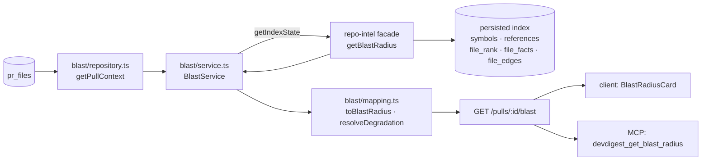
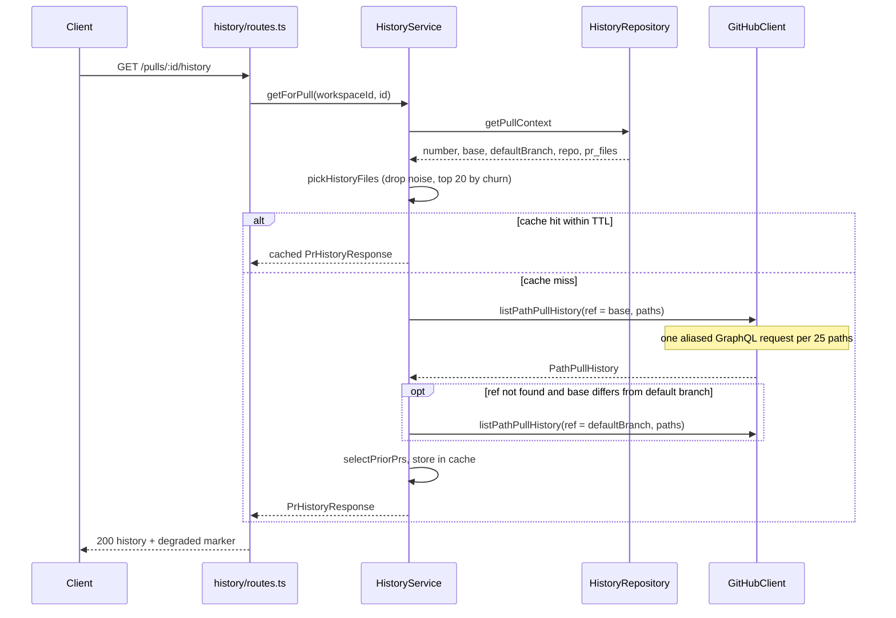
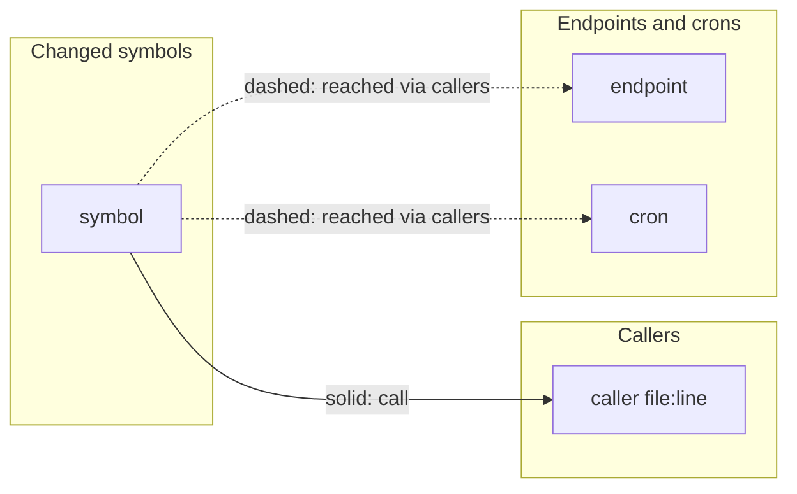

# Blast radius — impact map and prior PRs of a pull request

How DevDigest answers "what else can this PR break?" and "who touched these files
before?". Read this before changing the `blast` or `history` modules, the
`GitHubClient.listPathPullHistory` port, or the Blast radius card in the studio.

Two independent reads feed one card on the PR Overview tab:

| Read | Route | Source of truth | Cost |
|------|-------|-----------------|------|
| Impact map (symbols, callers, endpoints, crons) | `GET /pulls/:id/blast` | the persisted repo-intel index in Postgres | DB reads only |
| Prior PRs touching the same files | `GET /pulls/:id/history` | GitHub GraphQL, cached in memory | one GraphQL request per 25 files |

Neither route calls an LLM, and neither writes to the database. Both answer `200`
even when the data is unavailable: the body carries `degraded: true` and a reason
instead of an error, so the Overview never fails because of them. An unknown pull
id is a `404`, a non-UUID id is a `422` (`IdParams`).

## Impact map — `GET /pulls/:id/blast`

The map is assembled from data that already exists. Nothing is parsed or
re-indexed while the request runs.



1. `BlastRepository.getPullContext` reads the pull (scoped to the workspace) and
   its changed file paths from `pr_files`, sorted by path.
2. `BlastService.getForPull` decides whether the index may be read at all (see
   [Degraded states](#degraded-states)). Only when the index status is `full` or
   `partial` does it call `repoIntel.getBlastRadius(repoId, files)`, exactly once.
   It deliberately skips the call otherwise, because the facade's fallback would
   rescan the clone with ripgrep, which this feature must not do.
3. On the persistent path the facade returns the symbols declared in the changed
   files, their resolved callers (references whose declaring file is a changed
   file), and the endpoint/cron facts of the caller files. It also follows reverse
   import edges (`file_edges`) from each caller file up to `BFS_DEPTH`, so an
   endpoint in a file that imports a caller file is attributed to that caller
   (`reachableFactsByFile`).
4. `toBlastRadius` (pure, `blast/mapping.ts`) groups the flat caller list by the
   changed symbol it reaches:
   - a caller located in the file that declares the same symbol is dropped;
   - duplicates (`symbol|file|caller|line`) are removed;
   - callers sort by file rank (descending), then file, then line, and are capped
     per symbol;
   - a symbol's endpoints and crons are the union over its kept callers' files;
   - `downstream` lists only symbols that have at least one caller, ordered by
     best caller rank, then caller count, then name. Both clients keep this
     order and never re-sort.
5. `summarizeBlast` builds the one-line `summary`, for example
   `2 changed symbols · 14 callers · 3 endpoints · 1 cron/job`. Endpoints and
   crons are counted once even when several symbols reach them.

"Changed symbols" means every symbol declared in a changed file, not only the
edited hunks, so the counts can exceed what the diff touched. The index reflects
the repository at `indexed_sha`, not the PR head, so a symbol that exists only in
the PR is not in the map.

### Contract

`PrBlastRadiusResponse` (`vendor/shared/contracts/blast.ts`) is the existing
`BlastRadius` from `brief.ts` plus three fields:

| Field | Meaning |
|-------|---------|
| `changed_symbols[]` | `{ name, file, kind }` for every symbol declared in a changed file |
| `downstream[]` | per symbol with callers: `symbol`, `callers[]` (`{ name, file, line }`), `endpoints_affected[]`, `crons_affected[]` |
| `summary` | the one-line count string |
| `degraded` | `true` when the map is empty or possibly incomplete because of the index |
| `degraded_reason` | `flag_off` · `index_failed` · `index_partial` · `repo_too_large` · `no_data`, or `null` |
| `indexed_sha` | commit the caller line numbers refer to; `null` when there is no index |

The response is a superset of `BlastRadius`, so it also parses as one. The
reason literals are the same as `DegradedReason` in `repo-intel/types.ts`; a
compile-time guard in `blast/mapping.ts` fails the build if the two drift apart.
The contract is canonical in `server/src/vendor/shared` and copied to
`client/src/vendor/shared`; MCP reads the server copy through its path alias.

### Degraded states

`resolveDegradation` picks the marker in this order:

| Condition | `degraded_reason` | Map |
|-----------|-------------------|-----|
| `REPO_INTEL_ENABLED` is off | `flag_off` | empty, facade not called |
| index status is not `full`/`partial` | the index's own reason, else `index_failed` (status `failed`) or `no_data` | empty, facade not called |
| the facade reports `degraded` | the facade's reason, else `no_data` | as returned |
| index status is `partial` | `index_partial` | as returned |
| otherwise | `null` (`degraded: false`) | as returned |

A repo that was never indexed reports status `degraded` with reason `no_data`.
A PR with no rows in `pr_files` returns an empty, non-degraded map (or
`index_partial` when the index is partial), again without calling the facade.

**Resync.** The card offers a button that calls `POST /repos/:id/resync`
(`repo-intel` module: fetch from origin and reindex incrementally) for the
reasons a resync can fix: `no_data`, `index_failed`, `index_partial`. It does not
offer it for `flag_off` or `repo_too_large`. After a successful call the card
re-reads the map every 3 seconds until the response is no longer degraded or
2 minutes pass.

### Limits and where they live

| Constant | Value | File | Effect |
|----------|-------|------|--------|
| `MAX_CALLERS_PER_SYMBOL` | 20 | `server/src/modules/repo-intel/constants.ts` | callers kept per changed symbol, applied by the facade and again by `toBlastRadius` |
| `BFS_DEPTH` | 2 | same file | caller file plus the files that directly import it are searched for endpoints and crons |
| `RESYNC_POLL_MS`, `RESYNC_POLL_MAX_MS` | 3000, 120000 | `BlastRadiusCard/constants.ts` | polling after a resync |
| `GRAPH_MAX_*`, `GRAPH_LABEL_MAX_CHARS` | see [Graph view](#graph-view) | `BlastGraph/constants.ts` | graph caps |

No limit is hard-coded in a React component. The server log shows one line per
request: `Blast radius: read from persisted index` (repo, index status and sha,
changed files, symbol/caller/endpoint/cron counts, degradation, duration) or
`Blast radius: index not usable, nothing read` (repo, reason). The empty-files
case returns without a log line.

### MCP tool

`devdigest_get_blast_radius` (`mcp/src/tools/get-blast-radius.ts`) resolves
`owner/repo#N` to the pull, calls this route and renders the same map as text:
the summary, an `Index incomplete (<reason>)` line when degraded, then each
symbol with its callers as `file:line`, its endpoints and its crons/jobs. It
lists every caller the API returned in both response formats; `detailed` adds the
caller function name and `indexed_sha`. Output is truncated to a character
budget. A PR that was never imported is not synced on demand.

## Prior PRs — `GET /pulls/:id/history`

Lists earlier merged PRs that touched the same files, most overlapping first. It
uses the GitHub API, not the local index, and ranks deterministically.



1. **Context.** `HistoryRepository.getPullContext` joins the pull with its repo
   (workspace-scoped) and reads `pr_files` with additions and deletions. No rows
   means `no_files`: the files of a PR are filled when the PR is opened in the
   studio.
2. **File selection.** `pickHistoryFiles` drops noise (lockfiles such as
   `pnpm-lock.yaml`, anything under `vendor`, `dist`, `build`, `node_modules` or
   `__snapshots__`, files ending in `.lock`, `.snap` or `.min.js`, and names
   containing `.generated.`), ranks the rest by additions plus deletions
   (descending, then path) and keeps the first 20. If nothing remains the answer
   is an empty, non-degraded list.
3. **Cache.** An in-memory map keyed by `repoId | base | PR number | paths`
   serves repeated reads for 10 minutes, holds at most 200 entries and evicts the
   oldest first. Only successful results are stored, so adding a token takes
   effect on the next request. The cache is per process and lost on restart.
4. **GitHub read.** `GitHubClient.listPathPullHistory` issues one GraphQL query
   that aliases `history(path: $pN, first: $n)` per path on the base branch, with
   `associatedPullRequests(first: $m)` per commit. Paths travel only as GraphQL
   variables, never inside the query text. The Octokit adapter
   (`adapters/github/octokit.ts`, query text and parsing in
   `adapters/github/path-history.ts`) clamps both counts to 1..100, splits the
   paths into chunks of 25, and runs each chunk with the usual retry and
   30 second timeout. If GitHub reports the base ref as missing, the service
   retries once with the repository's default branch.
5. **Selection.** `selectPriorPrs` (pure, `history/selection.ts`):
   - keeps only merged PRs and drops the current PR; when the current PR is itself
     already merged, only PRs merged strictly before it count;
   - drops PRs that changed more than 100 files (mass refactors);
   - merges duplicates by PR number, collecting the overlapping paths in request
     order;
   - sorts by overlap size, then merge time, then PR number (all descending) and
     keeps 8;
   - writes a `notes` line such as `Touches 3 of the same files (12 files changed
     in total)`.

### Contract and degraded states

`PrHistoryResponse` (`vendor/shared/contracts/history.ts`) is `PrHistory` from
`brief.ts` (`history[]` of `{ pr_number, title, merged_at, author,
files_overlap, notes }`) plus `degraded` and `degraded_reason`:

| `degraded_reason` | When |
|-------------------|------|
| `no_files` | the pull has no `pr_files` rows |
| `no_token` | `container.github()` throws `ConfigError` (no `GITHUB_TOKEN`) |
| `github_error` | any other failure: network, GraphQL error, or the ref not found on either branch |

GitHub problems never throw out of the service. An author GitHub does not report
is shown as `unknown`.

The port types `PathPullHistoryQuery`, `PathPull` and `PathPullHistory` live in
`vendor/shared/adapters.ts` next to `GitHubClient`; `MockGitHubClient` implements
the method for tests (`pathHistory`, `pathHistoryError`, `pathHistoryQueries`).

### Limits and log lines

| Constant | Value | File |
|----------|-------|------|
| `HISTORY_MAX_FILES` | 20 | `server/src/modules/history/constants.ts` |
| `HISTORY_COMMITS_PER_FILE` | 20 | same |
| `HISTORY_PULLS_PER_COMMIT` | 3 | same |
| `HISTORY_MAX_PRS` | 8 | same |
| `HISTORY_MAX_PR_CHANGED_FILES` | 100 | same |
| `HISTORY_CACHE_TTL_MS`, `HISTORY_CACHE_MAX_ENTRIES` | 10 min, 200 | same |
| `PATH_ALIASES_PER_QUERY` | 25 | `server/src/adapters/github/path-history.ts` |

One log line per request: `PR history: read from GitHub GraphQL (no LLM)`
(repo, ref, files queried, PRs found, `cached`, duration) or
`PR history: not available` (repo, reason, and the error message, never the
token). An all-noise file list returns without a log line.

### Known limits

- Only the latest 20 commits per file on the base branch are inspected, so older
  PRs are not found.
- Renames are not followed; history stops at the old path.
- Only pull requests GitHub associates with a commit (`associatedPullRequests`)
  can appear; a commit with no associated PR contributes nothing.
- A PR that was never opened in the studio may have no `pr_files` rows. Both
  routes then report an empty result (`no_files` for history; an empty map for
  blast) until the PR is opened once.

## The card in the studio

`BlastRadiusCard` sits on the right of the Overview tab, next to the Intent card
(`OverviewTab` receives both as slots from `page.tsx`). It owns both reads
through two hooks in `client/src/lib/hooks`: `usePrBlastRadius`
(`blast.ts`, `GET /pulls/:id/blast`, optional polling) and, inside
`PriorPrsAccordion`, `usePrHistory` (`history.ts`, `GET /pulls/:id/history`).

```mermaid
flowchart TD
  card["BlastRadiusCard"] --> hookB["usePrBlastRadius"]
  card --> degr["degraded marker + Resync"]
  card --> stats["stat chips + Tree/Graph switch"]
  card --> tree["BlastSymbolRow (Tree view)"]
  card --> graph["BlastGraph (Graph view)"]
  card --> prior["PriorPrsAccordion"]
  prior --> hookH["usePrHistory"]
  graph --> layout["graph-layout.ts<br/>buildBlastGraph"]
  card --> model["blast-model.ts<br/>blastCounts · callerLinkSha"]
```

The folder is
[`BlastRadiusCard`](../../client/src/app/repos/%5BrepoId%5D/pulls/%5Bnumber%5D/_components/BlastRadiusCard/).
All labels come from `client/messages/en/blast.json`.

- **Header.** Four chips (symbols, callers, endpoints, crons) and a two-button
  Tree/Graph switch (`aria-pressed`, Tree by default). The view is local state.
- **Degraded marker.** Shown above both views, with the reason text and the
  Resync button described above.
- **Tree view.** One collapsible `BlastSymbolRow` per `downstream` item, in server
  order; the first starts open. Each caller is a `file:line` link to GitHub at
  `indexed_sha` (the PR head when there is none), followed by endpoint chips and
  a separate group of cron chips. Symbols without callers fold into one toggle.
  With no downstream at all the card says so in words.
- **Graph view.** `BlastGraph` draws an inline SVG (`role="img"`, labelled, node
  tooltips via `<title>`), derived during render from `buildBlastGraph`. Nodes are
  not links; the Tree keeps the GitHub links.
- **Prior PRs.** `PriorPrsAccordion` is always present under the content of either
  view, collapsed by default, with a count badge once loaded. It shows a skeleton
  while loading, a retry on a failed request, the `prior.degraded.<reason>` text
  when degraded, an empty message, or the list. Each row links `#number title` to
  the GitHub PR, shows author and merge date, up to five shared files as chips
  (the rest as "+N more files") and the server's `notes` line. It renders only
  once the blast data has loaded.

### Graph view

Three columns, left to right: changed symbols, callers, endpoints and crons.



The contract links endpoints and crons to the changed symbol, not to a single
caller, so the graph draws symbol to caller edges (solid) and symbol to
endpoint/cron edges (dashed). No caller to endpoint edge is invented. Node kinds
have their own colours and a legend entry (the cron entry only appears when a
cron node exists), so crons stay visually separate from endpoints.

Symbols keep the server's rank order. Caps, all in `BlastGraph/constants.ts`:

| Constant | Value | Effect |
|----------|-------|--------|
| `GRAPH_MAX_SYMBOLS` | 8 | symbols drawn |
| `GRAPH_MAX_CALLERS_PER_SYMBOL` | 5 | callers drawn per symbol |
| `GRAPH_MAX_TARGETS` | 10 | endpoint and cron nodes together (endpoints first) |
| `GRAPH_LABEL_MAX_CHARS` | 16 | longer labels end in an ellipsis; the tooltip has the full text |

A caller shared by several symbols is one node with several edges; endpoints and
crons are de-duplicated by name, like the stat chips. Anything past a cap is
counted, not dropped silently: a line under the legend reads "N more items not
shown — see Tree". An empty `downstream` shows a text instead of the SVG.

## Related

- [`architecture.md`](architecture.md) — DI container, ports and module registration
- [`../README.md`](../README.md) — API map
- [`../../client/docs/ui-architecture.md`](../../client/docs/ui-architecture.md) — client data flow and file layout
- [`../../mcp/README.md`](../../mcp/README.md) — the MCP tool table
