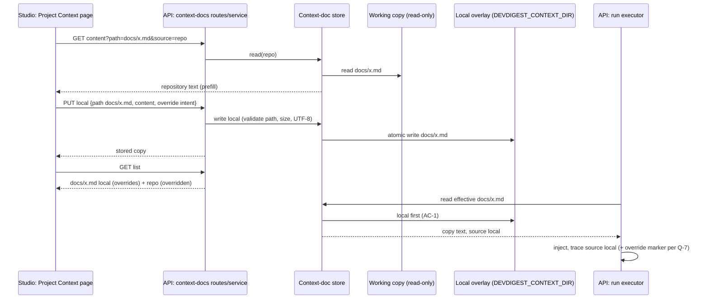

# Design review: Local override of a repository context document (SPEC-02)
Sources: text description only (variant B "Edit a copy", chosen by the user) · Current code read:
server/src/adapters/context-docs/fs-store.ts:161-203 (list, `shadowed` derived at :167-171),
fs-store.ts:222-251 (effective read, repository first at :235-242), fs-store.ts:278-282 (create
rejected when the repository holds the path), fs-store.ts:338-359 (local folder conflicts with any
repository entry), server/src/adapters/context-docs/types.ts:107 (port contract "repo first"),
server/src/vendor/shared/contracts/context-docs.ts:47-59 (`ContextDocEntry.shadowed`), :109-115
(`LocalDocWriteBody`), server/src/vendor/shared/contracts/trace.ts:101-115 (`specs_read`, `context`),
server/src/modules/context-docs/service.ts:116-151 (write, upload), helpers.ts:80-96 (`computeUsage`,
path-based), server/src/modules/reviews/run-executor.ts:464-490 (`loadContextDocs`, reads the
effective document at :478), server/src/modules/reviews/context-docs.ts:56-87,
client/.../ProjectContextView/ProjectContextView.tsx:64-73 (`source=local` only for a shadowed row),
doc-groups.ts:33-47 (selection prefers repo when no source), _components/DocViewer/DocViewer.tsx:44,
:74-95 (Edit disabled for repo docs, Delete only for local), _components/DocTree/DocTree.tsx:101-117
(badges), _components/DocEditor/DocEditor.tsx:41-50 (editor loads source `local` only; draft starts
empty), _components/DeleteDocDialog/DeleteDocDialog.tsx:47-81, client/messages/en/projectContext.json:28-38,
:128 ("These attachments stay and will show as “Missing”"),
client/src/components/context-doc-picker/context-doc-rows.ts:42-71 (shadowed rows dropped),
ContextDocPicker.tsx:309-313 (preview source from `row.local`),
client/.../FindingCard/_components/CitedDocs/CitedDocs.tsx:32 (preview without source = effective),
client/.../RunTraceDrawer/_components/ContextDocsSummary/ContextDocsSummary.tsx:23 and
TraceBody/TraceBody.tsx:51 ("Local" mark), docs/project-context.md:102-138, :324-345.
SPEC-01 decisions read: specs/project-context-folder/design-review.md:253-254 (Round 4, Q-23 →
repository wins, "Shadowed", read-only, 422).

## States coverage
| Screen / flow | State | In design? | Spec reference |
|---|---|---|---|
| Project Context page, repository doc selected | not overridden, readable | yes (task) | AC-4 |
| Project Context page, repository doc selected | too large / not UTF-8 | no | AC-8 |
| Project Context page, repository doc selected | already overridden | no | AC-11, AC-13 → Q-3 |
| Edit a copy | entry (confirm or not), draft before first Save | partly (task asks) | AC-5 → Q-2 |
| Edit a copy | first Save success / validation 422 / conflict (second tab) | no | AC-6, AC-9, EC-7 |
| Edit a copy | Cancel before first Save | no | AC-5 → Q-2 |
| Override copy selected | preview, edit, stale save 409 | existing flow | AC-9 |
| Override copy selected | repository changed upstream | no | AC-10 → Q-5 |
| Override copy selected | repository document removed (orphan) | no | AC-10 → Q-8 |
| Return to repository version | confirm / success / failure | no | AC-14 → Q-4 |
| Left panel | overridden path rows and badges | wording open (task) | AC-11 → Q-3 |
| Usage / Coverage | for overridden path | asked (task) | AC-12 → Q-3 |
| New file / New folder / Upload | target = repository path | asked (task) | AC-7 → Q-6 |
| Context tabs (agent, skill) | overridden path row, budget | no | AC-16 → Q-7 |
| Run trace drawer | injected override | asked (task) | AC-17 → Q-7 |
| Run executor | override unreadable | no | AC-18 → Q-9 |
| Rollout | existing "Shadowed" local docs | no | AC-19 → Q-1 |
| No working copy | page "not cloned"; runs | existing | EC-14 |
| Loading / error of the page | skeleton / retry | existing (SPEC-01 AC-58) | unchanged |

## Gaps in the designs
- No rule for what happens to today's "Shadowed" local documents when precedence flips: they would
  silently start being injected into runs that so far used the repository text → Q-1
- No rule for a plain local document whose path appears later upstream (after the flip it silently
  wins; before, it silently lost) → Q-1
- Entry into the copy flow: confirmation, creation time, Cancel before first Save → Q-2
- Presentation of an overridden path (one row vs two), badge wording ("Overrides repo" /
  "Overridden"), which row carries "Used by N agents" → Q-3
- The current Delete dialog says attachments "will show as Missing" — wrong for an override, where
  they fall back to the repository document → Q-4, AC-14
- Upstream change detection needs the text the copy was made from; nothing stores it today → Q-5
- The create API cannot tell "Edit a copy" from an accidental New file onto a repository path; both
  hit SPEC-01 AC-84 today (fs-store.ts:279-282) → AC-7, Q-6
- Trace keeps `source: local`; nothing tells "my local doc" from "my override of the repo doc" → Q-7
- Orphaned override after an upstream delete → Q-8
- Run-time fallback when an override is unreadable → Q-9 (next round)
- Saving a copy identical to the repository text → Q-10 (next round)
- The editor today loads only `source: local` and starts a draft empty (DocEditor.tsx:43-49); the copy
  needs a draft prefilled with repository text → AC-5 (planner note)

## Edge cases not covered
- Override of a too-large or non-UTF-8 repository document → EC-4, EC-5
- Agents already attached to the path switch silently on the next run → EC-3, P-1
- First save of a copy from two tabs → EC-7
- Unsaved edits in the copy's editor → EC-8
- Orphan → EC-9
- Copy unreadable at run time → EC-10
- Rollout of "Shadowed" docs and later upstream collisions → EC-11, EC-12
- Identical copy → EC-13
- No working copy → EC-14
- Repository removed → EC-15
- Citation chip previews a different text than the run used → EC-16, P-4
- Injection text inside the copy → EC-17 (SPEC-01 rules unchanged)

## Module interactions
| From | To | Via (external contract) | New / changed / existing | Consumers affected |
|---|---|---|---|---|
| studio Project Context page | API `modules/context-docs` | `GET /repos/:id/context-docs` (list) | changed: override / overridden marks replace `shadowed` semantics | studio page, Context-tab picker (both via the shared contract; server and client vendor copies must be synced) |
| studio Project Context page | API | `GET …/content?path&source` | existing (prefill reads `source=repo`) | — |
| studio Project Context page | API | `PUT …/local` create with override intent | changed: new explicit intent on create (AC-7) | studio editor; upload (`POST …/local/upload`) only if Q-6 option 2/3 |
| studio Project Context page | API | `DELETE …/local?path` (revert) | existing, reused for revert (Q-4) | — |
| studio Project Context page | API | `GET …/usage?path` | existing, path-based | DeleteDocDialog / revert dialog |
| API run executor | context-doc store (port) | effective read by path | changed: local first (AC-1) | every review run; CI runner unaffected (reviewer-core does no I/O) |
| API run executor | Postgres `run_traces` | `RunTrace.context.docs[].source` | existing; optional new override indicator if Q-7 option 1 (absent on old traces) | RunTraceDrawer (`TraceBody`, `ContextDocsSummary`) |
| studio Context tabs | API | list (as above) | changed semantics of the shadow flag | `context-doc-rows.ts` `buildRows` |
| MCP client | API | — | none (MCP exposes no context-doc tool) | — |

Notes for the implementation planner (internal wiring, not part of the spec):
- Precedence lives in two places that must flip together: the store's effective read
  (fs-store.ts:235-250) and the list's `shadowed` derivation (fs-store.ts:167-171); the port comment
  (types.ts:107) and the client's `buildRows` filter (context-doc-rows.ts:52) and `resolveSelection`
  (doc-groups.ts:39-45) encode the same rule on the client.
- `ContextDocEntry.shadowed` is a shared contract field: changing or replacing it means editing
  `server/src/vendor/shared` and syncing `client/src/vendor/shared` (CLAUDE.md convention).
- `ProjectContextView.urlFor` sets `source=local` only for shadowed rows (ProjectContextView.tsx:68);
  with the flip, the repository row of an overridden path is the one that needs an explicit source.
- AC-7's override intent needs the create path in `writeLocal` (fs-store.ts:279-282) to skip the
  repository-collision check only when the intent is present; the local-collision check stays.
- If Q-5 is answered with a flag, the copy's origin (hash of the repository text it was made from)
  has to be persisted outside the clone and outside the DB rule of SPEC-01 AC-24 (document text is
  never in the DB; a hash is not text, but the planner decides where it lives — e.g. a sidecar in the
  overlay, which must then be hidden from the list and from `countLocal`).
- `computeUsage` is path-based (helpers.ts:80-96), so usage numbers are identical for both rows of an
  overridden path; Q-3 decides what the repository row shows.
- `docs/project-context.md` §"Local documents (the overlay)" and §"Project Context page" describe
  "repository wins" and "Edit disabled for repository documents"; they need an update after
  implementation.

## UX improvements
- P-1 On first Save of a copy, list the agents and skills that attach the path and will start using
  the copy (from the existing usage endpoint) — makes the silent switch of EC-3 visible before it
  happens — cost S — status: accepted → AC-25 (shown as a notice in the draft editor, since Q-2
  removed the confirmation dialog)
- P-2 "Compare with repository version" on an override: side-by-side or diff view of copy vs current
  repository text — cost M — status: rejected → NG-8
- P-3 "Copy markdown" button on an override copy — cost S — status: rejected → NG-9
- P-4 Citation chips and the trace's document list open the document from the source the run
  actually used — cost S — status: rejected → NG-10 (kept as a known limitation, EC-16)
- P-5 On a selected overridden repository row, an "Open local copy" link next to the disabled Edit
  toggle (AC-26) — the user who lands on the repository row through `source=repo` or the tree
  otherwise has to find the copy's row by eye — cost S — status: accepted → AC-27

## Round 2 analysis (after round-1 answers)
- Q-5 option 1 needs an origin per copy (AC-23) and an acknowledge action (AC-22). Two gaps follow:
  copies that never had an origin (AC-19 rollout and later collisions) → Q-11; whether a plain Save
  acknowledges → Q-12. A sync between opening the editor and the first Save → EC-18 (origin is the
  version loaded into the editor, so the badge shows at once).
- Q-3 option 1 + AC-13: the repository row is addressable by `source=repo`; with no "Edit a copy" on
  it, P-5 offers a shortcut to the copy.
- Q-7 option 1: the trace indicator is set only when the repository document existed in the working
  copy at run time; with no clone the copy is recorded as plain `local` (EC-14).
- Q-8 option 1 + Q-1 option 1: an orphan that the repository re-adds becomes an override again
  (EC-9); its origin falls under Q-11.
- Q-6 option 1: SPEC-01 AC-84 stays unchanged; the only way to create an override is the explicit
  intent of AC-7.

## Module interactions — changes after round 1
| From | To | Via (external contract) | New / changed / existing | Consumers affected |
|---|---|---|---|---|
| studio Project Context page | API | `PUT …/local` create with override intent and origin version | changed (AC-7, AC-23) | studio editor |
| studio Project Context page | API | "Keep my copy" (acknowledge origin) | new (AC-22) | studio viewer |
| API list | studio | list entry marks: overrides / overridden / repository changed | changed (AC-2, AC-21) | page, picker (shared contract, both vendor copies) |
| API run executor | Postgres `run_traces` | `RunTrace.context.docs[]` optional override indicator | changed, backward-compatible (AC-17) | RunTraceDrawer |

Notes for the implementation planner (round 2):
- The origin record lives outside the clone and is not document text (a version hash); it must be
  hidden from the list, from `countLocal` and from the upload/new-folder collision checks, and be
  removed together with the copy on revert and with the repository's overlay (SPEC-01 AC-87).
- AC-24: when the repository document disappears, the origin record becomes irrelevant; the planner
  decides whether to keep or drop it (Q-11 decides what happens if the path returns).

## Decisions log
- Round 1: draft written; Q-1 to Q-8 asked, Q-9 and Q-10 queued for round 2; P-1 to P-4 proposed.
- Round 2 (answers to round 1): Q-1 → all become overrides, no notice (AC-19, NG-12) · Q-2 → editor
  at once, created on first Save, Cancel leaves nothing (AC-5) · Q-3 → two rows, "Overrides repo" /
  "Overridden", repository row shows "Not used — overridden by a local copy" instead of usage and
  Coverage (AC-11, AC-12, AC-26, AC-13) · Q-4 → "Revert to repository version" with confirmation
  (AC-20, AC-14) · Q-5 → "Repository changed" until "Keep my copy" or revert (AC-21, AC-22, AC-23,
  NG-11) · Q-6 → keep 422 (AC-7, NG-7; SPEC-01 AC-84 unchanged) · Q-7 → override marker in trace and
  in Context-tab rows (AC-16, AC-17) · Q-8 → orphan becomes a plain local document (AC-24) · P-1
  accepted → AC-25 · P-2 rejected → NG-8 · P-3 rejected → NG-9 · P-4 rejected → NG-10 (known
  limitation, EC-16). New: Q-11, Q-12, P-5. Still open: Q-9, Q-10.
- Round 3 (answers to round 2): Q-9 → skip with reason, no fallback to the repository document
  (AC-18) · Q-10 → identical copy allowed, stays an override (AC-30) · Q-11 → origin is the
  repository text at the moment the override first appears without one (AC-28) · Q-12 → a Save keeps
  the origin; only "Keep my copy" or revert clears "Repository changed" (AC-29, EC-19) · P-5 accepted
  → AC-27 (EC-20). Re-check of the new criteria: AC-27 reuses the SPEC-01 AC-74 unsaved-edits guard;
  AC-28 needs no new user state (origin is recorded silently); AC-30 interacts with AC-21 only through
  a later repository change. No new question. No blocking question left.
- Approval: user approved SPEC-02; no open question left; Status set to approved. The
  `Superseded by` line in SPEC-01 is added by the caller, not by spec-creator.

Notes for the implementation planner (round 3):
- AC-28: the origin of an override without one is recorded the first time the API observes it (a
  list request or a run); the planner decides which path writes it, and it must stay inside the
  overlay (NFR-1).
- AC-18: the effective read must not fall back to the repository on an unreadable local copy — today
  the store falls back only on `not_found` from the repository side (fs-store.ts:236-242); the flipped
  order must keep the same "only on not_found" rule for the local side.
