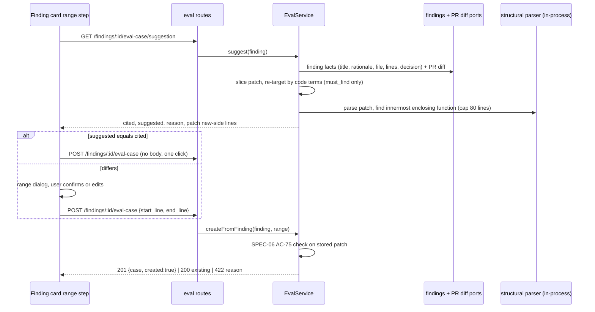

# Design review: Line-range suggestion when turning a finding into an eval case (SPEC-07)
Sources: text description only (no designs; inbox ignored by the user) · Current code read:
server/src/modules/eval/service.ts:49-97 (createFromFinding), server/src/modules/eval/service.ts:118-147
and 321-324 (AC-75 check on manual create/edit only), server/src/modules/eval/helpers.ts:39-51
(patchForFile), helpers.ts:62-87 (validateExpectationsAgainstDiff), server/src/modules/eval/types.ts:134-152
(EvalFindingFacts — no rationale), server/src/platform/container.ts:317-345 (findings and prDiff ports),
server/src/modules/eval/routes.ts:62-75 (`POST /findings/:id/eval-case`, no body),
server/src/vendor/shared/contracts/eval-pipeline.ts:16-98, server/src/db/schema/reviews.ts:28-51
(`findings.rationale` exists), server/src/adapters/astgrep/index.ts:57-76 (langForFile: .ts .tsx .jsx
.js .cjs .mjs only), server/src/modules/repo-intel/constants.ts:14,
reviewer-core/specs/grounding.md:13-45 (hunk intersection; full-file kinds exempt),
client/src/app/repos/[repoId]/pulls/[number]/_components/EvalCaseButton/EvalCaseButton.tsx:16-85,
client/src/app/repos/[repoId]/pulls/[number]/_components/FindingCard/FindingCard.tsx:134,
client/src/app/repos/[repoId]/pulls/[number]/_components/DiffTab/_components/InlineFinding/InlineFinding.tsx:89,
client/src/vendor/ui/kit/Modal.tsx:4-69, client/messages/en/prReview.json:17-24,
docs/eval-pipeline.md:129-171, specs/eval-pipeline/spec.md (SPEC-06),
specs/context-doc-local-override/spec.md:1-37 (SPEC-02, precedent for partial supersession)

## Scope decision
- Repository rule (CLAUDE.md "Naming"): an approved spec is never edited; a change is a new spec with
  `Supersedes:`. Nothing requires a full carry-over. SPEC-02 is a precedent for a partial
  supersession with a "Scope of supersession" section (replaced / amended / unchanged ids); SPEC-06 is
  a full carry-over only because it was a revision of the same spec. SPEC-07 follows the SPEC-02
  pattern: it touches SPEC-06 AC-1, AC-2, AC-3, AC-5, AC-6, AC-9, AC-75 and G-1 / US-1 / US-2 wording.
- The SPEC-06 header line `Superseded by: SPEC-07 (specs/eval-case-line-suggestion/spec.md) — in part`
  cannot be written by spec-creator (path outside the spec folder is denied); it is a proposal in the
  reply, to be added when SPEC-07 is approved.

## What exists today
- `createFromFinding` copies `facts.startLine` / `facts.endLine` into the expectation verbatim
  (service.ts:84-92). The request has no body (routes.ts:62-75); the response is
  `{ case, created }` (eval-pipeline.ts:93-98).
- The stored input is the whole patch block of the finding's file (`patchForFile`, helpers.ts:39-51).
  For a **modified** file this is only the hunks with their context lines, not the whole file; only a
  new file's patch carries the whole file. Structural expansion can therefore only see fragments →
  EC-9, Q-10.
- A case made from a finding is **not** validated against the diff (docs/eval-pipeline.md:165-166);
  AC-75 runs only on manual create/edit (service.ts:123,139). Once a range can be edited before
  saving, the same check is needed on this path → AC-15.
- The findings port gives title, file, lines, severity, category and decision, but **not the
  rationale** (types.ts:135-148, container.ts:318-333), although the column exists (reviews.ts:39).
  The suggestion needs it → noted for the planner.
- The structural parser already in the server (`adapters/astgrep`, @ast-grep/napi) supports only
  `.ts .tsx .jsx .js .cjs .mjs` (index.ts:57-76) → EC-8, Q-7.
- Grounding drops findings whose lines do not intersect a hunk, except full-file kinds
  (grounding.md:13-45). So a full-file finding's cited lines may lie outside every hunk; if the
  suggestion step enforced AC-75 on them, such findings could no longer become cases at all → EC-10,
  Q-11. (SPEC-06 AC-66 requires they stay offerable.)
- The button creates on one click with no dialog (EvalCaseButton.tsx:37-42), is rendered in two
  places (FindingCard.tsx:134, InlineFinding.tsx:89) and is disabled with "Already an eval case"
  when a case exists (EvalCaseButton.tsx:30,50,55).
- The vendored `Modal` (Modal.tsx:19-66) sets `role="dialog"` and `aria-modal`, but has no accessible
  name link (`aria-labelledby`), no focus move/trap, no Escape handling and no focus return. NFR-5
  cannot be met by it alone; it is under `vendor/` (do not touch) → planner note.
- The demo files `playground/eval-demo/` named in the task do **not** exist in this checkout (no file
  matches `findUserByEmail` / `listOrderTotals`). The example line numbers come from the task text and
  are used only in VA material, not as ACs.
- Doc drift: docs/eval-pipeline.md:154 links `FindingCard/_components/EvalCaseButton/…`; the real path
  is `pulls/[number]/_components/EvalCaseButton/`, and the button is also used by `InlineFinding`.

## States coverage
| Screen / flow | State | In design? | Spec reference |
|---|---|---|---|
| Finding card / inline finding — button | undecided | n/a (text) | SPEC-06 AC-4 |
| — | already an eval case | n/a | SPEC-06 AC-9, EC-17, AC-35 |
| — | loading suggestion / creating (one-click path) | no | AC-26 |
| — | suggestion request failed | no | AC-27 |
| — | suggestion equals cited → created in one click | no | AC-24 |
| Range dialog | suggestion differs from cited | yes (task) | AC-1, AC-20, AC-32 |
| — | unsupported language / parse failure | no | AC-13, AC-41 |
| — | tie between places | no | AC-9 |
| — | function above 80 lines | no | AC-12, AC-32 |
| — | edited range (neither option) | no | AC-40 |
| — | invalid edited range | no | AC-23, Q-9 |
| — | confirming (in flight) | no | AC-19 |
| — | API rejects range | no | AC-15 |
| — | API error | no | AC-17 |
| — | case appeared meanwhile | no | AC-18 |
| — | success | yes | AC-16 |
| — | cancel | no | AC-2 |

## Gaps in the description
- Conflict with SPEC-06 AC-3 ("one click, no dialog") → Q-1.
- No contract for getting a suggestion before saving and for passing a confirmed range → Q-2.
- How the two ranges are presented → Q-3.
- Whether re-targeting applies to `must_not_flag`, and which block each type expands to ("do not
  expand beyond the structural block" can mean the innermost statement or the enclosing function)
  → Q-4, Q-5.
- No size bound on expansion (`registerRoutes` on line 15 encloses every route handler) → Q-6.
- Behaviour outside TS/JS → Q-7.
- Tie-break → Q-8.
- "Nothing better found" presentation; reversed edited range → Q-9.
- Block partly outside the patch → Q-10.
- Full-file kinds → Q-11.
- What counts as an "identifier or phrase": `GET /users` does not appear literally in code
  (`app.get('/users', …)`), so a method+path term needs a rule; plain English words ("route",
  "validation") would match everywhere → Q-12.
- Diff drift between preview and confirm → Q-13.
- No performance bound → Q-14.
- Task example says the real problem of "Unhandled promise rejection in GET /users route" is on
  lines 15–19, while the handler is 16–19 and line 15 is `registerRoutes`. Expansion to the innermost
  handler gives 16–19; both overlap any finding on the handler, so the case passes either way, but the
  expected fixture value must be fixed in the plan's tests → to confirm with the user in round 2.
- The second example ("Missing input validation on route parameters", cited line 6, real 22–24) has
  no code-like term in its title; re-targeting can only work if the rationale names e.g. `req.body`
  or a parameter. With only line 6 cited and no matching term, AC-8/AC-10 would expand around line 6,
  not move to 22–24 → the user should know that this example may still need a manual edit (AC-22).

## Edge cases not covered by the description
- Same finding opened in both views; case created in one while the other's range step is open → EC-6
- Double Confirm → EC-7
- Decision cleared / agent deleted mid-step → EC-12, EC-13
- No code-like term at all → EC-14
- Term only on removed lines → EC-15
- Reversed cited range → EC-16
- Diff changes mid-step → EC-11

## Module interactions
| From | To | Via (external contract) | New / changed / existing | Consumers affected |
|---|---|---|---|---|
| client EvalCaseButton | server eval module | `GET /findings/:id/eval-case/suggestion` (AC-3, AC-36..AC-38, AC-35) | new | client only |
| client EvalCaseButton (range dialog) | server eval module | `POST /findings/:id/eval-case` + optional `start_line`/`end_line` (AC-39) | changed (optional body; absent body = SPEC-06 behaviour) | client only; `mcp/` has no reference to `eval-case` (grep), e2e not checked |
| server eval module | findings data | findings port: needs `rationale` | changed (internal port) | none outside server |
| server eval module | structural parser | in-process parse of patch text | existing adapter, new use | none |
| shared contract `eval-pipeline.ts` | client copy | suggestion response + create body schemas | new / changed | both vendored copies must be synced |

Notes for the implementation planner (internal wiring, not part of the spec):
- The findings port must expose `rationale` and `kind` (AC-44) (types.ts:135-148, container.ts:318-333).
- The patch fingerprint (AC-36, AC-43) only has to be a stable digest of the sliced patch text; the
  create path recomputes it from the freshly loaded patch.
- The AC-48 timeout needs a computation that can actually be abandoned (the parse is synchronous napi);
  the planner decides how — this is the only source of nondeterminism allowed by NFR-1.
- The suggestion is a pure function of (finding facts, patch) — fits `helpers.ts`-style pure code plus
  the existing `adapters/astgrep` adapter behind a port; keep ast-grep out of the service directly
  (onion-architecture). Parse failures must be caught (tree-sitter is lenient, napi may throw —
  adapters/astgrep/index.ts:626-635).
- Parsing a hunk fragment rather than a whole file: hunks of a modified file are not valid programs;
  either parse per hunk with the new-side text reconstructed, or map ast-grep lines back through
  `newLineNumbers`. Lines in the preview are new-side numbers (SPEC-06 AC-13).
- Reuse `validateExpectationsAgainstDiff` (helpers.ts:62-87) for AC-5, AC-15 and AC-23 so client and
  server agree; the client can mirror it for AC-23 or call the API.
- `Modal` lacks focus management and an accessible name (Modal.tsx:19-66); `vendor/` is do-not-touch —
  wrap it locally or use an existing accessible dialog from the client, if one exists.
- Keep tests under `server/test/eval/` so `pnpm verify:l06` runs them (see P-1).
- Update docs/eval-pipeline.md "From a finding" (and fix the path drift at line 154) after
  implementation.

## Round 2 findings (after the round-1 answers)
- Q-1 = "dialog only on divergence" means the one-click path now waits for a suggestion request
  before it creates the case → busy state AC-26. Errors of the suggestion request mirror the create
  endpoint's preconditions (AC-38) and are shown like SPEC-06 AC-6 (AC-27), so the error behaviour of
  the button does not change for the user.
- The one-click path sends no range, so the API stores the cited range exactly as in SPEC-06 (AC-39,
  no AC-75 check). This keeps full-file kinds creatable regardless of Q-11.
- Q-4 + Q-5 combined: `must_not_flag` is never moved but is expanded to the whole innermost function.
  Recorded as accepted risk EC-18; because expansion makes the suggestion differ from the citation,
  the dialog opens for nearly every `must_not_flag` citation inside a function, so the user always
  sees the widened range and can pick "Cited".
- Q-5 "nearest enclosing function" is read as the innermost function node (declaration, method,
  function expression, arrow function) whose lines contain the whole starting range (AC-10). With
  that rule the first example's handler `app.get('/users', async (…) => {…})` gives 16–19, not 15–19
  (line 15 is `registerRoutes`, which would only be chosen if the handler were not a function) → Q-18.
- Q-6 "largest nested block that fits" is read as the largest statement or block inside the function
  that contains the whole starting range and spans ≤ 80 lines; none → keep the starting range
  (AC-12). A starting range longer than 80 lines is neither expanded nor shortened (AC-30).
- New gaps: a starting range outside any function (`const PAYMENT_API_KEY` on line 8) → Q-15; what a
  "place" is when counting matches (one line vs window vs function — a function with three different
  terms on three lines loses to a single line with two terms under a per-line rule) → Q-16.
- The suggestion response carries the patch's new-side lines and hunk bounds (AC-36) so the dialog can
  preview and validate any edited range without another request (AC-21..AC-23).
- With "Suggested / Cited" plus free fields, an edited range is neither option → AC-40 (forced by the
  switch semantics, not a new decision).
- The route path `GET /findings/:id/eval-case/suggestion` follows the existing
  `POST /findings/:id/eval-case` naming; the planner may rename it only together with this spec.

## UX improvements
- P-1 Run the suggestion's unit tests (the task's two examples as fixtures) as part of
  `pnpm verify:l06` — protects the heuristic from regressions with the existing gate — cost S —
  status: accepted → AC-31
- P-2 Show why the range was suggested: the matched terms ("matched `findUserByEmail` ×2") or "expanded
  to enclosing function `chargeUser`" — makes a wrong suggestion easy to spot instead of trusted
  blindly — cost S — status: accepted → AC-32
- P-3 In the preview, show 3 lines of context above and below the selected range, marked as outside
  the range by a gutter marker (not colour alone) — lets the user see whether to widen the range
  without guessing numbers — cost S — status: rejected → NG-6
- P-4 Record on the expectation where its lines came from (`cited` / `suggested` / `edited`) as an
  optional note the scorer ignores (like `title`, SPEC-06 AC-69) — lets the author later measure how
  often the suggestion is right; changes the shared expectation contract — cost M — status:
  rejected → NG-7
- P-5 "Suggest lines" for existing cases (case editor / Evals tab), applying the same suggestion to a
  case that has a `source_finding_id` — existing cases created under SPEC-06 keep their wrong ranges
  and keep understating recall — cost M — status: rejected → NG-4
- P-6 Keyboard shortcuts in the range step: Enter confirms when valid, buttons "Use suggested" / "Use
  cited" to reset the fields in one action — faster correction loop — cost S — status: accepted →
  AC-33, AC-34 (the Q-3 switch is the reset control)

## Decisions log
- Round 1: draft written; questions Q-1..Q-8 and proposals P-1..P-6 sent; Q-9..Q-14 queued for round 2.
- Round 1 answers: Q-1 → dialog only on divergence (SPEC-06 AC-3 amended, AC-1, AC-24); Q-2 → separate
  read-only suggestion route + optional range on create, validated by the AC-75 rule (AC-3, AC-36..39,
  AC-15); Q-3 → one preview with a "Suggested / Cited" switch and start/end fields (AC-20, AC-21,
  AC-40); Q-4 → no re-targeting for `must_not_flag` (AC-11, NG-8); Q-5 → both types expand to the
  nearest enclosing function, false-hit risk for `must_not_flag` accepted (AC-10, EC-18); Q-6 → 80-line
  cap, fallback to the largest nested block that fits (AC-12, AC-30); Q-7 → unsupported files:
  re-targeting only, no expansion, note "structure not available for this file type" (AC-13, AC-41);
  Q-8 → nearest to the cited range, then lower line number (AC-9). P-1 accepted → AC-31; P-2 accepted →
  AC-32; P-6 accepted → AC-33, AC-34; P-3 rejected → NG-6; P-4 rejected → NG-7; P-5 rejected → NG-4.
- Round 2: questions Q-9..Q-13, Q-15, Q-16, Q-18 sent; Q-14 queued for round 3.
- Round 2 answers: Q-12 → code terms as listed, case-sensitive, ≥ 3 chars (AC-6, AC-49); Q-16 → a place
  is one line, distinct terms counted (AC-7, AC-9); Q-10 → truncate to the hunk containing the starting
  range (AC-42); Q-11 → full-file kinds: suggestion = cited, one click (AC-44, AC-5); Q-15 → no
  expansion outside a function (AC-45); Q-13 → patch fingerprint, 409 "The diff changed", reload keeping
  the typed numbers (AC-39, AC-43, AC-36); Q-9 → normalise a reversed range (AC-46); Q-18 → example 1
  fixture expects 16–19 (AC-31). The round-1 interpretations (AC-10 innermost function, AC-12 nested
  block, AC-27/AC-38 errors, AC-35 existing case, AC-40 edited state) accepted as written.
- Q-14: the coordinator asked spec-creator to set the bounds; written as proposed defaults pending a
  user veto — 5,000 new-side lines cap (AC-47), 3-second timeout with fallback to the cited range
  (AC-48), 1-second target (NFR-2). Q-14 stays open as non-blocking.
- Interpretations added in round 2 (to confirm at approval): the 80-line cap applies to the range
  after truncation to the hunk (AC-12 after AC-42); a starting range touching two hunks keeps both
  (AC-42); with no term anywhere in the patch the starting range is the cited range (AC-51); a skipped
  suggestion equals the cited range, so it takes the one-click path and no dialog shows a note.
- Round 3: Q-14 → no bounds: AC-47 and AC-48 withdrawn, NFR-1 timeout exception removed, NFR-2 states
  that no bound is set, the slow-route risk for very large patches recorded as accepted EC-22 (EC-23
  merged into it). The round-2 interpretations accepted as written; "skipped suggestion" now applies
  only to the remaining fallbacks (full-file kinds AC-44, no function AC-45, no term AC-51, unsupported
  file AC-13).
- Approval: `User approval: approved` received with no blocking question left → Status: approved.
- Planner note superseded: the AC-48 timeout note above no longer applies.
