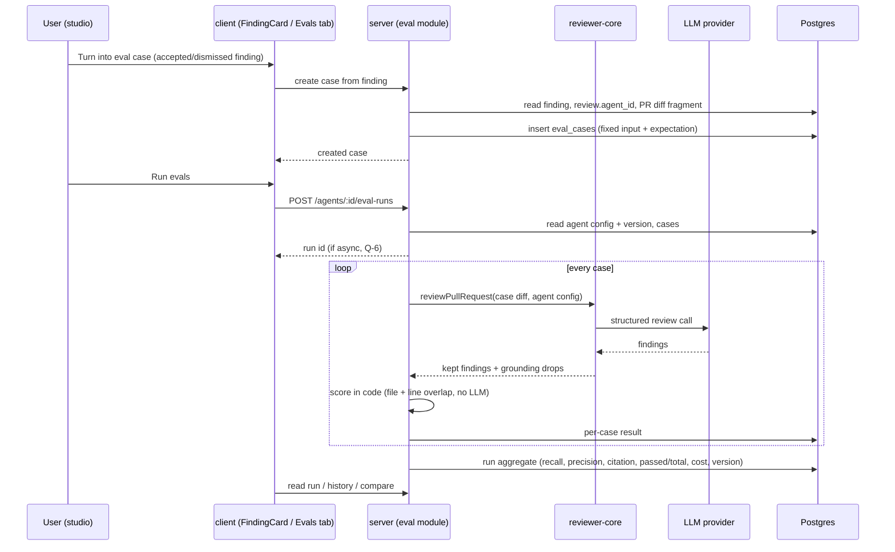

# Design review: Eval pipeline — regression harness for review agents, v2 (SPEC-06)
Supersedes the review of SPEC-05 (previous revision of specs/eval-pipeline/design-review.md, kept in
git history). Carried over unchanged except the items marked **[SPEC-06]**.

Sources: designs/1-finding-card-turn-into-eval-case.webp, designs/2-eval-dashboard-agents-list.png,
designs/3-eval-dashboard-agent-detail.webp, designs/4-eval-compare-modal.webp,
designs/5-agent-editor-evals-tab.webp, designs/6-eval-case-modal.webp (in
specs/eval-pipeline/designs/); user task text (wins over the designs) ·
Current code read: server/src/db/schema/eval.ts:7-35, server/src/vendor/shared/contracts/knowledge.ts:49-84,
server/src/vendor/shared/contracts/eval-ci.ts:19-89, server/src/db/schema/reviews.ts:28-51,
server/src/db/schema/agents.ts:9-52, server/src/db/schema/runs.ts:8-37,
server/src/modules/agents/repository.ts:150-200, server/src/modules/agents/routes.ts:130-146,
server/src/modules/reviews/findings.ts:11-34, server/src/modules/reviews/routes.ts:17,154,
reviewer-core/src/index.ts:43-53, reviewer-core/src/review/run.ts:45-125,
reviewer-core/specs/grounding.md, server/specs/review-flow.md:94-138,
client/src/app/repos/[repoId]/pulls/[number]/_components/FindingCard/FindingCard.tsx:102-123,
client/src/app/agents/[id]/_components/AgentEditor/AgentEditor.tsx:15-34,
client/src/app/agents/[id]/_components/AgentEditor/constants.ts:11-15,
client/src/app/agents/[id]/_components/AgentEditor/AgentEditor.test.tsx:78,
client/src/vendor/ui/nav.ts:21-44, client/src/components/app-shell/helpers.ts:35,
client/messages/en/eval.json, client/messages/en/shell.json:25, client/specs/pages.md:160-214,
server/test/contracts.test.ts:174-192;
**[SPEC-06]** server/src/modules/reviews/diff-loader.ts:12-30, server/src/modules/reviews/run-executor.ts:220-252
(cited by the user), server/src/app.ts:49 (`bodyLimit: 1_048_576`), server/src/app.ts:123-171 (shared
error handler)

## [SPEC-06] What changed and why
- SPEC-05 AC-73 required rejecting a case whose diff exceeds "the diff size limit that regular reviews
  apply" (decision Q-16). No such limit exists: `loadDiff` returns the whole `git diff base...head`
  or the whole reconstruction from `pr_files` (diff-loader.ts:12-30) and the executor sends it as is
  (run-executor.ts:220-252, per the user). AC-73 is therefore removed (id kept as "Removed"), NG-7
  records the non-goal, and EC-14 and the "Untrusted inputs" diff line are reworded.
- The resulting bound: Fastify's global `bodyLimit` of 1 MB (app.ts:49). Fastify rejects a larger
  body with status 413 before any handler runs; the shared error handler forwards the status
  (app.ts:166-170), so the API answers 413 and stores nothing. This applies only to requests that
  carry the diff — i.e. manually entered cases. A case created from a finding sends only the finding
  reference; its patch is read server-side and has no size bound, exactly like a regular review.
- No other requirement changed. Ids are unchanged; no criterion was renumbered.

## What already exists (and what does not)
- Tables `eval_cases` and `eval_runs` exist (eval.ts:7-35). `eval_runs` is **per case** (`case_id`
  NOT NULL) with `recall/precision/citation_accuracy/pass/cost_usd/duration_ms/actual_output`. There
  is **no** run-level record: no grouping of the per-case rows into one execution of the set, no
  `agent_version`, no status/progress, no owner on the run row. "History of runs", "v6 → v7" and
  Compare cannot be built on it as is → Q-1.
- `eval_cases` has `owner_kind/owner_id/name/input_diff/input_files/input_meta/expected_output/notes`.
  It has no link to the source finding (needed for duplicate detection, EC-2) and no created-at
  timestamp (needed to explain differing case sets between runs, EC-9) → Q-1, Q-11, Q-13.
- Contracts: `EvalCase`, `EvalRun` (aggregate with `per_trace`), `EvalOwnerKind` (knowledge.ts);
  `EvalCaseInput`, `EvalRunRecord` (per-case row), `EvalRunResult`, `EvalTrendPoint`, `EvalDashboard`
  (eval-ci.ts). Gaps: `expected_output` is `z.unknown()` — no typed `must_find`/`must_not_flag`
  expectation; no run-level record contract with agent version/status; `EvalDashboard` is per owner
  and has no per-agent list for the all-agents page; no compare contract. Both vendored copies must be
  synced (root INSIGHTS: the copies already drift in comments; compare only touched files).
- Agent versions exist: `agents.version` + `agent_versions.config_json` snapshot on every config
  change, including skill link changes (repository.ts:150-200), and `GET /agents/:id/versions/:version`
  (routes.ts:137). This is what makes "record the version" (AC-15) and the config diff in Compare
  (AC-32) feasible without new snapshot logic.
- Finding decisions: `accepted_at` / `dismissed_at` timestamps (reviews.ts:46-47), set through
  `POST /findings/:id/accept|dismiss` (reviews/routes.ts:154). The finding's agent is
  `reviews.agent_id` (nullable; `agent_runs.agent_id` is `on delete set null`) → AC-7.
- Grounding: `reviewPullRequest` returns `dropped` (grounding drops with reasons) next to the kept
  findings (run.ts:104-125) — citation accuracy can be computed in code from that.
- Client: no eval screen exists. `eval.json` i18n namespace and `shell.json` "Eval Dashboard" label
  exist; `activeKeyFor` already maps `/eval*` → `eval` (helpers.ts:35); the sidebar `NAV` has no eval
  item (nav.ts:30-43). `AgentEditor.test.tsx:78` asserts that an "Evals" tab is **absent** — that test
  must change. `client/specs/pages.md:211-214` and `server/specs/review-flow.md:135-138` both say the
  eval pipeline is "a later lesson".
- `verify:l06` exists nowhere (no root `package.json`; each package has only `test`/`typecheck`) → Q-8.
- **[SPEC-06]** Regular reviews apply no diff size limit (diff-loader.ts:12-30); the only size bound on
  API requests is the global 1 MB body limit (app.ts:49).

## States coverage
| Screen / flow | State | In design? | Spec reference |
|---|---|---|---|
| FindingCard · Turn into eval case | idle (accepted / dismissed finding) | yes (one variant, decision not visible) | AC-1, AC-2, AC-3 |
| | finding undecided | no | AC-4, Q-11 |
| | creating (pending) | no | AC-3 (button disabled while pending — planner) |
| | created / confirmation | no | AC-5 |
| | already a case for this finding | no | AC-9, Q-11 |
| | error | no | AC-6, AC-7 |
| Evals tab · cases list | empty | no (i18n has `emptyCases`) | AC-11 |
| | many cases, mixed pass/fail/never run | yes | AC-10 |
| | loading | no (i18n has `loadingCases`) | skeleton (pages.md cross-cutting rule) |
| | must_not_flag case | partly ("clean-refactor-no-flags · empty []" shows a no-findings case, not a "must not flag Y" case) | AC-10 |
| Evals tab · metrics | no runs yet | no | AC-27, AC-29 ("—") |
| | first run (no previous to diff against) | no | AC-27, AC-29 |
| | latest run with deltas | yes | AC-27 |
| Run | idle / running / progress | partly (i18n `running`) | AC-16, Q-6 |
| | empty set | no | AC-17 |
| | missing API key | no | AC-18 |
| | run already in progress | no | AC-19, Q-13 |
| | one case errors | no | AC-20, Q-14 |
| | whole run fails | no | AC-20, Q-14 |
| Run history | 0 / 1 / many runs | many only | AC-28 |
| | selection of 0, 1, 2, 3+ runs | 2 only | AC-30 |
| Compare | metric deltas | yes (+ cost) | AC-31, P-6 |
| | config diff | yes (system prompt only) | AC-32, Q-9 |
| | different case sets | no | AC-33, Q-13 |
| | same version on both sides | no | AC-32 (empty diff) |
| | Promote | yes | Q-7 (recommended cut) |
| Eval Dashboard · agents | agent never run | no | AC-35 |
| | disabled agent | no | AC-35, Q-15 |
| | no agents with cases | no | AC-35, Q-15 |
| Eval Dashboard · recent runs | empty / many | many only | AC-36 |
| Eval Dashboard · agent detail | yes (period filter, agent switcher, banner, trend chart) | yes | AC-37, Q-7, P-3, P-4 |
| Case modal (manual create/edit) | create / edit / invalid JSON / last run | yes (valid JSON + passed only) | AC-46..AC-54, Q-19, Q-22, Q-24 |
| Case modal (manual create) | **[SPEC-06]** save request over 1 MB | no | EC-14 (HTTP 413, API error message shown) |
| Compare · Promote | click / same version | yes (click only) | AC-59, Q-18 |
| Dashboard agent view · period filter, agent switcher | yes | yes | AC-55, AC-56, Q-23 |

## Gaps in the designs
- No feedback after "Turn into eval case" (no toast, no state change on the card) → AC-5.
- The design does not show which decision the finding has, so the user cannot see which expectation
  type will be created → AC-1/AC-2; P (none) — the confirmation names the case; Q-11 for undecided.
- Expected-output editor (design 6) holds a JSON array with `severity`, `category`, `title`, `file`,
  `start_line` and **no `end_line` and no expectation type**. The user's scoring ignores
  severity/category/title and needs a type (`must_find` / `must_not_flag`) → NG-6, Q-7.
- Design 5 rows show "CRITICAL · security" and "expected 1 finding, got 1" — a count-based view.
  The user's model is location-based (file:line, must / must-not) → AC-10 shows type + `file:line`.
- Design 6 "Files" input tab and `input_files` column: no source of real data for it from a finding
  → Q-4 / Q-7.
- Design 6 "Run on save", "Run case", "Finding skeleton" — not in the user's list → Q-7, P-5.
- Design 4 "Promote v7": DevDigest has no notion of a promoted/active version separate from the
  current agent config; promoting an older version would mean restoring a config → Q-7 (cut).
- Design 3 "30 days" filter and agent switcher; design 2 "Run all agents" → Q-7, P-5 (Run all agents
  is listed as P-5 below).
- Design 3 subtitle "5 runs on the 20-trace gold set"; i18n `casesSummary` says "gold set": DevDigest
  has no separate gold set; the set is "the agent's eval cases". Copy to revisit at planning.
- Design 3 warning banner ("Precision dipped 2pts on v7 — a new false positive slipped in") — the
  `EvalDashboard.alert` contract field exists but no rule for when it appears → P-3.
- No design for running state, progress, error, or empty states anywhere → AC-11, AC-16..AC-20.
- No design for reading a case's actual output ("trajectory"), which the user's own method needs
  when a delta does not reproduce → NFR-7, P-1.

## Edge cases not covered
- Undecided finding; finding turned into a case twice; decision flipped after case creation → EC-1, EC-2, EC-4
- Full-file finding kinds (secret_leak etc.) as cases → EC-5
- Model returns zero findings; set with only must_not_flag cases (0/0 metrics) → EC-6, EC-7
- One case's model call fails; API restart mid-run; leaving the page mid-run → EC-8, EC-11, EC-12
- Case set changed between two compared runs → EC-9
- Double-start / second tab → EC-10
- Agent edited during a run → EC-13
- Huge diff fragment → EC-14 (**[SPEC-06]** global 1 MB body limit for manual cases; no bound for
  cases from findings)
- Disabled agent on the dashboard → EC-15
- Unpriced model → EC-16

## Module interactions
| From | To | Via (external contract) | New / changed / existing | Consumers affected |
|---|---|---|---|---|
| client FindingCard | server reviews/eval | create-case-from-finding route (shape: finding id in, created case out) | new | client only |
| client Evals tab | server eval | list cases of an agent; delete case | new | client only |
| client Evals tab / Dashboard | server eval | `POST /agents/:id/eval-runs` (route fixed by the user) | new | client; MCP could later expose it (not in scope) |
| client | server eval | list runs of an agent; read one run (status/progress, per-case results); all-agents dashboard | new | client only |
| client Compare | server agents | `GET /agents/:id/versions/:version` | existing | — |
| server eval | reviewer-core | `reviewPullRequest` (no intent, no repo-intel, no specs) + `dropped` | existing, unchanged | — |
| server eval | Postgres | `eval_cases`, `eval_runs` + run-level record (Q-1) | changed (new migration if Q-1 = option 1) | none today (tables are empty) |
| shared contracts | server + client vendor copies | `EvalCaseInput.expected_output` typed; run-level record; dashboard list; compare | changed / new | server, client (sync both copies) |

Notes for the implementation planner (internal wiring, not part of the spec):
- The engine needs a `UnifiedDiff`; the fragment must keep new-side line numbers so the case's
  `start_line`/`end_line` still intersect a hunk (grounding uses `newLineNumbers`). Rebuilding a
  synthetic diff from `pr_files.patch` already exists as the review's fallback path (review-flow.md
  "The diff").
- Do not trigger the intent classifier for eval runs: `executeRuns` resolves intent via
  `container.intent.getForReview`; an eval path must bypass it (INSIGHTS: unmocked provider paths turn
  into real network calls in it-tests). Eval it-tests must inject a mock LLM.
- Scoring belongs in a pure function with no container access, so "no LLM call" (AC-26) is
  provable by a unit test where any provider call throws.
- `citation_accuracy` source: `ReviewOutcome.dropped` (grounding) vs kept; `scopeDropped` is empty
  because no intent is passed.
- Sidebar item lives in `client/src/vendor/ui/nav.ts`, a `vendor/**` path the root CLAUDE.md says not
  to touch — yet the Conventions item was added there. Check the precedent before editing; propose a
  guidance clarification if it is the accepted place.
- `AgentEditor.test.tsx:78` asserts "Evals" is absent — update it with the new tab.
- `agentsRepo` list has an explicit ORDER BY rule (server INSIGHTS 2026-09-24): the cases list and run
  history need a total order too.
- Per-case LLM calls need a concurrency bound and the API's rate limit for this route (expensive
  routes tighten it locally, architecture.md).
- A new DB-backed test must end `*.it.test.ts`; migrations via drizzle-kit only (watch the rename
  prompt, server INSIGHTS 2026-09-25).
- **[SPEC-06]** Do not implement any diff size check for eval cases (AC-73 removed). The 413 on an
  over-1 MB body comes from Fastify before the handler; the shared error handler sends it with
  code `internal_error` and Fastify's message (app.ts:166-170) — the case editor must surface the
  API's error message for a failed save. Do not raise the body limit for the eval routes.

## UX improvements
- P-1 Per-case drill-down: open a case result to see the agent's findings, which one matched the
  expectation, and the findings dropped by grounding with reasons — the user's method says "read the
  trajectories" when a delta does not reproduce — cost M — status: accepted → AC-39, AC-40, NFR-7
- P-2 Compare lists the cases whose result flipped (pass → fail, fail → pass) — the lab's expected
  outcome is "a specific expectation drops", not an abstract score — cost S — status: accepted → AC-41
- P-3 Regression banner on the agent's eval view when the latest run lowered any metric versus the
  previous run, naming the metric and the flipped cases (design 3; `EvalDashboard.alert` exists) —
  cost S — status: accepted → AC-42 (threshold Q-26)
- P-4 Metric trend chart per agent (design 3; recharts is already a client dependency) — cost M —
  status: accepted → AC-43
- P-5 "Run all agents" on the Eval Dashboard (design 2) — cost M — status: accepted → AC-44 (agent
  selection Q-15)
- P-6 Show run cost and cost delta in history and compare (design 3/4; `cost_usd` in contracts) —
  cost S — status: accepted → AC-45 (unknown cost Q-27)

## Design vs user text — contradictions after "all designs" (round 2 of SPEC-05)
User text and ACs win; each item is a question, not a silent choice.
- Expected-output JSON (design 6) carries `severity/category/title`, lacks `end_line` and an
  expectation type → scoring stays file + line overlap (NG-6); shape → Q-19.
- "Promote v7" (design 4) — no defined meaning in DevDigest (agent config is always "current") → Q-18.
- Edit on a case (design 5/6) vs "inputs are fixed so runs are comparable" (user text) → Q-24.
- "Run case" / "Run on save" (design 5/6) vs run history made of whole-set runs → Q-22.
- "Files" input tab (design 6) — no data source from a finding → Q-20.
- Stats / CI tabs (design 5) and Learn / Reply to author (design 1) — no behaviour described anywhere
  → Q-21 (NG-3, NG-4 withdrawn pending the answer).
- "20-trace gold set", "traces passed" copy (designs 3/4/5, `eval.json casesSummary`) — mock data;
  the user's term is the agent's set of eval cases → AC-64.
- "expected 1 finding, got 1" row subtitle and "CRITICAL · security" chips (design 5) — count- and
  severity-based; kept as display only (AC-53 count), never scored.
- Sidebar in the designs shows Memory, Multi-Agent Review, Agent Performance, CI Runs — not part of
  this spec; only "Eval Dashboard" is added (AC-34).
- Agent cards in design 5 ("142 runs · 78% accept · $0.04 avg") — existing/other feature, untouched.

## Decisions log
Rounds 1–4 and the approval below are SPEC-05's, carried over as made; they are not reopened.
- Round 1: draft written; Q-1..Q-8 returned; Q-9..Q-17 pending for round 2; P-1..P-6 proposed.
- Round 2 answers:
  - Q-1 → new run-level record (new migration; per-case rows link to it; contracts synced in both
    vendor copies) → AC-15, AC-28.
  - Q-2 → precision = 1 − findings matching `must_not_flag` / all findings → AC-23 (base Q-25).
  - Q-3 → micro-average over the run; "—" when the denominator is 0 → AC-22, AC-23, AC-24, AC-63.
  - Q-4 → input = diff + PR title/body snapshot → AC-13.
  - Q-5 → whole patch of the finding's file → AC-13.
  - Q-6 → background run, immediate id, live progress → AC-16, AC-61, AC-62.
  - Q-7 → all designs in scope; contradictions flagged above → AC-12, AC-37, AC-42..AC-60, AC-64;
    new questions Q-18..Q-24.
  - Q-8 → new `verify:l06` script in `server/package.json` (typecheck + scoring unit tests + eval
    it-tests with mock LLM) → AC-38, NFR-8.
  - P accepted: P-1, P-2, P-3, P-4, P-5, P-6. P rejected: none.
  - Follow-ups opened: Q-25 (precision base), Q-26 (banner threshold), Q-27 (cost with unknown case).
- Round 3 answers (to round-2 questions):
  - Q-10 → only the case's expectations decide pass; unmatched findings do not → AC-25, AC-68.
  - Q-11 → disabled until decided; one case per finding (existing case returned); type kept on
    decision change; full-file kinds allowed → AC-4, AC-9, AC-65, AC-66.
  - Q-13 → reject a second run while one runs; compare warns and computes on shared cases → AC-19,
    AC-33.
  - Q-14 → errored case marked "error", excluded from metrics, error count shown → AC-20, AC-67.
  - Q-18 → Promote restores the newer run's version config as a new agent version; disabled when that
    version is current → AC-59, AC-70.
  - Q-19 → `{type, file, start_line, end_line}` + optional notes ignored by scoring → AC-71, AC-47,
    AC-48, AC-69.
  - Q-22 → single-case run updates the case's last result only, no history run; Run on save runs the
    case after saving → AC-51, AC-52.
  - Q-24 → Edit changes name and expectations only; input locked → AC-50, AC-72.
  - P: none new accepted or rejected.
  - New follow-up: Q-28 (expectation outside the case's diff, EC-17).
- Round 4 answers (to round-3 questions):
  - Q-9 → compare shows system prompt diff + provider/model + skills added/removed/reordered → AC-32.
  - Q-12 → slug of the finding title, `-2`, `-3` suffix on collision → AC-8.
  - Q-15 → dashboard lists all agents (incl. disabled, never run); "Run all agents" runs enabled agents
    with ≥1 case; 10 recent runs; recall sparkline → AC-35, AC-36, AC-44, EC-15.
  - Q-16 → the review's diff size limit; over-limit creation rejected → AC-73. **Superseded in
    SPEC-06, see below.**
  - Q-17 → in-progress eval runs marked failed on API start → AC-74.
  - Q-20 → Files tab = read-only list of diff file paths → AC-54.
  - Q-21 → Stats/CI tabs and Learn/Reply buttons out of scope and hidden → NG-3, NG-4, AC-60.
  - Q-23 → periods 7 / 30 / 90 days / all, default 30 → AC-55.
  - Q-25 → precision counts findings that passed grounding → AC-23.
  - Q-26 → banner at a drop of ≥ 1 percentage point → AC-42.
  - Q-27 → run cost "—" when any case cost is unknown → AC-45, AC-76.
  - Q-28 → expectation outside the case's diff rejected on save → AC-75.
  - No open questions remain. Ready for approval.
- SPEC-05 approval: "User approval: approved" received with no blocking question left →
  SPEC-05 Status: approved.
- Planner notes from round 3: the duplicate rule (AC-9) needs a persisted link from a case to its
  source finding; Promote (AC-59) must restore every field of the `agent_versions.config_json`
  snapshot, including linked skills if the snapshot carries them — check what the snapshot holds.
- **[SPEC-06] Round 1:** the user re-decided Q-16 — regular reviews have no diff size limit
  (diff-loader.ts:12-30, run-executor.ts:220-252), so AC-73 is removed (id kept as "Removed"); cases
  are bounded only by the global 1 MB request body limit (app.ts:49) → EC-14 reworded (HTTP 413,
  nothing stored, API error shown in the case editor; cases from findings unbounded), NG-7 added,
  "Untrusted inputs" diff line reworded. No other decision changed; no new question opened.
  SPEC-06 Status: draft, ready for approval.
- **[SPEC-06] Approval:** "User approval: approved" received from the caller with no blocking question
  left → SPEC-06 Status: approved. By the user's choice SPEC-06 lives in the same folder
  (specs/eval-pipeline/), replacing SPEC-05's files; SPEC-05's text remains in git history, and no
  "Superseded by" line is added.
