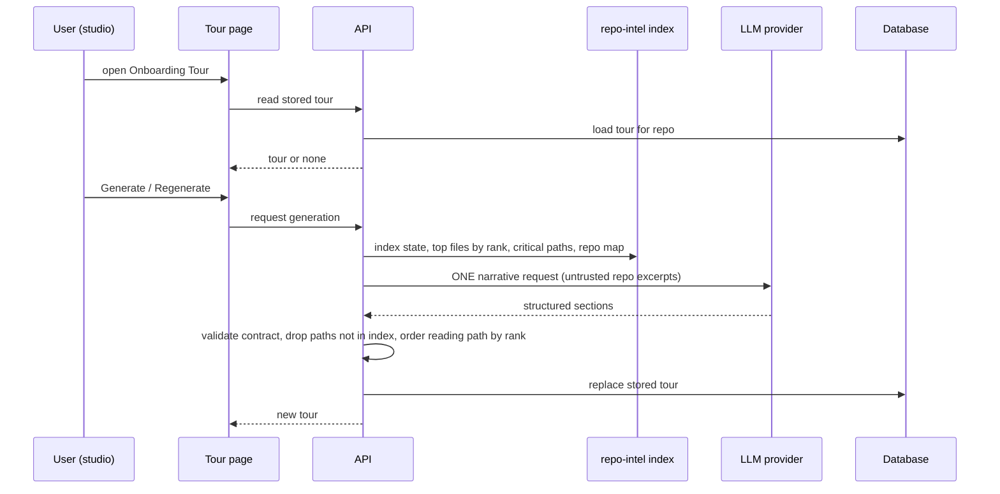

# Design review: Onboarding Tour of a repository (SPEC-03)
Sources: `specs/onboarding-tour/designs/onboarding-tour-overview.png`,
`specs/onboarding-tour/designs/onboarding-tour-run-and-reading.png` ·
Current code read: `client/src/vendor/ui/nav.ts:21-43`, `client/src/components/app-shell/helpers.ts:26-40`,
`client/src/app/onboarding/page.tsx:1`, `client/messages/en/onboarding.json:1-17`,
`client/messages/en/settings.json:45-47`, `client/src/components/mermaid-diagram/MermaidDiagram.tsx:7-59`,
`server/src/vendor/shared/contracts/knowledge.ts:28-47`, `server/src/vendor/shared/contracts/platform.ts:13-49`,
`server/src/db/schema/context.ts:120-126`, `server/src/prompts/onboarding.system.md:1-45`,
`server/src/modules/repo-intel/README.md:1-55`, `server/src/modules/repo-intel/types.ts:124-177`,
`server/src/modules/repo-intel/service.ts:685-789`, `server/src/modules/repo-intel/pipeline/rank.ts:1-70`,
`server/src/modules/repo-intel/routes.ts:32-65`, `server/src/modules/index.ts` (no onboarding module
registered), `specs/conventions-extractor.md` (one-call LLM feature precedent), `server/INSIGHTS.md:59-68`.

## What already exists (starter scaffolding)
- Shared contract `Onboarding { sections: [{ kind, title, body, diagram?, links[{label,path}] }] }`
  (`knowledge.ts:28-47`) — consumed today only by `server/test/contracts.test.ts`.
- Table `onboarding (repo_id PK → repos, json, generated_at)` (`context.ts:120-126`), cascade on repo
  delete → covers EC-19.
- System prompt `onboarding.system.md` with `{{sections}}` and `{{language}}` placeholders; it lists
  a `routes_and_apis` section and allows a mermaid diagram only for `architecture` /
  `routes_and_apis` — does not match the five sections of this spec.
- Feature model `onboarding` ("Onboarding Tour", default `openrouter / deepseek/deepseek-v4-flash`)
  in Settings (`platform.ts:45-49`) → AC-16.
- repo-intel facade: `getTopFilesByRank(repoId, n, {exclude})` (rank DESC, tests/configs/migrations
  filtered, `service.ts:695-712`) and `getCriticalPaths(repoId)` (greedy chains from the 5
  top-ranked roots, `service.ts:719-758`), both annotated "onboarding reading-path".
- File rank = PageRank over the import graph; `hotness` is fixed at 0 because the clone is shallow
  (`rank.ts:4-7`). So "rank" today means import-graph centrality only.
- Index state route `GET /repos/:id/index-state` gives `filesIndexed`, `status`, `updatedAt`,
  `degradedReason` (`types.ts:25-50`) — candidate source for "index of N files · last refreshed".
- Client copy `onboarding.json` already has "Generate onboarding tour", "Regenerate",
  "Regenerating…", "Couldn't load the onboarding tour"; its body describes five *different*
  sections ("overview, architecture, key modules, getting started, conventions & gotchas").
- `MermaidDiagram` renders with `securityLevel: "strict"` and renders nothing on invalid input
  (`MermaidDiagram.tsx:37-59`) → AC-25.
- No server module, no API route, no client page for the tour exist yet. No MCP tool.

## Conflicts with current behaviour
- `/onboarding` is the **add-repository** page (`app/onboarding/page.tsx:1`), and
  `activeKeyFor` maps any path containing `/onboarding` to key `onboarding-tour`
  (`helpers.ts:29`) — a key that is not in `NAV` today. Once the sidebar entry exists, the
  add-repository page would light it up. → AC-2.
- The sidebar has no "Onboarding Tour" entry (`nav.ts:21-43`); the design shows it in WORKSPACE
  between Pull Requests and Project Context. → AC-1.
- Existing client copy and prompt describe other section sets; the task fixes the five sections.
  Not a question (the task is explicit); planner must update copy and prompt.
- Settings has an unused "Sync generated docs to a folder — onboarding tours and digests are
  written to the repo folder" string (`settings.json:45-47`) with no server code behind it.
  Relevant to Q-5 (Share link) and to NFR-2 (no write into the working copy); not in scope unless
  the user picks it.

## States coverage
| Screen / flow | State | In design? | Spec reference |
|---|---|---|---|
| Tour page | Tour stored, all sections | Yes (4 of 5 sections) | AC-3, AC-6..AC-13 |
| Tour page | First tasks section | No (nav entry only) | AC-13 |
| Tour page | No tour yet (first run) | No | AC-17 |
| Tour page | Generating (first time) | No | AC-18, AC-33 |
| Tour page | Regenerating with an old tour shown | No | AC-18, AC-32 |
| Tour page | Generation failed (LLM error, timeout) | No | AC-20 |
| Tour page | Invalid model output | No | AC-21, Q-15 |
| Tour page | No API key | No | AC-34 |
| Tour page | Not indexed / partial / degraded index | No | AC-24 |
| Tour page | Not cloned / empty repo | No | AC-24 |
| Tour page | Stale (index newer than tour) | No | AC-35, Q-9 |
| Tour page | Loading the stored tour | No | AC-22 (state itself: planner, standard skeleton) |
| Tour page | Load error | Copy exists, no design | AC-20 |
| Architecture | Diagram invalid / missing | No | AC-25, Q-6 |
| Critical paths | Zero items | No | Q-2 |
| How to run | No commands found | No | EC-16, Q-13 |
| How to run | Copy success / failure | No feedback shown | AC-9, AC-10 |
| Reading path | Fewer files than N, rank ties | No | EC-13, Q-10 |
| Share link | Any | Button only | Q-5 |

## Gaps in the designs
- Rank source for the reading path is not defined → Q-1 (index rank is the only rank that exists).
- Origin of critical paths and of their reasons ("used by 14 routes" is a numeric fact the model
  cannot know unless given) → Q-2.
- First tasks section has no design and no definition → Q-3.
- No empty / generate state, and no trigger rule → Q-4.
- "Share link" has no meaning in a local-first, single-user app with no hosted URL → Q-5.
- Diagram: the mock shows a styled graph (coloured nodes, `api/public/*`); the source is not
  stated → Q-6.
- No behaviour for missing index / clone → Q-7.
- "Open" target unspecified; there is no in-app file viewer today → Q-8.
- "last refreshed 2h ago" can mean index time or tour time → Q-9.
- Commands in the mock include `cp .env.example .env # add OPENAI + STRIPE keys` — a model can
  invent such lines; grounding is not stated → Q-13.
- The one-call constraint removes the usual "retry/repair" path for malformed output → Q-15.

## Edge cases not covered
- Double submit / two tabs → EC-10
- Navigate away mid-generation → EC-11
- Index refreshed after generation → EC-12
- Clipboard unavailable → EC-14
- Long paths and reasons → EC-15
- Prompt injection in repository files → EC-17
- Repository switch while on the page → EC-18
- Repository removed → EC-19 (table cascade already exists)

## Module interactions
| From | To | Via (external contract) | New / changed / existing | Consumers affected |
|---|---|---|---|---|
| Studio tour page | API | Read stored tour for a repository (HTTP) | New | Studio only |
| Studio tour page | API | Request a generation for a repository (HTTP) | New | Studio only |
| Studio tour page | API | `GET /repos/:id/index-state` | Existing | Indexed badge (unchanged) |
| API | — | `Onboarding` shared contract | Changed (needs per-item reasons, ordered reading path, commands, first tasks, generation time, indexed file count) | `server/test/contracts.test.ts`; client copy must be synced |
| API onboarding | repo-intel facade | `getTopFilesByRank`, `getCriticalPaths`, index state, repo map | Existing (internal) | Blast, conventions, reviews (unchanged) |
| API onboarding | LLM provider | One structured request, model from feature model `onboarding` | Existing mechanism | — |
| API onboarding | Database | `onboarding` table (one row per repository) | Existing table, first writer | — |

Notes for the implementation planner (internal wiring, not part of the spec):
- Register a new server module statically in `server/src/modules/index.ts`; follow the
  conventions module shape (resolve feature model per call, `<untrusted>` wrapping).
- Pin the output language in the prompt (server/INSIGHTS.md 2026-09-25) — see Q-12.
- `NAV` lives in `client/src/vendor/ui/nav.ts` (vendored); find its canonical source before editing.
- `activeKeyFor` must stop matching the add-repository route for `onboarding-tour` (AC-2).
- Reading-path order must not depend on model output (AC-12); ties need a deterministic key (Q-10).
- Path filter for AC-14: compare against indexed file paths, not just "exists on disk".

## UX improvements
- P-1 Missing API key notice — before generation, show which provider key is missing with a link
  to Settings → API keys, and disable Generate — avoids a guaranteed failure and a wasted wait —
  cost S — status: accepted → AC-34
- P-2 Stale tour badge — when the index was refreshed after the tour was generated, show "Index
  changed since this tour was generated" next to Regenerate — the tour silently ages otherwise —
  cost S — status: accepted → AC-35
- P-3 Keep the old tour visible while regenerating and after a failed regenerate, with an inline
  banner — a failed call must not blank a working page — cost S — status: accepted → AC-32, AC-20
- P-4 Reading-path progress — let the user tick files as read, kept per browser — turns the list
  into a checklist — cost M — status: rejected → NG-6
- P-5 "Copy all" for How to run locally — one click for the whole setup sequence — cost S —
  status: accepted → AC-31
- P-6 Background generation — generation keeps running if the user leaves; coming back shows the
  progress or the result — a one-call generation can take tens of seconds — cost M — status:
  accepted → AC-33
- P-7 "Open" on reading-path and first-task files too — the design has "Open" only on critical
  paths, but the reading path is where the user actually reads files one by one — cost S —
  status: accepted → AC-30, AC-11, AC-13

## Decisions log
- Round 1: draft written; Q-1..Q-8 sent to the user; Q-9..Q-15 queued for round 2.
- Round 1 answers: Q-1 → top-N by index file rank, LLM writes reasons only (AC-11, AC-12);
  Q-2 → distinct files of index dependency chains, counts supplied by the index (AC-7, AC-29);
  Q-3 → 3–5 LLM tasks tied to indexed files (AC-13, NG-9); Q-4 → on demand only (AC-17, NG-10);
  Q-5 → copy local deep link with section anchor (AC-26..AC-28, NG-7); Q-6 → LLM Mermaid, hidden
  when invalid (AC-6, AC-25, NG-12); Q-7 → block with reason (AC-24, NG-11); Q-8 → GitHub, new tab
  (AC-30, NG-8). P-1 accepted → AC-34; P-2 accepted → AC-35; P-3 accepted → AC-32, AC-20;
  P-4 rejected → NG-6; P-5 accepted → AC-31; P-6 accepted → AC-33.
- Round 2 opened: Q-9..Q-16 (Q-9 narrowed: the stale flag is settled by P-2; Q-16 new from Q-2;
  EC-21..EC-23 new from the answers). P-7 proposed.
- Round 2 answers: Q-9 → tour generation time (AC-3); Q-10 → 7 files, ties by path (AC-11);
  Q-11 → join the running generation (AC-23); Q-12 → Other: language from a workspace setting
  (AC-38..AC-40, NG-15; follow-ups Q-17, Q-18, Q-19 — no such setting exists today, see below);
  Q-13 → only from repository scripts and docs (AC-36, AC-37, NG-13); Q-14 → not kept (AC-5,
  NG-14); Q-15 → keep valid sections, mark empty ones (AC-20, AC-21, AC-41); Q-16 → up to 5 by
  rank (AC-7; follow-up Q-20 on ties). P-7 accepted → AC-30, AC-11, AC-13.
- Round 3 opened: Q-17..Q-20; EC-24, EC-25 new.
- Round 3 answers: Q-17 → Other: "давай фиксированый список - English, Українська, Иврит" →
  exactly English, Ukrainian, Hebrew (AC-38, AC-42, NG-17); default English and placement in
  Settings → Workspace are coordinator-relayed assumptions, kept open as non-blocking Q-21 for veto
  at approval. Hebrew is RTL → AC-43..AC-45, EC-26..EC-29, NG-18. Q-18 → headings and labels stay
  English (AC-3, NG-16); Q-19 → notice + manual Regenerate (AC-40); Q-20 → ties by path (AC-7).
- Status after round 3: no blocking question left; ready for approval.
- Round 4: Q-21 → confirm all (default English, Settings → Workspace, labels "English",
  "Українська", "עברית") → AC-38. User approval: approved → Status: approved.

## Finding from round 3: right-to-left tours
- Hebrew text mixes with LTR tokens (paths, identifiers, commands, numbers, English technology
  names); without direction isolation the bidi algorithm reorders paths at sentence edges and
  next to punctuation (EC-27). Planner: per-block `dir` on generated text, LTR isolation for
  inline code, paths, command rows and the Mermaid container; keep the page shell LTR.
- `MermaidDiagram` (`client/src/components/mermaid-diagram/MermaidDiagram.tsx:62-73`) sets no
  direction; it must stay LTR inside an RTL section (AC-44). Hebrew node labels are allowed by the
  language rule but must stay on one line (prompt rule).
- Section list numbering stays LTR (AC-43) so focus order is identical across languages (AC-45).

## Finding from round 2: tour language setting
- No language or locale setting exists in the server (`server/src/modules/settings/**` has none;
  the only use is the `{{language}}` placeholder in `server/src/prompts/onboarding.system.md:42`).
  The studio UI ships English messages only (`client/messages/en/`).
- Settings → Workspace already groups workspace-wide preferences (theme, polling interval, the
  unused "Sync generated docs" toggle; `client/messages/en/settings.json:31-47`) — a natural home,
  pending Q-17.
- A new persisted workspace setting changes the settings contract in `@devdigest/shared`
  (both vendored copies) and needs a migration — planner material.
- Language drift of cheap models (server/INSIGHTS.md 2026-09-25) makes the explicit language in
  the prompt mandatory.
