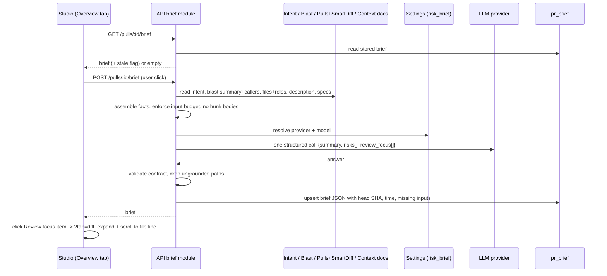

# Design review: PR Brief on the Overview tab (SPEC-04)
Sources: designs/01-image.png (Overview with PR Brief), 02-image-copy.png (Files changed, Smart order),
03-image-copy-2.png (Files changed after a Review focus click, target file outlined), 04-image-copy-3.png
(Risk areas and Review focus outlined), 05-image-copy-4.png (verdict banner outlined) · Current code read:
client/src/app/repos/[repoId]/pulls/[number]/page.tsx:84-92,160-205 ·
client/src/app/repos/[repoId]/pulls/[number]/_components/OverviewTab/OverviewTab.tsx:15-30 ·
client/src/app/repos/[repoId]/pulls/[number]/_components/VerdictBanner/VerdictBanner.tsx:12-58 ·
client/src/app/repos/[repoId]/pulls/[number]/_components/DiffTab/DiffTab.tsx:40,165-198 ·
client/src/components/diff-viewer/FileCard/FileCard.tsx:71-88 ·
client/src/app/repos/[repoId]/pulls/[number]/_components/DiffTab/_components/SmartDiffGroup/SmartDiffGroup.tsx:28-71 ·
client/messages/en/brief.json:1-19 · server/src/vendor/shared/contracts/brief.ts:84-160 ·
server/src/vendor/shared/contracts/blast.ts:21-27 · server/src/vendor/shared/contracts/platform.ts:15-21,59-64 ·
server/src/db/schema/reviews.ts:82-87 · server/src/modules/settings/feature-models.ts:51-57 ·
server/src/modules/intent/service.ts:67-73,97-190 · server/src/modules/intent/routes.ts:19-36 ·
server/src/modules/intent/constants.ts:17-30 · server/src/modules/blast/routes.ts:19-26 ·
server/src/modules/reviews/routes.ts:135-141 · server/src/modules/reviews/smart-diff/classify.ts:27 ·
server/src/modules/pulls/routes.ts:239-331 · server/src/modules/polling/routes.ts:42-53 ·
server/src/adapters/llm/openai.ts:88-139 · server/src/modules/index.ts:31-47 · docs/project-context.md:241-288

## States coverage
| Screen / flow | State | In design? | Spec reference |
|---------------|-------|------------|----------------|
| PR Brief block | No brief yet (empty, "Generate brief") | No | AC-2 |
| PR Brief block | First generation running | No | AC-4, AC-5 |
| PR Brief block | Regeneration running with an earlier brief | No | AC-5, AC-35 |
| PR Brief block | Brief shown (summary, Intent, Blast, Risk areas, Review focus, provenance line) | Yes (01), summary and provenance line not drawn | AC-6, AC-7, AC-36 |
| PR Brief block | Brief outdated (new commit) | No | AC-30 |
| Files changed | Opened from a deep link (`file`, `line`) / Back to Overview | No | AC-37, AC-17 |
| PR Brief block | Generated with missing inputs (no Intent, degraded Blast, no specs) | No | AC-9 |
| PR Brief block | Generation failed | No | AC-31 |
| PR Brief block | No API key for the Risk Brief provider | No | AC-41 |
| PR Brief block | Generation already running elsewhere (409) | No | AC-42 |
| PR Brief block | Brief in Hebrew (right-to-left text) | No | AC-46, AC-47 |
| PR Brief block | Language setting changed since generation | No | AC-48 |
| Verdict banner | Review exists | Yes (01, 05) | AC-33 |
| Verdict banner | No review yet | No | AC-34 |
| Risk areas | Many risks, collapsed rows with expand chevron | Yes (01, 04) | AC-11, AC-13 |
| Risk areas | Risk expanded (explanation) | No | AC-13 |
| Risk areas | Zero risks | No (copy exists in brief.json) | AC-12 |
| Review focus | List of 4 items with count badge | Yes (01, 04) | AC-15 |
| Review focus | Zero items | No | AC-16 |
| Files changed | After Review focus click: file outlined, scrolled | Yes (03) | AC-17, AC-18 |
| Files changed | Target in collapsed group / collapsed large file | No | AC-17 |
| Files changed | Target line outside changed lines / no patch | No | AC-43 |
| Files changed | Target file not in diff (Blast-only file) | No | AC-19 |
| Files changed | Original order active | No | AC-17 |

## Gaps in the designs
- The design shows only one summary — inside the verdict banner, and it is the review's summary
  ("Solid middleware approach… Two blockers before merge"). The brief's own "what the PR does and why"
  summary has no place in the mock-up → Q-6.
- The refresh icon sits inside the verdict banner (01, 05). It is unclear whether it regenerates the
  brief or re-runs the review; with no review the banner is absent, so the control would vanish → Q-6,
  AC-6 (refresh belongs to the brief).
- Risk rows show `path:12-18` line ranges, but the contract's `Risk.file_refs` is `string[]` without a
  defined format → Q-8.
- Review focus items name lines (`src/config.ts:12`) that only someone who read the code could know;
  the model gets no code → Q-2 (blocking).
- No empty, loading, outdated, error or missing-input states are drawn → AC-2, AC-4, AC-9, AC-30, AC-31.
- The mock-up's Intent quote and Blast radius tree are the existing cards; whether the brief stores a
  snapshot of them is open → Q-7.
- Existing copy conflicts with the task: `brief.json` has `block.risks: "Risks"` (design and task say
  "Risk areas"), and `unavailableHint: "Run a review or open the PR to compute it."` contradicts the
  on-request generation (NG-3). There are no keys yet for the summary, Review focus, Generate brief,
  outdated, missing inputs or "File not in this PR's diff" → AC-8 (planner adds keys and fixes copy).
- Severity is shown by icon/colour only on risk rows (shield, package, bolt) → NFR-3 requires text.
- Prototype chrome in screenshots 03–05 ("Made with Claude Design", "Back", "More screens: Conformance,
  First-run setup", "Translate / Start chat / Share") is not part of the studio and is ignored.

## Edge cases not covered
- No Intent stored → EC-1
- Blast radius degraded or index missing → EC-2
- No specs available → EC-3
- New commit after generation → EC-4
- No API key / provider failure → EC-5
- Zero or all-dropped risks / focus items → EC-6
- Hallucinated or differently-cased paths → EC-7
- Invalid structured answer → EC-8
- Double submit / two tabs → EC-10
- Target in a collapsed group or collapsed large file → EC-11
- File without patch → EC-12
- Blast-only file as target → EC-13
- Very large PR / budget overflow → EC-14
- No review yet → EC-15
- Leaving the page mid-generation → EC-16
- Prompt injection through description/issue/specs → EC-17
- Long text and paths → EC-18
- Closed/merged PR → EC-19

## Module interactions
| From | To | Via (external contract) | New / changed / existing | Consumers affected |
|------|----|-------------------------|--------------------------|--------------------|
| client PR page | server brief module | `GET /pulls/:id/brief` | New | studio; MCP could add later |
| client PR page | server brief module | `POST /pulls/:id/brief` | New | studio |
| server brief module | intent module | stored intent (same data as `GET /pulls/:id/intent`) | Existing, read only | none |
| server brief module | blast module | Blast radius (same data as `GET /pulls/:id/blast`) | Existing, read only | none |
| server brief module | pulls / smart diff | PR files and Smart Diff roles | Existing, read only | none |
| server brief module | context docs | specification documents (Q-1) | Existing reader, new consumer | none |
| server brief module | settings | `risk_brief` feature model | Existing | none |
| server brief module | LLM provider | one structured call (Q-4) | Existing adapter | none |
| server brief module | Postgres `pr_brief` (`pr_id`, `json`) | persisted brief JSON incl. commit SHA | Existing empty table, first writer | none |
| shared contract `brief.ts` | server + client copies | `PrBrief` gains `summary`, `review_focus[]` and provenance fields, loses `intent`/`blast`/`history` (Q-7, AC-22) | Changed | `client/src/lib/types.ts` re-exports `PrBrief` (no runtime use found) |
| client Overview | client Files changed | URL `?tab=diff&file=<path>&line=<n>` (AC-37) | New | DiffTab, PR page URL handling |
| server brief module | reviews | latest completed review findings per agent (file, line, title, severity) | Existing, read only | none |
| server brief module | GitHub API | read of the first referenced issue (≤ 20,000 bytes) | Existing adapter, new consumer | none |
| server brief module | settings | workspace "Tour language" (en/uk/he) | Existing setting, new consumer | Onboarding Tour shares it |
| client PR Brief block | server settings | API key presence for the Risk Brief provider (existing secrets-status data) | Existing | none |

Notes for the implementation planner (internal wiring, not part of the spec):
- `pr_intent` is read through `modules/intent/repository.ts` (`getIntent`), not
  `reviews/repository.ts` as the task text says; `IntentService.get` already computes `stale` from
  `head_sha` (intent/service.ts:67-73) — the same pattern fits AC-30.
- `pr_brief` exists (schema/reviews.ts:82-87) with only `pr_id` + `json`; commit SHA, generation time,
  model, tokens and missing inputs go inside `json` per the task. No migration should be needed.
- `pull_requests.head_sha` is updated by polling (polling/routes.ts:42-53); `GET /pulls/:id`
  refreshes files/body from GitHub but returns GitHub's `head_sha` without writing it to the row
  (pulls/routes.ts:285-297). Staleness must compare against one consistent source.
- `completeStructured` re-prompts up to 2 times by default; `singleAttempt: true` gives exactly one
  HTTP call and no SDK retry (openai.ts:88-139) — relevant to Q-4.
- Smart Diff roles are path-based and LLM-free (`classifyFile`, smart-diff/classify.ts:27); findings
  come from the latest reviews.
- Project-context documents are attached per agent/skill and read through `container.contextDocs`
  `readEffective`; reviews wrap each as `<untrusted source=…>` and cap at 8,000 tokens
  (docs/project-context.md:241-288) — reuse the wrapper and tokenizer for Q-1/Q-3.
- The Intent layer already fetches linked issues and plan/spec docs with byte caps
  (intent/constants.ts:17-30) but stores only `sources` metadata, not the text — relevant to Q-10.
- DiffTab has no external "open this file" entry point: groups own their `openCommand`
  (SmartDiffGroup.tsx:33), files auto-collapse above a line threshold (FileCard.tsx:80), and the order
  toggle is local state (DiffTab.tsx:40). AC-17/18 need a target passed from the page (P-1 suggests the
  URL). Mind the sticky-header offset when scrolling (client/INSIGHTS.md 2026-09-26).
- Client may import only types from `@devdigest/shared` (client/INSIGHTS.md 2026-10-04).
- `VerdictBanner` uses the `prReview` namespace; the banner for AC-33 needs verdict/score/counts of
  the most recent completed review (`usePrReviews`).
- System prompts must pin the output language (server/INSIGHTS.md 2026-09-25) → Q-13.
- Register the new module statically in `server/src/modules/index.ts`; follow the intent module's
  rate limit on POST (10/min).

## UX improvements
- P-1 Put the navigation target in the URL (`?tab=diff&file=<path>&line=<n>`) — Back returns to the
  Overview, a reload or shared link lands on the same line, items can be real links — cost S — status:
  accepted → AC-37, AC-17
- P-2 After navigation, move keyboard focus to the target file header and briefly highlight the target
  row — keyboard and screen-reader users otherwise lose their place after the tab switch — cost S —
  status: accepted → AC-38, AC-18
- P-3 Provenance line under the brief: "Generated <relative time> · commit <short SHA> · <model>" —
  makes freshness and cost source visible, supports AC-30 — cost S — status: accepted → AC-36
- P-4 During regeneration keep the earlier brief visible with an inline "Regenerating…" state instead
  of a skeleton — avoids losing content the reviewer is reading; skeleton only on first generation —
  cost S — status: accepted → AC-35
- P-5 Order risks by severity (high → medium → low) and show the severity word next to the icon — the
  most important risk is read first; the design relies on icons only — cost S — status: rejected → NG-8
  (the severity word stays required by AC-11 / NFR-3 for accessibility; only the ordering is dropped —
  see round 2 note)
- P-6 In the "missing inputs" notice, offer "Derive intent" (the existing Intent action) when Intent is
  missing — a better brief is one click away; it is a separate, user-started call — cost M — status:
  rejected → NG-9

## Decisions log
- Round 1: draft written; no answers yet.
- Round 2 (answers to round 1):
  - Q-1 → union of documents attached to enabled agents and their linked, globally enabled skills,
    de-duplicated, effective document → AC-23, provenance, EC-3. Order inside the budget opened as Q-15.
  - Q-2 → hunk ranges and header lines (no body) plus findings of the latest completed review per
    agent → AC-23, provenance.
  - Q-3 → 8,000 tokens, system + user message, server tokenizer, shortening order specs → issue →
    callers → description → per-file list, Intent and totals never shortened → AC-25; consequence
    AC-40 (reject when the never-shortened part alone exceeds the budget). Place of hunk headers and
    findings in that order opened as Q-15.
  - Q-4 → exactly one HTTP request, no re-prompt, no transport retry → AC-26, AC-39, NG-11, NFR-1.
  - Q-5 → "Outdated" text with the stored short SHA, no automatic call → AC-30, `stale` flag in AC-29.
  - Q-6 → banner keeps the review summary; the brief summary is its own paragraph; Regenerate belongs to
    the brief → AC-6, AC-33, AC-34.
  - Q-7 → live Intent and Blast radius cards; `PrBrief` drops `intent`/`blast`/`history` and carries
    summary, risks, review_focus and provenance fields → AC-7, AC-22, NG-10.
  - Q-8 → path-only references; invalid ones removed, risk kept while one remains → AC-11, AC-20.
  - P-1, P-2, P-3, P-4 accepted; P-5, P-6 rejected.
  - Note: P-5's rejection is read as rejecting the severity ordering; the text severity label remains
    because AC-11 and NFR-3 (not by colour alone) required it independently. Flagged to the user.
  - New edge cases from the answers: EC-21 (deep link to a removed file / moved lines), EC-22
    (regeneration fails while the earlier brief is shown).
  - Still open (non-blocking, asked in round 2): Q-9 to Q-15.
- Round 3 (answers to round 2):
  - Q-9 → file in diff but line not a new-side row or no patch: open the file without marking and show
    "Line <line> is outside the changed lines" (AC-43); file not in diff: Overview tab with "File not in
    this PR's diff" (AC-19), also for direct deep links.
  - Q-10 → first referenced issue, GitHub API at generation time, ≤ 20,000 bytes; unreadable → missing
    input (AC-23, AC-9, EC-23, NG-12, provenance, NFR-2 exception for that one GitHub read).
  - Q-11 → second concurrent request gets 409 without a model request; block shows "Generation already
    running" (AC-42, NFR-1).
  - Q-12 → at most 5 risks and 5 Review focus items after grounding, model order kept (AC-44, EC-24).
  - Q-13 → brief language = workspace "Tour language" (en/uk/he), not the recommended "always English":
    generated text follows the setting read at generation start, language named in the request and
    stored with the brief; UI labels stay English from messages (AC-45, AC-8, AC-22, G-6, US-4,
    NG-13 to NG-16, EC-25). New follow-ups opened: Q-16 (Hebrew right-to-left rendering, EC-26) and
    Q-17 (notice when the language changed after generation, EC-27).
  - Q-14 → key pre-check like the Onboarding Tour (AC-41, EC-5).
  - Q-15 → specs sorted by path, dropped whole from the end; hunk headers and findings shortened with the
    per-file list (AC-25).
  - P-5 interpretation confirmed: no severity sorting, text severity label kept (NG-8, AC-11, NFR-3).
- Round 4 (answers to round 3):
  - Q-16 → as in the Onboarding Tour: generated text right-to-left, paths/`path:line`/identifiers
    isolated left-to-right, layout, labels and focus order left-to-right (AC-46, AC-47, NFR-3, EC-26).
  - Q-17 → "Language changed since this brief was generated" next to Regenerate, no automatic call
    (AC-48, EC-27).
  - No open questions left; Status stays draft pending the user's approval.
- Approval: "User approval: approved" received with no blocking question left → Status: approved.
